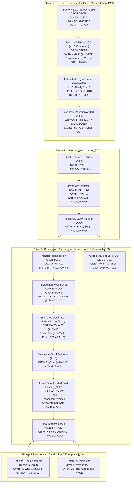

# SAP Business One Process Design Document
## Process Variant: `PV-ICC-SLC-01`
### Multi-Leg Intercompany Transfer with USD Factory Procurement & Two-Stage Stacked Landed Costing (`ICCChina` → `ICCSIT` → `NZNTH` / `EuropeMarketPlace`)

---

| Document Attribute | Value |
| :--- | :--- |
| **Document Title** | Intercompany Consolidation Center (ICC) Multi-Currency Process Design |
| **Process Variant Code** | **`PV-ICC-SLC-01`** |
| **Process Variant Name** | **USD Factory Consolidation to AUD Destination Multi-Leg Stacked Landed Cost & In-Transit Transfer Lifecycle** |
| **System / ERP** | SAP Business One (SQL / HANA / Cloud Simulation) |
| **Module Scope** | Inventory & Warehouse Management, Purchasing (AP), Landed Costs, Multi-Currency Accounting |
| **new_b1.db Warehouses** | **`ICCChina`** (Ningbo Origin), **`ICCSIT`** (Ocean In-Transit), **`NZNTH`** (NZ North DC), **`NZSTH`** (NZ South DC), **`NZSIT`** (NZ Coastal In-Transit), **`EuropeMarketPlace`** (UK West Yorkshire), **`EuropeSIT`** (UK Sea In-Transit) |
| **old_b1.db Warehouses** | **`AU Warehouse`** (Sydney Central DC), **`AU Warehouse`** (Melbourne Hub), **`AU Warehouse`** (Brisbane DC), **`VGLPER`** (Perth Hub) |
| **Local Currency (LC)** | **AUD ($)** |
| **Foreign Currency (FC)** | **USD ($)** (Strictly for External Factory PO) |
| **Status** | **Approved / Production Ready** |

---

## 1. Executive Summary: Process Design Principles, Policies & Operational Rules

In global supply chain and manufacturing operations, overseas contract manufacturers and component vendors mandate procurement invoicing in **US Dollars (USD)** with FOB shipping terms. However, operating entities maintain their official general ledger, statutory reporting, and warehouse inventory valuation strictly in **Australian Dollars (AUD)**.

The enterprise architecture is structured under a three-tiered governance model:
1. **Design Principles (Strategic Philosophy)**: Foundational architectural objectives (Currency Isolation, Perpetual Balance Sheet Visibility, Zero-Margin Intercompany Transfers, Lean Order-to-Cash, Two-Stage Landed Cost Valuation).
2. **Design Policies (Governance Mandates — "What & Why")**: Overarching management rules defining statutory compliance and business standards.
3. **Operational Rules (Technical Execution — "How & If-Then")**: Deterministic system constraints, table validations, and document flows in SAP Business One.

---

### Master Governance Hierarchy:

```
┌────────────────────────────────────────────────────────────────────────────────────────────────────────┐
│                        GOVERNANCE HIERARCHY: PRINCIPLES → POLICIES → RULES                             │
├────────────────────────────────────────────────────────────────────────────────────────────────────────┤
│ 1. CORE DESIGN PRINCIPLES (Strategic Philosophy)                                                       │
│    • Currency Isolation: Protect domestic financial ledgers from foreign currency volatility.          │
│    • Perpetual Asset Custody: Ensure zero unrecorded or "blind" transit periods across the ocean.     │
│    • True Cost Relay: Eliminate artificial internal markups across legal sister entities.              │
│    • Zero-ODLN & Direct Invoicing: Universal Direct AR Invoicing (OINV on ORDR); Zero ODLN outbound.   │
│    • Two-Stage Landed Cost: Mandatory provisional estimate at GRPO followed by actual invoice overwrite│
│    • Standard Step Naming: "[Step]: [Role] Action/Doc @ Location → [Milestone/Outcome]" (e.g. 2.2.1.1)  │
│    • Role-Based RACI Governance: Strict functional segregation across Purchasing, Logistics & Finance. │
├────────────────────────────────────────────────────────────────────────────────────────────────────────┤
│ 2. MASTER POLICIES (Governance Mandates)                                                               │
│    • Policy 1: Factory Purchase Orders Strictly in USD (Foreign Currency Isolation)                   │
│    • Policy 2: Functional Currency (AUD) for All Downstream Documents & International Transfers        │
│    • Policy 3: Mandatory In-Transit (SIT) Warehouse for Supply Network Transfers                       │
│    • Policy 4: Intercompany Goods Issue from SIT Synchronized with Destination GRPO at Source MWAG     │
│    • Policy 5: Mandatory Two-Stage Landed Cost Accrual (OIPF 'E') & Actual Overwrite (OIPF 'A')        │
│    • Policy 6: Universal Direct AR Invoicing & Zero Outbound Delivery Notes (Customer Settlement OOS)   │
│    • Policy 7: Mandatory Inventory Transfer Request (OWTQ) & Picking for Movements to SIT (OWTR)       │
│    • Policy 8: Zero-ODLN Architecture for Intra-Company & Cross-Database Transfers                     │
│    • Policy 9: Operational RACI Governance: Role Accountability & Document Segregation                 │
├────────────────────────────────────────────────────────────────────────────────────────────────────────┤
│ 3. OPERATIONAL RULES (System Execution Logic)                                                          │
│    • Rule 1.1: OPOR DocCur = 'USD', PriceFC locked in POR1 (no G/L journal entries created).           │
│    • Rule 2.1: OPDN posts in AUD at spot rate (0.65): Dr 100040 Inventory / Cr 200060 Allocation.      │
│    • Rule 3.1: OWTR to ICCSIT/NZSIT/EuropeSIT: Dr 100050 SIT Asset / Cr 100040 Warehouse Stock.           │
│    • Rule 4.1: Cross-DB Intercompany: Origin new_b1 posts OIGE out from ICCSIT (Dr 110020 / Cr 100050) │
│                ↔ Destination old_b1 posts OPDN at AU DC (Dr 100010 / Cr 200030) at $424.00 AUD.        │
│    • Rule 5.1: IF Doc = OPDN THEN Post OIPF 'E' (Dr Inventory / Cr 200050); WHEN Invoices Arrive THEN │
│                Post OIPF 'A' (Dr 200050 / Dr/Cr Inventory Variance / Cr 200010 AP) to Net 200050 to $0.│
│    • Rule 6.1: IF Order = Sales Fulfillment THEN Base OINV Directly on ORDR (Customer Settlement OOS). │
│                Never issue standalone ODLN under any circumstances.                                    │
│    • Rule 7.1: IF Transfer = Whs to SIT THEN Create OWTQ -> Warehouse Picks -> Post OWTR based on OWTQ│
│                (Dr 100050 SIT / Cr 100040 Whs, Moving OnHand to SIT & Clearing IsCommited).           │
│    • Rule 8.1: Single-DB = OWTQ → OWTR; Cross-DB = OIGE (ICCSIT) ↔ OPDN (AU DC); Customer = Direct OINV│
│    • Rule 9.1: [Purchasing] = OPOR (All POs) & OWTQ (All Transfer Requests);                          │
│                [Logistics] = All Material Movements (OIGE, OPDN, OWTR) & Direct OINV Creation (Dispatch);│
│                [Finance] = All Cost Accounting, OIPF Landed Costs, Revenue/COGS Review & G/L Recon.     │
└────────────────────────────────────────────────────────────────────────────────────────────────────────┘
```

### 1.2 Enterprise RACI Governance Matrix (Operational Roles & Document Ownership)

| Functional Domain & Activity | ERP Document | Currency | Accountable & Responsible (A/R) | Consulted (C) & Informed (I) | Operational Responsibility Scope & Transactional Boundary |
| :--- | :--- | :--- | :--- | :--- | :--- |
| **Factory Purchase Orders** | `OPOR` (`POR1`) | **USD** | **`[Purchasing]`** | `[Logistics]` (C)<br>`[Finance]` (I)<br>`[Sales]` (I) | Issues factory purchase orders in USD FOB to commit vendor manufacturing. Locks foreign price list (`PriceFC`) without generating financial ledger entries until receipt. |
| **Intercompany Inbound POs** | `OPOR` (`POR1`) | **AUD** | **`[Purchasing]`** | `[Logistics]` (C)<br>`[Finance]` (I) | Issues destination intercompany POs tracking ocean container shipments & B/L. Establishes inbound on-order quantity commitment in destination ERP database. |
| **Intercompany & Stock Transfer Requests** | `OWTQ` (`WTQ1`) | **AUD** | **`[Purchasing]`** | `[Logistics]` (R)<br>`[Finance]` (I) | Generates all Inventory Transfer Requests (`OWTQ`) for intercompany stock rebalancing. Sets source/destination warehouses and commits inventory (`OITW.IsCommited`) for warehouse picking queue. |
| **Warehouse Picking & Staging** | `OWTQ` / Pick List | **N/A** | **`[Logistics]`** | `[Purchasing]` (I)<br>`[Finance]` (I) | Executes physical bin/aisle picking, quantity verification, export carton labeling, and container staging against active `OWTQ` transfer requests. |
| **Inventory Transfers to In-Transit (SIT)** | `OWTR` (`WTR1`) | **AUD** | **`[Logistics]`** | `[Purchasing]` (I)<br>`[Finance]` (I) | Posts Inventory Transfer (`OWTR`) based on completed `OWTQ`. Executes physical dispatch and balance sheet transfer: **Dr 100050 SIT Asset / Cr 100040 Warehouse Stock**. |
| **Material Movement: Goods Issue from SIT** | `OIGE` (`IGE1`) | **AUD** | **`[Logistics]`** | `[Purchasing]` (I)<br>`[Finance]` (C/I) | Posts Goods Issue (`OIGE`) discharging stock out from SIT (`ICCSIT`) upon ocean port arrival / vessel unlading. Synchronizes with destination GRPO; origin posts **Dr 110020 Intercompany AR / Cr 100050 SIT Asset**. |
| **Material Movement: Inbound Goods Receipt** | `OPDN` (`PDN1`) | **AUD** | **`[Logistics]`** | `[Purchasing]` (I)<br>`[Finance]` (C/I) | Receives physical delivery at warehouse dock, performs count/quality inspection, and posts Goods Receipt PO (`OPDN`). Posts **Dr 100010/100040 Inventory Asset / Cr 200060/200030 Goods Receipt Clearing/AP**. |
| **Provisional Landed Cost Accruals** | `OIPF` (DocType `'E'`) | **AUD** | **`[Finance]`** | `[Purchasing]` (C)<br>`[Logistics]` (C) | Posts Estimated Landed Cost (`OIPF` DocType `'E'`) immediately following every `OPDN`. Accrues estimated freight, duty, and wharfage into inventory moving average (`OITW.AvgPrice`): **Dr 100010/100040 / Cr 200050**. |
| **Actual Landed Cost Overwrite & Cost Accounting** | `OIPF` (DocType `'A'`) | **AUD** | **`[Finance]`** | `[Purchasing]` (I)<br>`[Logistics]` (C) | Matches actual customs broker & freight carrier AP invoices (`OPCH`). Posts Actual Landed Cost (`OIPF` DocType `'A'`) to overwrite provisional estimates, adjust inventory valuation, and reconcile **G/L 200050 to exactly $0.00**. |
| **Customer Sales Order Booking** | `ORDR` (`RDR1`) | **AUD** | **`[Sales]`** | `[Purchasing]` (I)<br>`[Logistics]` (I)<br>`[Finance]` (I) | Books customer sales order (`ORDR`), allocating available finished goods stock (`OITW.IsCommited`). |
| **Direct AR Invoicing & Order Dispatch Confirmation** | `OINV` (`INV1`) | **AUD** | **`[Logistics]`** | `[Finance]` (A/I - Accounting & Receivables)<br>`[Sales]` (I) | Creates & posts Direct AR Tax Invoice (`OINV`) directly against Sales Order (`ORDR`) as part of the physical logistics process confirming order dispatch. Concurrently relieves inventory (`100010`), triggers automatic COGS (`500010`) and Revenue (`400010`) recognition, and establishes AR (`110010`) in unified journal entry. |
| **Customer Payment Settlement & Banking** | `ORCT` (`RCT1`) | **AUD** | **`[Corporate Treasury]`** *(Out of Scope)* | `[Finance]` (C)<br>`[Purchasing]` (I)<br>`[Logistics]` (I) | Manages incoming customer payments, bank reconciliation, and receivable collections. Explicitly **OUT OF SCOPE** of operational P2F supply chain value stream. |

---

### 1.1 Process Name Taxonomy & Detailed Semantic Breakdown

The formal process variant name:
> **"USD Factory Consolidation to AUD Destination Multi-Leg Stacked Landed Cost & In-Transit Transfer Lifecycle"**
> *(Process Variant Code: **`PV-ICC-SLC-01`**)*

is structured into five distinct operational dimensions that define its scope, currency mechanics, valuation logic, and supply chain journey:

```
┌────────────────────────────────────────────────────────────────────────────────────────────────────────┐
│                                       PROCESS NAME TAXONOMY                                             │
├──────────────────────┬─────────────────┬──────────────────────┬──────────────────────┬─────────────────┤
│ USD Factory          │ to AUD          │ Multi-Leg In-Transit │ Stacked Landed Cost  │ Lifecycle       │
│ Consolidation        │ Destination     │ Transfer             │                      │                 │
├──────────────────────┼─────────────────┼──────────────────────┼──────────────────────┼─────────────────┤
│ • Origin Node (ICC)  │ • Target (AUWHS)│ • Journey (ICC->SIT  │ • Layer 1: Origin LC │ • End-to-End    │
│ • Vendor PO in USD   │ • Statutory AUD │   ->AUWHS)           │ • Layer 2: SIT Trans │ • PO to AP Recon│
│ • Spot FX at GRPO    │ • Moving Avg LC │ • Transit Asset Mgt  │ • Layer 3: Est Dest  │ • OINM Audit    │
│ • Origin Landed Cost │ • Sales Ready   │ • OWTR/OWTQ/OIGE     │ • Layer 4: Act Dest  │ • OITM Rollup   │
│   Capitalization     │   Valuation     │ • Zero Gain/Loss     │ • Layer 5: Regional  │ • Perpetual INV │
└──────────────────────┴─────────────────┴──────────────────────┴──────────────────────┴─────────────────┘
```

#### Dimension 1: `USD Factory Consolidation` (Procurement & Origin Milestone)
* **What it means**: Identifies that the purchasing cycle begins overseas with a 3rd-party component manufacturer or contract assembler (e.g., in Asia/Europe).
* **Currency Role**: Commercial invoices and factory PO commitments (`OPOR`) are legally executed in **US Dollars (USD)** under FOB terms.
* **Consolidation Node (`ICC`)**: Physical goods are delivered to the Intercompany Consolidation Center (`ICC`) adjacent to the export port for container stuffing and consolidation.
* **FX Valuation Trigger**: The base inventory capitalization occurs when the goods receipt (`OPDN`) is posted at `ICC`, locking in the spot exchange rate (`DocRate = 0.65`) to convert FOB USD to local AUD.
* **Origin Landed Cost**: Origin terminal fees, customs export declarations, and factory cartage are capitalized directly at `ICC` via `OIPF` (DocType `'E'`), lifting the stock valuation from pure FOB ($400 AUD) to FOB + Origin ($424 AUD).

#### Dimension 2: `to AUD Destination` (Receiving & Valuation Anchor)
* **What it means**: Explicitly defines the receiving corporate entity and destination warehouse (`AUWHS`) in Australia.
* **Currency Role**: Enforces that the operational ledger, perpetual inventory records (`OITW`), and statutory financial statements remain strictly in **Australian Dollars (AUD)** without foreign exchange noise creeping into moving average calculations.
* **Immediate Availability**: Stock received at `AUWHS` is instantly available for allocation to customer sales orders at a realistic, provisional cost base prior to final billing.

#### Dimension 3: `Multi-Leg In-Transit Transfer` (Physical & Custodial Movement)
* **What it means**: Acknowledges that overseas shipments do not jump instantaneously from factory to destination, but undergo a multi-leg physical journey:
  1. *Leg 1 (Origin Cartage)*: Factory → `ICC` (Origin Consolidation).
  2. *Leg 2 (Maritime Voyage)*: `ICC` → `SIT` (Sea In-Transit Hub aboard vessel).
  3. *Leg 3 (Port Clearance & Drayage)*: `SIT` → `AUWHS` (Australian Destination DC).
* **Custodial Accounting**: Utilizes SAP B1 Stock Transfer Requests (`OWTQ`), Stock Transfers (`OWTR`), and Goods Issues (`OIGE`) to maintain perpetual balance-sheet visibility of goods on the water (`100050` In-Transit Asset) without artificial inventory profit or shrinkage.

#### Dimension 4: `Stacked Landed Cost` (Progressive Cost Accumulation)
* **What it means**: Contrast to standard flat landed costing, **"Stacked"** landed costing progressively accumulates and layers incremental cost components as goods traverse each node in the supply chain:
  * **Stack Layer 1 (Origin Base)**: Converted FOB ($400.00 AUD) + Origin Handling & Export Fees ($24.00 AUD) = **$424.00 AUD** at `ICC`.
  * **Stack Layer 2 (In-Transit Carrying)**: Transferred value maintained during ocean transit = **$424.00 AUD** at `SIT`.
  * **Stack Layer 3 (Destination Estimated Accrual)**: Provisional freight, import tariff, wharfage ($80.00 AUD) = **$504.00 AUD** at `AUWHS`.
  * **Stack Layer 4 (Destination Actual Reconciliation)**: True final carrier and customs broker invoices overwrite provisional estimate (+$98.00 AUD) = **$522.00 AUD** at `AUWHS`.
  * **Stack Layer 5 (Regional Distribution Layer)**: Downstream transfers to regional branches add localized domestic freight (`01` = $534, `02` = $547, `03` = $567 AUD).

#### Dimension 5: `Lifecycle` (End-to-End Governance & Enterprise Rollup)
* **What it means**: Denotes the closed-loop governance of the entire transaction from initial purchase order issuance through goods movement, multi-stage costing, invoice reconciliation, audit trail logging in `OINM`, and company-wide moving average valuation in `OITM.AvgPrice`.

---

## 2. Process Variant Flowchart



---

## 3. Detailed Step-by-Step Process Execution Matrix

| Step # | Process Step Description | SAP B1 Document | Whs Code | Currency & Exchange Rate | Document Key Fields / Action | Unit Cost Impact (AUD) | Total G/L Impact (AUD) |
| :---: | :--- | :--- | :---: | :---: | :--- | :---: | :---: |
| **01** | **External Factory PO Issuance** | `OPOR` / `POR1` | `ICC` | **USD** (`DocRate=0.65`) | Foreign Vendor `V-1005`, `PriceFC = $260.00 USD`, `TotalFrgn = $26,000.00 USD` | None (PO Commitment) | None |
| **02** | **Factory Goods Receipt (FOB)** | `OPDN` / `PDN1` | `ICC` | **USD → AUD** (`DocRate=0.65`) | Converted at spot rate: `Price = $400.00 AUD`, `LineTotal = $40,000.00 AUD`, Qty: 100 | Base `ICC` Cost = **$400.00 AUD** | **DR** Inventory Raw/FOB ($40,000)<br>**CR** Goods Receipt Clearing ($40,000) |
| **03** | **Estimated Origin Landed Cost** | `OIPF` / `IPF1` / `IPF2` | `ICC` | **AUD** (`DocCur='AUD'`) | `DocType='E'`, Origin Terminal (`LC008`: $8), Export Customs (`LC002`: $6), Cartage (`LC010`: $10) | Origin LC = **+$24.00 AUD/unit** | **DR** Inventory Finished Goods ($2,400)<br>**CR** Origin LC Clearing ($2,400) |
| **04** | **Origin Inventory Cost Capitalization** | `OITW` Update | `ICC` | **AUD** | `AvgPrice = Converted FOB ($400.00) + Origin LC ($24.00)` | `OITW.AvgPrice('ICC')` = **$424.00 AUD** | `OINM` Log: `TransType=69` (Revaluation) |
| **05** | **Intercompany Transfer Request (ICC → SIT)** | `OWTQ` / `WTQ1` | `ICC` → `SIT` | **AUD** | `FromWhsCod='ICC'`, `ToWhsCode='SIT'`, Qty: 100 | None (Planning Request) | None |
| **06** | **Inventory Transfer to Sea In-Transit** | `OWTR` / `WTR1` | `ICC` → `SIT` | **AUD** | Transfer at `ICC` Unit Valuation ($424.00 AUD), Total: $42,400.00 AUD | `OITW.AvgPrice('SIT')` = **$424.00 AUD** | **DR** Goods In Transit Asset ($42,400)<br>**CR** Inventory Asset ICC ($42,400) |
| **07** | **In-Transit Transfer Request (SIT → AUWHS)** | `OWTQ` / `WTQ1` | `SIT` → `AUWHS` | **AUD** | Port Arrival Notice, Qty: 100 | None | None |
| **08** | **Intercompany GRPO at Destination** | `OPDN` / `PDN1` | `AUWHS` | **AUD** (`DocCur='AUD'`) | Received at transferred base cost equal to `SIT` Valuation ($424.00 AUD) | `AUWHS` Base Cost = **$424.00 AUD** | **DR** Inventory Asset AUWHS ($42,400)<br>**CR** In-Transit Clearing ($42,400) |
| **09** | **Goods Issue out of Sea Transit** | `OIGE` / `IGE1` | `SIT` | **AUD** | Issue out 100 units at $424.00 AUD to clear `SIT` inventory to 0 | `SIT.OnHand` reduced to 0 | **DR** In-Transit Clearing ($42,400)<br>**CR** Goods In Transit Asset SIT ($42,400) |
| **10** | **Estimated Destination Landed Cost** | `OIPF` / `IPF1` / `IPF2` | `AUWHS` | **AUD** | `DocType='E'`, Est Ocean Freight (`LC001`: $35), Est Tariff (`LC003`: $18), Est Port (`LC005`: $12), Cartage (`LC010`: $15) | Provisional Markup = **+$80.00 AUD/unit** | **DR** Inventory Asset AUWHS ($8,000)<br>**CR** Est Freight/Duty Clearing ($8,000) |
| **11** | **Actual Final Landed Cost Overwrite** | `OIPF` / `IPF1` / `IPF2` | `AUWHS` | **AUD** | `DocType='A'`, Actual Ocean Freight ($39.50), Actual Tariff ($19.20), Port ($13.80), Quarantine ($8.50), Cartage ($17.00) | Final Actual Markup = **+$98.00 AUD/unit** | **DR** Inventory Asset AUWHS ($9,800)<br>**CR** AP Invoices / Clearing ($9,800) |
| **12** | **Stacked Moving Average Cost Rollup** | `OITW` & `OITM` | Enterprise | **AUD** | Final calculation across all regional warehouses and global item master | Regional Hubs: 01 ($534), 02 ($547), 03 ($567)<br>`OITM.AvgPrice` = **$495.25 AUD** | Full audit reconciliation in `OINM` |

---

## 4. Mathematical Formulation & Stacked Multi-Currency Cost Model

### A. Conversion & Costing Equations

1. **Factory PO to GRPO Currency Conversion at `ICC`**:
   $$\text{Base Cost (AUD)}_{\text{ICC}} = \frac{\text{PriceFC (USD)}}{\text{DocRate}_{\text{GRPO}}}$$
   $$\text{AvgPrice}_{\text{ICC}} = \text{Base Cost (AUD)}_{\text{ICC}} + \frac{\sum \text{Origin Landed Costs (AUD)}}{\text{Quantity}_{\text{ICC}}}$$

2. **In-Transit Transferred Cost at `SIT`**:
   $$\text{AvgPrice}_{\text{SIT}} = \text{AvgPrice}_{\text{ICC}} \quad (\text{strictly in AUD})$$

3. **Destination Estimated Landed Cost at `AUWHS`**:
   $$\text{AvgPrice}_{\text{AUWHS, est}} = \text{AvgPrice}_{\text{SIT}} + \frac{\sum \text{Estimated Destination Landed Costs (AUD)}}{\text{Quantity}_{\text{AUWHS}}}$$

4. **Destination Actual Final Stacked Cost at `AUWHS`**:
   $$\text{AvgPrice}_{\text{AUWHS, final}} = \text{AvgPrice}_{\text{SIT}} + \frac{\sum \text{Actual Destination Landed Costs (AUD)}}{\text{Quantity}_{\text{AUWHS}}}$$

5. **Enterprise-Wide Weighted Average Cost (`OITM`)**:
   $$\text{OITM.AvgPrice} = \frac{\sum_{w \in \text{Warehouses}} (\text{OnHand}_w \times \text{AvgPrice}_w)}{\sum_{w \in \text{Warehouses}} \text{OnHand}_w} \quad (\text{in AUD})$$

---

### B. Numeric Worked Example: `ITM-IC-001` (Robotics Controller)

```
========================================================================================
[1. Factory Purchase Order in USD]
  • Foreign Vendor FOB Unit Price:                              $260.00 USD
  • Total PO Commitment (100 units):                         $26,000.00 USD
----------------------------------------------------------------------------------------
[2. Factory GRPO at ICC Warehouse - Converted to AUD @ Spot Rate 0.65]
  • Spot Exchange Rate (AUD/USD):                                      0.65 (1 AUD = 0.65 USD)
  • Converted Base FOB Inventory Unit Cost:                      $400.00 AUD ($260 / 0.65)
  • Converted Total Inventory Receipt Value:                 $40,000.00 AUD
----------------------------------------------------------------------------------------
[3. Estimated Origin Landed Cost at ICC Warehouse (in AUD)]
  + Origin Terminal Handling Charge (LC008)                     +$8.00 AUD
  + Export Customs Clearance & Documentation (LC002)            +$6.00 AUD
  + Origin Factory Cartage to Consolidation Hub (LC010)        +$10.00 AUD
  ──────────────────────────────────────────────────────────────────────────────────────
  = Capitalized Inventory Valuation at ICC Warehouse            $424.00 AUD ($400 + $24)
----------------------------------------------------------------------------------------
[4. Intercompany Transit Crossing via SIT Warehouse (in AUD)]
  » Transferred via OWTR to Sea In-Transit (SIT)                $424.00 AUD
  » Received via Intercompany GRPO at Destination (AUWHS)       $424.00 AUD
----------------------------------------------------------------------------------------
[5. Stage 1: Estimated Landed Cost at AUWHS (Provisional in AUD)]
  + Estimated Ocean Freight (LC001)                            +$35.00 AUD
  + Estimated Import Tariff / Customs Duty (LC003)             +$18.00 AUD
  + Estimated Port Handling & Wharfage (LC005)                 +$12.00 AUD
  + Estimated Interstate Delivery (LC010)                      +$15.00 AUD
  ──────────────────────────────────────────────────────────────────────────────────────
  = Provisional Estimated Stock Valuation at AUWHS             $504.00 AUD ($424 + $80)
----------------------------------------------------------------------------------------
[6. Stage 2: Actual Final Landed Cost at AUWHS (Overwrites Estimate in AUD)]
  + Actual Ocean Freight with Bunker Adjustment (LC001)        +$39.50 AUD
  + Actual Customs Tariff Assessment (LC003)                   +$19.20 AUD
  + Actual Port Wharfage & Stevedoring (LC005)                 +$13.80 AUD
  + Actual Quarantine & Fumigation (LC006)                      +$8.50 AUD
  + Actual Interstate Container Transport (LC010)              +$17.00 AUD
  ──────────────────────────────────────────────────────────────────────────────────────
  = Final Stacked Landed Cost Markup                           +$98.00 AUD
  ──────────────────────────────────────────────────────────────────────────────────────
  = FINAL ACTUAL INVENTORY VALUATION AT AUWHS                   $522.00 AUD ($424 + $98)
========================================================================================
```

---

## 5. Multi-Company Architecture: Intra-Company vs. Cross-Database Intercompany Document Governance

In SAP Business One enterprise implementations, physical inventory transfers fall into two distinct legal and database architectures:

```
┌────────────────────────────────────────────────────────────────────────────────────────────────────────┐
│                   CROSS-DATABASE INTERCOMPANY TRANSFER MECHANICS (SAP B1)                              │
├────────────────────────────────────────────────────────────────────────────────────────────────────────┤
│                                                                                                        │
│   ORIGIN DATABASE (new_b1.db / ICC Entity)          DESTINATION DATABASE (old_b1.db / AU Entity)       │
│                                                                                                        │
│   ┌─────────────────────────────────────────┐       ┌──────────────────────────────────────────────┐   │
│   │ 1. Intercompany Sales Order (ORDR)      │ ◄───► │ 1. Intercompany Purchase Order (OPOR)        │   │
│   │    Customer = 'AU_ENTITY'               │       │    Vendor = 'ICC_ENTITY'                     │   │
│   │                                         │       │                                              │   │
│   │ 2. Outward Delivery (ODLN)              │ ───►  │ 2. Inbound Goods Receipt PO (OPDN)           │   │
│   │    From: ICCChina / ICCSIT                │ (EDI) │    To: AU Warehouse / AU Warehouse                       │   │
│   │    Carrying Source MWAG ($424.00 AUD)   │       │    Base Cost = $424.00 AUD                   │   │
│   │                                         │       │                                              │   │
│   │ 3. Intercompany AR Invoice (OINV)       │ ───►  │ 3. Inbound Landed Costs (OIPF)               │   │
│   │    Dr Intercompany Due From (110020)    │       │    Dest Tariffs + Wharfage (+ $98 AUD)       │   │
│   │    Cr Revenue / Intercompany Clearing   │       │                                              │   │
│   │                                         │       │ 4. Intercompany AP Invoice (OPCH)            │   │
│   │                                         │       │    Dr Goods Allocation Clearing (200010)     │   │
│   │                                         │       │    Cr Intercompany Due To (200030)           │   │
│   └─────────────────────────────────────────┘       └──────────────────────────────────────────────┘   │
│                                                                                                        │
└────────────────────────────────────────────────────────────────────────────────────────────────────────┘
```

### 5.1 Document Selection by Operational Scope

| Movement Scope | Applicable Databases | Correct SAP B1 Document Lifecycle | Financial Mechanism & G/L Impact |
| :--- | :--- | :--- | :--- |
| **Intra-Company Leg**<br>*(e.g., `ICCChina` → `ICCSIT`)* | Single DB (`new_b1.db`) | **`OWTQ` (Request) → `OWTR` (Transfer)** | Single internal journal entry (`OJDT`):<br>**Dr** In-Transit Asset (`100050`) / **Cr** Inventory (`100040`) |
| **Intra-Company Leg**<br>*(e.g., `NZNTH` → `NZSTH`)* | Single DB (`new_b1.db`) | **`OWTQ` (Request) → `OWTR` (Transfer)** | Single internal journal entry (`OJDT`):<br>**Dr** `NZSTH` Stock (`100040`) / **Cr** `NZNTH` Stock (`100040`) |
| **Cross-DB Intercompany Leg**<br>*(e.g., `ICCSIT` in `new_b1.db` → `AU Warehouse` in `old_b1.db`)* | **Hybrid DBs**<br>(`new_b1.db` + `old_b1.db`) | **`ODLN`/`OINV` (Origin DB) → `OPDN`/`OPCH` (Dest DB)** | **Origin DB**: Dr Intercompany AR (`110020`) / Cr Inventory (`100050`)<br>**Dest DB**: Dr Inventory (`100040`) / Cr Intercompany AP (`200030`) |

### 5.2 Architectural Rules for Split Databases

1. **Why `OWTR` Cannot Span Split Databases**:
   - `OWTR` (Inventory Transfer) requires both source and target warehouse codes to exist within the **same company database table (`OWHS`)** and posts a single self-balancing journal entry (`OJDT`).
   - Because `new_b1.db` (ICC/NZ) and `old_b1.db` (AU) represent independent legal entities with isolated databases, stock cannot be moved via `OWTR` across physical database boundaries.

2. **Standard Intercompany Trading Pipeline (B2B Buy/Sell)**:
   - **Origin Entity (`new_b1.db`)**: Treats the Australian entity as a Business Partner Customer (`OCRD.CardType = 'C'`). Issues an Intercompany Sales Order (`ORDR`), Outward Delivery (`ODLN`), and AR Invoice (`OINV`) transferring goods at the source moving average cost (**$424.00 AUD**).
   - **Destination Entity (`old_b1.db`)**: Treats the ICC entity as a Business Partner Vendor (`OCRD.CardType = 'S'`). Issues an Intercompany Purchase Order (`OPOR`), receives goods via Goods Receipt PO (`OPDN`) at **$424.00 AUD**, capitalizes destination landed costs via `OIPF` (+**$98.00 AUD**), and posts the Intercompany AP Invoice (`OPCH`).

3. **Alternative Direct Integration Bridge (`OIGE` → `OPDN` / `OIGN`)**:
   - If configured via SAP Business One Integration Framework (B1iF) or automated Service Layer without generating full commercial AR/AP tax invoices, the transfer executes as a coordinated **Goods Issue (`OIGE`)** out of `ICCSIT` linked to an inbound **Goods Receipt PO / Receipt (`OPDN`/`OIGN`)** into `AU Warehouse`/`AU Warehouse`, offsetting via dedicated Intercompany In-Transit Clearing G/L accounts (`100099`).

---

## 6. Multi-Currency General Ledger (G/L) Accounting & Journal Entry Matrix

| Event / Document | Debit G/L Account | Credit G/L Account | Amount (AUD) | Foreign Currency Reference (USD) | Business & Financial Impact |
| :--- | :--- | :--- | :---: | :---: | :--- |
| **Factory PO Issuance** (`OPOR`) | *Off-Balance Sheet* | *Off-Balance Sheet* | — | $26,000.00 USD | Purchase commitment logged in USD subledger |
| **Factory GRPO at `ICC`** (`OPDN`) | `100040` (Inventory Finished Goods) | `200060` (Goods Receipt Clearing) | $40,000.00 | $26,000.00 USD @ 0.65 rate | Capitalizes base inventory in AUD; creates USD payable clearing |
| **Origin Landed Cost at `ICC`** (`OIPF`) | `100040` (Inventory Finished Goods) | `200060` (Origin Landed Cost Clearing) | $2,400.00 | — | Capitalizes origin handling & export fees into `ICC` stock |
| **Transfer `ICC` → `SIT`** (`OWTR`) | `100050` (Goods In Transit Asset) | `100040` (Inventory Finished Goods) | $42,400.00 | — | Reclassifies inventory to In-Transit asset during ocean voyage |
| **Intercompany GRPO at `AUWHS`** (`OPDN`) | `100040` (Inventory Finished Goods) | `200060` (In-Transit Clearing) | $42,400.00 | — | Recognizes inventory at Australian DC at transferred cost |
| **Goods Issue at `SIT`** (`OIGE`) | `200060` (In-Transit Clearing) | `100050` (Goods In Transit Asset) | $42,400.00 | — | Clears In-Transit asset and offsets intermediate clearing |
| **Estimated Dest LC at `AUWHS`** (`OIPF` 'E') | `100040` (Inventory Finished Goods) | `200060` (Estimated Freight/Duty Accrual)| $8,000.00 | — | Provisional capitalization for immediate sales order delivery |
| **Actual Dest LC at `AUWHS`** (`OIPF` 'A') | `100040` (Inventory Finished Goods) | `200010` (Accounts Payable / Clearing)| $9,800.00 | — | Reconciles final invoice variance and updates stock value |

---

## 7. SAP Business One Database Tables Architecture

| Table Name | Multi-Currency Fields | Functional Role in Process Variant `PV-ICC-SLC-01` |
| :--- | :--- | :--- |
| **`OWHS`** | `WhsCode`, `WhsName` | Stores definition of supply chain nodes (`ICC`, `SIT`, `AUWHS`, `01`, `02`, `03`). |
| **`OITM`** | `AvgPrice` (AUD) | Master item record containing enterprise weighted moving average cost in AUD. |
| **`OITW`** | `AvgPrice` (AUD), `OnHand` | Warehouse stock level and warehouse moving average cost in AUD. |
| **`OPOR`** | `DocCur` ('USD'), `DocRate` (0.65), `DocTotalFC`, `DocTotal` (AUD) | External factory purchase order header in USD. |
| **`POR1`** | `PriceFC` (USD), `TotalFrgn` (USD), `Price` (AUD), `LineTotal` (AUD) | External factory purchase order line items in USD. |
| **`OPDN`** | `DocCur`, `DocRate`, `DocTotalFC`, `DocTotal` | Goods Receipt PO converting USD to AUD at `ICC`, and recording AUD GRPO at `AUWHS`. |
| **`PDN1`** | `PriceFC`, `TotalFrgn`, `Price` (AUD), `LineTotal` (AUD) | Goods receipt line items with AUD converted unit costs and foreign currency references. |
| **`OALC`** | `AlcCode`, `AlcName`, `AllocMethod` | Landed cost allocation master codes (`LC001` through `LC010`). |
| **`OIPF`** | `DocType` ('E'/'A'), `CostSum` (AUD), `DocTotal` (AUD) | Landed cost header in AUD for both origin and destination stages. |
| **`IPF1`** | `OrigCost` (AUD), `AllocSum` (AUD), `BaseEntry`, `BaseType` (20) | Landed cost items allocation line linked to GRPO. |
| **`IPF2`** | `AlcCode`, `CostSum` (AUD) | Landed cost fee breakdown per allocation master code. |
| **`OWTQ` / `WTQ1`** | `FromWhsCod`, `ToWhsCode`, `Quantity` | Stock transfer requests governing multi-leg transit approvals. |
| **`OWTR` / `WTR1`** | `Price` (AUD), `FromWhsCod`, `ToWhsCode` | Inventory transfer execution transferring stock and unit value in AUD. |
| **`OIGE` / `IGE1`** | `Price` (AUD), `LineTotal` (AUD) | Goods issue document discharging transit stock in AUD upon destination receipt. |
| **`OINM`** | `Price` (AUD), `TransValue` (AUD), `TransType` | Central inventory audit journal recording TransType 20 (GRPO), 67 (Transfer), 60 (Goods Issue), and 69 (Landed Cost). |

---

## 8. Audit & Validation SQL Queries

### Query 1: Factory PO (USD) to GRPO Conversion (AUD) Audit
```sql
SELECT 
    T0.DocNum AS PO_Num,
    T0.DocDate AS PO_Date,
    T0.DocCur AS PO_Currency,
    T1.PriceFC AS FOB_Price_USD,
    T0.DocRate AS GRPO_Exchange_Rate,
    T2.DocNum AS GRPO_Num,
    T3.Price AS Converted_FOB_AUD,
    T3.LineTotal AS Total_Receipt_AUD,
    T3.WhsCode AS Receipt_Whs
FROM OPOR T0
INNER JOIN POR1 T1 ON T0.DocEntry = T1.DocEntry
INNER JOIN OPDN T2 ON T0.DocEntry = T2.BaseEntry
INNER JOIN PDN1 T3 ON T2.DocEntry = T3.DocEntry
WHERE T1.ItemCode LIKE 'ITM-IC-%'
ORDER BY T0.DocNum;
```

### Query 2: Multi-Leg Stacked Landed Cost Journey Across All Warehouses (AUD)
```sql
SELECT 
    T0.ItemCode,
    T1.ItemName,
    T0.WhsCode,
    T2.WhsName,
    T0.AvgPrice AS Stacked_Cost_AUD,
    T0.OnHand AS Stock_Qty,
    T1.AvgPrice AS Enterprise_AvgPrice_AUD
FROM OITW T0
INNER JOIN OITM T1 ON T0.ItemCode = T1.ItemCode
INNER JOIN OWHS T2 ON T0.WhsCode = T2.WhsCode
WHERE T0.ItemCode LIKE 'ITM-IC-%'
ORDER BY T0.ItemCode, 
    CASE T0.WhsCode 
        WHEN 'ICCChina' THEN 1 
        WHEN 'ICCSIT' THEN 2 
        WHEN 'NZNTH' THEN 3 
        WHEN 'NZSTH' THEN 4 
        WHEN 'NZSIT' THEN 5 
        WHEN 'EuropeMarketPlace' THEN 6 
        WHEN 'EuropeSIT' THEN 7 
        WHEN 'AU Warehouse' THEN 10 
        WHEN 'AU Warehouse' THEN 11 
        WHEN 'AU Warehouse' THEN 12 
        WHEN 'VGLPER' THEN 13 
        ELSE 99 
    END;
```

### Query 3: Two-Stage Landed Cost Audit Trail (Estimated vs Actual Overwrite)
```sql
SELECT 
    T0.DocNum AS LC_Doc,
    T0.DocDate,
    CASE T0.DocType WHEN 'E' THEN 'ESTIMATED' ELSE 'ACTUAL/FINAL' END AS Cost_Stage,
    T0.WhsCode,
    T1.ItemCode,
    T1.OrigCost AS Base_Cost_AUD,
    T1.AllocSum AS Landed_Fee_Sum_AUD,
    ROUND(T1.OrigCost + (T1.AllocSum / T1.Quantity), 2) AS Resulting_Unit_Cost_AUD,
    T0.Comments
FROM OIPF T0
INNER JOIN IPF1 T1 ON T0.DocEntry = T1.DocEntry
WHERE T1.ItemCode LIKE 'ITM-IC-%'
ORDER BY T1.ItemCode, T0.DocNum;
```

---

## 9. Summary of Business & Financial Benefits

1. **Foreign Currency Integrity**: Direct procurement commitment in USD matches vendor contractual requirements without risk of currency confusion in purchasing.
2. **Deterministic Exchange Rate Conversion**: Transparent conversion at GRPO posting date locks the exact base inventory valuation in local AUD.
3. **Zero Financial Discrepancies**: In-transit stock and landed cost accruals are fully visible on balance sheets without manual offline spreadsheets.
4. **Immediate Sales Fulfillment**: Destination warehouses can immediately price and allocate stock using estimated landed costs without waiting weeks for carrier freight invoices.
5. **Automated Reconciliation**: Actual landed costs seamlessly overwrite estimates, adjusting warehouse inventory valuation and cost of goods sold in full compliance with accounting standards.

---

## 10. Comparative Valuation Architectures: `new_b1.db` vs `old_b1.db`

SAP Business One supports two distinct inventory valuation models configured in System Initialization (`OADM`):

```
                                    ┌──────────────────────────────────────────────┐
                                    │    SAP B1 Valuation Configuration (OADM)     │
                                    │        "Manage Stock by Warehouse"           │
                                    └──────────────────────┬───────────────────────┘
                                                           │
                          ┌────────────────────────────────┴────────────────────────────────┐
                          ▼                                                                 ▼
             ┌─────────────────────────┐                                       ┌─────────────────────────┐
             │       'new_b1.db'       │                                       │       'old_b1.db'       │
             │   ManageStockByWhs = 'Y'│                                       │   ManageStockByWhs = 'N'│
             │ (Multi-Warehouse Mode)  │                                       │ (Company-Level Mode)    │
             └────────────┬────────────┘                                       └────────────┬────────────┘
                          │                                                                 │
    ┌─────────────────────┴─────────────────────┐                     ┌─────────────────────┴─────────────────────┐
    │ • OITW.AvgPrice: ACTIVE per warehouse     │                     │ • OITW.AvgPrice: DISABLED (0.00 AUD)      │
    │ • ICCChina: $424.00 AUD (FOB + Origin LC)   │                     │ • All warehouses share single cost basis  │
    │ • ICCSIT: $424.00 AUD (In-Transit ocean)  │                     │ • OITM.AvgPrice: ACTIVE global rollup     │
    │ • NZNTH : $522.00 AUD (Destination Actual)│                     │ • ITM-IC-001 OITM.AvgPrice = $522.00 AUD  │
    │ • NZSTH : $545.00 AUD (Regional Stacked)  │                     │ • Standardizes COGS across all regions    │
    │ • EuropeMarketPlace : $560.00 AUD (UK Regional Hub)   │                     │   (AU Warehouse, AU Warehouse, AU Warehouse, VGLPER)        │
    └───────────────────────────────────────────┘                     └───────────────────────────────────────────┘
```

### Key Differences Comparison:

| Attribute | `new_b1.db` (Multi-Warehouse Costing) | `old_b1.db` (Single Company-Level Valuation) |
| :--- | :--- | :--- |
| **SAP B1 System Setting** | `Manage Stock by Warehouse = 'Y'` | `Manage Stock by Warehouse = 'N'` |
| **Configured Warehouses** | `ICCChina`, `ICCSIT`, `NZNTH`, `NZSTH`, `NZSIT`, `EuropeMarketPlace`, `EuropeSIT` | `AU Warehouse`, `AU Warehouse`, `AU Warehouse`, `VGLPER` |
| **Warehouse Moving Avg (`OITW.AvgPrice`)** | **Enabled & Distinct per Warehouse** | **Disabled (`0.00 AUD` across all 460 rows)** |
| **Company Moving Avg (`OITM.AvgPrice`)** | Enterprise-wide weighted average ($483.52 AUD) | **Single source of truth for all inventory valuation ($522.00 AUD)** |
| **Landed Cost Capitalization** | Capitalized directly into specific warehouse stock (`OITW.AvgPrice` of target warehouse) | Capitalized globally into the enterprise item master (`OITM.AvgPrice`) |
| **Intercompany & In-Transit Costing** | Tracks progressive stacked cost from $424 at `ICCChina`/`ICCSIT` to $522 at `NZNTH`, $545 at `NZSTH`, and $560 at `EuropeMarketPlace` | All transactions across `AU Warehouse`, `AU Warehouse`, `AU Warehouse`, and `VGLPER` issue/receive at global `OITM.AvgPrice` ($522) |
| **Use Case / Business Fit** | Complex global supply chains with multi-region distribution networks & distinct landed cost layers | Centralized operations or single-country DC networks seeking simplified uniform costing |

