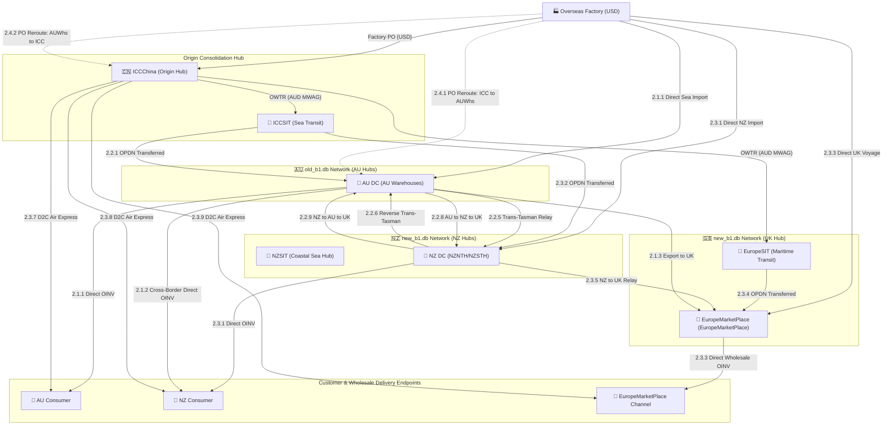
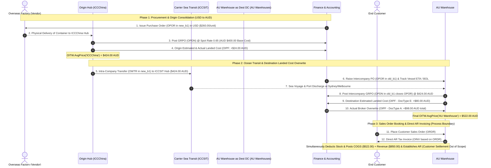

# SAP Business One Enterprise Process Hierarchy Map
## End-to-End Value Stream: Factory Procurement to Customer Order Fulfillment (`E2E-P2F`)

---

| Hierarchy Attribute | Specification |
| :--- | :--- |
| **Value Stream Code** | **`E2E-P2F`** |
| **Value Stream Name** | **Global Factory Procurement to Multi-Channel Customer Order Fulfillment** |
| **Architecture Standard** | **5-Level Process Classification Framework (PCF)** |
| **System Scope** | SAP Business One (SQL / HANA Architecture) |
| **Operating Databases** | [**`new_b1.db`**](file:///Users/billy/SAPB1_Sim/new_b1.db) (Multi-Warehouse Costing) & [**`old_b1.db`**](file:///Users/billy/SAPB1_Sim/old_b1.db) (Company-Level Valuation) |
| **Document Version** | **2.4.0 (Master Data Maintenance & Group Reporting Extensions - 20260905 (BL))** |

---

## 0. Enterprise Process Design Principles, Policies & Operational Rules

The enterprise supply chain architecture is governed by a three-tiered framework:
1. **Design Principles**: Foundational architectural tenets that define the operational philosophy.
2. **Design Policies (Governance)**: High-level management mandates that state **what** standard must be achieved and **why**.
3. **Operational Rules (Execution)**: Precise **"If–Then"** system logic and database validations that dictate **how** each transaction is executed in SAP Business One.

```
┌────────────────────────────────────────────────────────────────────────────────────────────────────────┐
│                        GOVERNANCE HIERARCHY: PRINCIPLES → POLICIES → RULES                             │
├────────────────────────────────────────────────────────────────────────────────────────────────────────┤
│ 1. DESIGN PRINCIPLES (Architectural Philosophy)                                                        │
│    • Currency Isolation: Shield domestic ledgers from foreign currency shifts.                         │
│    • Perpetual Custody: Zero "blind transit" periods on enterprise balance sheets.                     │
│    • Zero Profit Distortion: Transfer intercompany stock at actual cost without artificial margins.     │
│    • Zero-ODLN & Direct Invoicing: Universal Direct AR Invoicing (OINV on ORDR); Zero ODLN outbound.   │
│    • Two-Stage Landed Cost: Mandatory provisional estimate at GRPO followed by actual invoice overwrite│
│    • Standard Step Naming: "[Step]: [Role] Action/Doc @ Location → [Milestone/Outcome]" (e.g. 2.2.1.1)  │
│    • Role-Based RACI Governance: Strict functional segregation across Purchasing, Logistics & Finance. │
├────────────────────────────────────────────────────────────────────────────────────────────────────────┤
│ 2. DESIGN POLICIES (Strategic Mandates & Governance Standards)                                         │
│    • POLICY 1: Factory Purchase Orders Strictly in USD (Foreign Currency Isolation)                   │
│    • POLICY 2: Functional Currency (AUD) for All Downstream Documents & International Transfers        │
│    • POLICY 3: Mandatory In-Transit (SIT) Warehouse for Intercompany Supply Network Movements          │
│    • POLICY 4: Intercompany Goods Issue from SIT Synchronized with Destination GRPO at Source MWAG     │
│    • POLICY 5: Mandatory Two-Stage Landed Cost Accrual (OIPF 'E') & Actual Overwrite (OIPF 'A')        │
│    • POLICY 6: Universal Direct AR Invoicing & Zero Outbound Delivery Notes (Customer Settlement OOS)   │
│    • POLICY 7: Mandatory Inventory Transfer Request (OWTQ) & Picking for Movements to SIT (OWTR)       │
│    • POLICY 8: Zero-ODLN Architecture for Intra-Company & Cross-Database Transfers                     │
│    • POLICY 9: Operational RACI Governance: Role Accountability & Document Segregation                 │
├────────────────────────────────────────────────────────────────────────────────────────────────────────┤
│ 3. OPERATIONAL RULES (Technical Execution & System Logic)                                              │
│    • RULE 1.1: IF Doc = OPOR AND Vendor = Factory THEN DocCur = 'USD' AND Lock PriceFC.               │
│    • RULE 2.1: IF Doc = OPDN THEN Base_AUD = PriceFC / 0.65 (Spot FX applied at GRPO posting date).    │
│    • RULE 3.1: IF Movement = Inter-Node Transfer THEN Route via SIT (Dr 100050 SIT / Cr 100040).      │
│    • RULE 4.1: IF Transfer = Cross-DB Intercompany THEN Origin new_b1 posts OIGE out from ICCSIT       │
│                (Dr 110020 / Cr 100050) ↔ Dest old_b1 posts OPDN at AU DC (Dr 100010 / Cr 200030).      │
│    • RULE 5.1: IF Doc = OPDN THEN Post OIPF 'E' (Dr Inventory / Cr 200050); WHEN Invoices Arrive THEN │
│                Post OIPF 'A' (Dr 200050 / Dr/Cr Inventory Variance / Cr 200010 AP) to Net 200050 to $0.│
│    • RULE 6.1: IF Order = Sales Fulfillment THEN Base OINV Directly on ORDR (Customer Settlement OOS). │
│                Never issue standalone ODLN under any circumstances.                                    │
│    • RULE 7.1: IF Transfer = Whs to SIT THEN Create OWTQ -> Warehouse Picks -> Post OWTR based on OWTQ│
│                (Dr 100050 SIT / Cr 100040 Whs, Moving OnHand to SIT & Clearing IsCommited).           │
│    • RULE 8.1: Single-DB = OWTQ → OWTR; Cross-DB = OIGE (ICCSIT) ↔ OPDN (AU DC); Customer = Direct OINV│
│    • RULE 9.1: [Purchasing] = OPOR (All POs) & OWTQ (All Transfer Requests);                          │
│                [Logistics] = All Material Movements (OIGE, OPDN, OWTR) & Direct OINV Creation (Dispatch);│
│                [Finance] = All Cost Accounting, OIPF Landed Costs, Revenue/COGS Review & G/L Recon.     │
└────────────────────────────────────────────────────────────────────────────────────────────────────────┘
```

### 0.1 Enterprise RACI Governance Matrix (Operational Responsibility & Document Segregation)

The enterprise enforces strict separation of duties and deterministic document ownership across five key functional roles:
* **`[Purchasing]`**: Accountable & Responsible for all Purchase Orders (`OPOR` in USD and AUD) and all Inventory / Intercompany Transfer Requests (`OWTQ`).
* **`[Logistics]`**: Accountable & Responsible for all material movements, physical picking, staging, loading, Goods Issue (`OIGE`), Goods Receipt POs (`OPDN`), Inventory Transfers (`OWTR`), and **creating Direct AR Tax Invoices (`OINV`) directly based on Sales Orders (`ORDR`) as part of the logistics process confirming order dispatch**.
* **`[Finance]`**: Accountable & Responsible for all Cost Accounting, Landed Cost accruals (`OIPF 'E'`) and actual overwrites (`OIPF 'A'`), Revenue/COGS accounting verification, and General Ledger reconciliations (`G/L 200050`, `G/L 100050`, `G/L 110020`, `OJDT`).
* **`[Sales]`**: Accountable & Responsible for Customer Sales Orders (`ORDR`) and reservation of available stock.
* **`[Corporate Treasury]`**: Accountable & Responsible for Customer Payment Settlement (`ORCT`) and bank reconciliations (strictly **OUT OF SCOPE** of operational supply chain).

| Functional Domain & Activity | ERP Document (Table) | Currency | Accountable & Responsible (A/R) | Consulted (C) & Informed (I) | Operational Responsibility Scope & Transactional Boundary |
| :--- | :--- | :--- | :--- | :--- | :--- |
| **Factory Purchase Orders** | `OPOR` (`POR1`) | **USD** | **`[Purchasing]`** | `[Logistics]` (C)<br>`[Finance]` (I)<br>`[Sales]` (I) | Issues factory purchase orders in USD FOB to commit vendor manufacturing. Locks foreign price list (`PriceFC`) without generating financial ledger entries until receipt. |
| **Intercompany Inbound POs** | `OPOR` (`POR1`) | **AUD** | **`[Purchasing]`** | `[Logistics]` (C)<br>`[Finance]` (I) | Issues destination intercompany POs tracking ocean container shipments & B/L. Establishes inbound on-order quantity commitment in destination ERP database. |
| **Intercompany & Stock Transfer Requests** | `OWTQ` (`WTQ1`) | **AUD** | **`[Purchasing]`** | `[Logistics]` (R)<br>`[Finance]` (I) | Generates all Inventory Transfer Requests (`OWTQ`) for intercompany stock rebalancing. Sets source/destination warehouses and commits inventory (`OITW.IsCommited`) for warehouse picking queue. |
| **Warehouse Picking & Staging** | `OWTQ` / Pick List | **N/A** | **`[Logistics]`** | `[Purchasing]` (I)<br>`[Finance]` (I) | Executes physical bin/aisle picking, quantity verification, export carton labeling, and container staging against active `OWTQ` transfer requests. |
| **Inventory Transfers to In-Transit (SIT)** | `OWTR` (`WTR1`) | **AUD** | **`[Logistics]`** | `[Purchasing]` (I)<br>`[Finance]` (I) | Posts Inventory Transfer (`OWTR`) based on completed `OWTQ`. Executes physical dispatch and balance sheet transfer: **Dr 100050 SIT Asset / Cr 100040 Warehouse Stock**. |
| **Material Movement: Goods Issue from SIT** | `OIGE` (`IGE1`) | **AUD** | **`[Logistics]`** | `[Purchasing]` (I)<br>`[Finance]` (C/I) | Posts Goods Issue (`OIGE`) discharging stock out from SIT (`ICCSIT`) upon ocean port arrival / vessel unlading. Synchronizes with destination GRPO; origin posts **Dr 110020 Intercompany AR / Cr 100050 SIT Asset**. |
| **Material Movement: Inbound Goods Receipt** | `OPDN` (`PDN1`) | **AUD** | **`[Logistics]`** | `[Purchasing]` (I)<br>`[Finance]` (C/I) | Receives physical delivery at warehouse dock, performs count/quality inspection, and posts Goods Receipt PO (`OPDN`). Posts **Dr 100010/100040 Inventory Asset / Cr 200060/200030 Goods Receipt Clearing/AP**. |
| **Provisional Landed Cost Accruals** | `OIPF` (DocType `'E'`) | **AUD** | **`[Finance]`** | `[Purchasing]` (C)<br>`[Logistics]` (C) | Posts Estimated Landed Cost (`OIPF` DocType `'E'`) immediately following every `OPDN`. Accrues estimated freight, duty, and wharfage into inventory moving average (`OITW.AvgPrice`): **Dr 100010/100040 / Cr 200050**. |
| **Actual Landed Cost Overwrite & Cost Accounting** | `OIPF` (DocType `'A'`) | **AUD** | **`[Finance]`** | `[Purchasing]` (I)<br>`[Logistics]` (C) | Matches actual customs broker & freight carrier AP invoices (`OPCH`). Posts Actual Landed Cost (`OIPF` DocType `'A'`) to overwrite provisional estimates, adjust inventory valuation, and reconcile **G/L 200050 to exactly $0.00**. |
| **Customer Sales Order Booking** | `ORDR` (`RDR1`) | **AUD** | **`[Sales]`** | `[Purchasing]` (I)<br>`[Logistics]` (I)<br>`[Finance]` (I) | Books customer sales order (`ORDR`), allocating available finished goods stock (`OITW.IsCommited`). |
| **Direct AR Invoicing & Order Dispatch Confirmation** | `OINV` (`INV1`) | **AUD** | **`[Logistics]`** | `[Finance]` (A/I - Accounting & Receivables)<br>`[Sales]` (I) | Creates & posts Direct AR Tax Invoice (`OINV`) directly against Sales Order (`ORDR`) as part of the physical logistics process confirming order dispatch. Concurrently relieves inventory (`100010`), triggers automatic COGS (`500010`) and Revenue (`400010`) recognition, and establishes AR (`110010`) in unified journal entry. |
| **Customer Payment Settlement & Banking** | `ORCT` (`RCT1`) | **AUD** | **`[Corporate Treasury]`** *(Out of Scope)* | `[Finance]` (C)<br>`[Purchasing]` (I)<br>`[Logistics]` (I) | Manages incoming customer payments, bank reconciliation, and receivable collections. Explicitly **OUT OF SCOPE** of operational P2F supply chain value stream. |

---

---

## 1. Five-Level Process Hierarchy Framework Architecture

```
┌────────────────────────────────────────────────────────────────────────────────────────────────────────┐
│                              5-LEVEL PROCESS ARCHITECTURE HIERARCHY                                    │
├────────────────────────────────────────────────────────────────────────────────────────────────────────┤
│ LEVEL 1: Enterprise Value Stream (End-to-End Enterprise Chain)                                         │
│   └── E2E-P2F: Global Factory Procurement to Customer Order Fulfillment                               │
├────────────────────────────────────────────────────────────────────────────────────────────────────────┤
│ LEVEL 2: Supply Network Node Groups & Operational Domains (6 Node Groups)                              │
│   ├── 2.1 [SNG-AU-ONLY]: old_b1.db Only (AU Domestic DC Network - 3 Routes)                            │
│   ├── 2.2 [SNG-HYBRID]: old_b1.db + new_b1.db (Cross-System Intercompany & Trans-Tasman - 11 Routes)   │
│   ├── 2.3 [SNG-NEW-ONLY]: new_b1.db Only (International Multi-Leg, NZ, UK & D2C Network - 9 Routes)    │
│   ├── 2.4 [SNG-EXCEPTION]: Exception Management & Routing Modification Workflows - 3 Routes            │
│   ├── 2.5 [SNG-RECONCILIATION]: Enterprise Financial & Landed Cost Reconciliation - 3 Routes           │
│   └── 2.6 [MD-MAINTENANCE]: SAP B1 Master Data Maintenance (Items & Business Partners) - 2 Routes      │
├────────────────────────────────────────────────────────────────────────────────────────────────────────┤
│ LEVEL 3: Supply Network Route Groups & Lifecycle Control Processes (31 Master Processes)              │
│   ├── 2.1.1 - 2.1.3: Domestic AU & Direct Export Routes (old_b1.db)                                    │
│   ├── 2.2.1 - 2.2.11: Consolidated Trans-Tasman & Global Intercompany Routes (Hybrid DBs)              │
│   ├── 2.3.1 - 2.3.9: Direct & Consolidated NZ, EuropeMarketPlace & D2C Drop-Ship Routes (new_b1.db)           │
│   ├── 2.4.1 - 2.4.3: PO Reroutes & Intercompany Transfer Quantity Discrepancies                        │
│   ├── 2.5.1 - 2.5.3: Perpetual Inventory, Landed Cost Clearing & Group Report Reconciliation          │
│   └── 2.6.1 - 2.6.2: SAP B1 Inventory Item & Business Partner Master Data Maintenance                 │
├────────────────────────────────────────────────────────────────────────────────────────────────────────┤
│ LEVEL 4: Process Steps per Level 3 Process (Sequential Procedural Milestones)                          │
│   └── Explicit sub-steps (e.g. 2.1.1.1 - 2.1.1.6, 2.2.1.1 - 2.2.1.11, 2.4.1.1 - 2.4.3.4, 2.5.1.1)    │
│       executed across OPOR, OPDN, OIPF, OWTQ, OWTR, OIGE, ORDR, OINV, and OJDT.                         │
├────────────────────────────────────────────────────────────────────────────────────────────────────────┤
│ LEVEL 5: Transaction Artifacts, System Tables & GL Journal Postings                                    │
│   └── Database Tables: OPOR/POR1, OPDN/PDN1, OIPF/IPF1/IPF2, OWTR/WTR1, ORDR/RDR1, OINV/INV1, OJDT/JDT1│
│       GL Postings: Inventory (100010/100040), SIT (100050), LC Clearing (200050), COGS (500010)       │
└────────────────────────────────────────────────────────────────────────────────────────────────────────┘
```

---

## 2. Level 2 (Node Groups) & Level 3 (Route Groups) Master Topology



---

### Master Supply Network Routing & Control Matrix (31 Process Variants — Last Updated 20260905 BL)

| Level 2 Process Group | Level 3 Code | Process Pathway & Title | Operating DBs | Origin Node | Transit Node | Destination Node | Primary Valuation & Costing Mechanism |
| :--- | :---: | :--- | :---: | :--- | :--- | :--- | :--- |
| **GROUP 2.1: old_b1.db ONLY (AU DOMESTIC DC NETWORK) — 3 Route Process Variants** | | | | | | | |
| `2.1 [SNG-AU-ONLY]` | **`2.1.1`** | **Factory → AU Warehouse → AU Consumer** | `old_b1.db` | Factory | Direct B/L | `AU Warehouses` | Two-Stage Destination Landed Cost (`OIPF 'E'` Accrual + `'A'` Overwrite). |
| `2.1 [SNG-AU-ONLY]` | **`2.1.2`** | **Factory → AU Warehouse → NZ Consumer** | `old_b1.db` | Factory | Direct Freight | `AU Warehouses` | Two-Stage AU Inward Landed Cost + Cross-Border Direct Invoicing. |
| `2.1 [SNG-AU-ONLY]` | **`2.1.3`** | **Factory → AU Warehouse → EuropeMarketPlace** | `old_b1.db` | Factory | Export Transit | `EuropeMarketPlace (EuropeMarketPlace)` | Two-Stage AU Inward Landed Cost + Long-Haul UK Freight Stack. |
| **GROUP 2.2: HYBRID DBs (CROSS-SYSTEM INTERCOMPANY & TRANS-TASMAN RELAY) — 11 Route Process Variants** | | | | | | | |
| `2.2 [SNG-HYBRID]` | **`2.2.1`** | **Factory → ICC → AU Warehouse → AU Consumer** | `new_b1 + old_b1` | `ICCChina` | `ICCSIT` | `AU Warehouses` | Two-Stage Stacked Cost (Origin LC + Dest LC Overwrite). |
| `2.2 [SNG-HYBRID]` | **`2.2.2`** | **Factory → ICC → AU Warehouse → NZ Consumer** | `new_b1 + old_b1` | `ICCChina` | `ICCSIT` | `AU Warehouses` | Two-Stage Stacked Cost at AU DC + Direct Export OINV. |
| `2.2 [SNG-HYBRID]` | **`2.2.3`** | **Factory → ICC → AU Whs → NZ Whs → NZ Consumer** | `new_b1 + old_b1` | `ICCChina` | `ICCSIT + NZSIT` | `NZNTH/NZSTH (NZ whs)` | Triple-Stacked Cost: Origin LC + AU Landed + NZ Landed. |
| `2.2 [SNG-HYBRID]` | **`2.2.4`** | **Factory → ICC → NZ Whs → AU Whs → AU Consumer** | `new_b1 + old_b1` | `ICCChina` | `ICCSIT + NZSIT` | `AU Warehouses` | Triple-Stacked Cost: Origin LC + NZ Landed + AU Landed. |
| `2.2 [SNG-HYBRID]` | **`2.2.5`** | **Factory → AU Warehouse → NZ Warehouse → NZ Consumer** | `new_b1 + old_b1` | `AU Warehouse` | `NZSIT` | `NZNTH/NZSTH (NZ whs)` | Direct AU Landed Cost + Trans-Tasman Relay at AU MWAG. |
| `2.2 [SNG-HYBRID]` | **`2.2.6`** | **Factory → NZ Warehouse → AU Warehouse → AU Consumer** | `new_b1 + old_b1` | `NZNTH` | `NZSIT` | `AU Warehouses` | Direct NZ Landed Cost + Trans-Tasman Relay at NZ MWAG. |
| `2.2 [SNG-HYBRID]` | **`2.2.7`** | **Factory → ICC → AU Warehouse → EuropeMarketPlace** | `new_b1 + old_b1` | `ICCChina` | `ICCSIT + EuropeSIT` | `EuropeMarketPlace (EuropeMarketPlace)` | Two-Stage Stacked at AU + Long-Haul UK Export Freight. |
| `2.2 [SNG-HYBRID]` | **`2.2.8`** | **Factory → AU Warehouse → NZ Warehouse → EuropeMarketPlace** | `new_b1 + old_b1` | `AU Warehouse` | `NZSIT + EuropeSIT` | `EuropeMarketPlace (EuropeMarketPlace)` | AU Landed + Trans-Tasman Relay + UK Re-Export Freight. |
| `2.2 [SNG-HYBRID]` | **`2.2.9`** | **Factory → NZ Warehouse → AU Warehouse → EuropeMarketPlace** | `new_b1 + old_b1` | `NZNTH` | `NZSIT + EuropeSIT` | `EuropeMarketPlace (EuropeMarketPlace)` | NZ Landed + Trans-Tasman Relay + UK Re-Export Freight. |
| `2.2 [SNG-HYBRID]` | **`2.2.10`**| **Factory → ICC → AU Whs → NZ Whs → EuropeMarketPlace** | `new_b1 + old_b1` | `ICCChina` | `ICCSIT+NZSIT+EuropeSIT` | `EuropeMarketPlace (EuropeMarketPlace)` | Multi-Leg Stacked Costing Across 3 Intercompany Entities. |
| `2.2 [SNG-HYBRID]` | **`2.2.11`**| **Factory → ICC → NZ Whs → AU Whs → EuropeMarketPlace** | `new_b1 + old_b1` | `ICCChina` | `ICCSIT+NZSIT+EuropeSIT` | `EuropeMarketPlace (EuropeMarketPlace)` | Multi-Leg Stacked Costing Across 3 Intercompany Entities. |
| **GROUP 2.3: new_b1.db ONLY (INTERNATIONAL MULTI-LEG, NZ, UK & D2C NETWORK) — 9 Route Process Variants** | | | | | | | |
| `2.3 [SNG-NEW-ONLY]`| **`2.3.1`** | **Factory → NZ Warehouse → NZ Consumer** | `new_b1.db` | Factory | Direct B/L | `NZNTH/NZSTH (NZ whs)` | Two-Stage NZ Destination Landed Cost (`OIPF 'E'` Accrual + `'A'` Overwrite). |
| `2.3 [SNG-NEW-ONLY]`| **`2.3.2`** | **Factory → ICC → NZ Warehouse → NZ Consumer** | `new_b1.db` | `ICCChina` | `ICCSIT + NZSIT` | `NZNTH/NZSTH (NZ whs)` | Two-Stage Stacked Cost (`$424 + $522 + $545 AUD`). |
| `2.3 [SNG-NEW-ONLY]`| **`2.3.3`** | **Factory → EuropeMarketPlace** | `new_b1.db` | Factory | Direct Voyage | `EuropeMarketPlace (EuropeMarketPlace)` | Two-Stage UK Destination Landed Cost (`OIPF 'E'` Accrual + `'A'` Overwrite). |
| `2.3 [SNG-NEW-ONLY]`| **`2.3.4`** | **Factory → ICC → EuropeMarketPlace** | `new_b1.db` | `ICCChina` | `EuropeSIT` | `EuropeMarketPlace (EuropeMarketPlace)` | Two-Stage Stacked Cost (`$424 + $424 + $560 AUD`). |
| `2.3 [SNG-NEW-ONLY]`| **`2.3.5`** | **Factory → NZ Warehouse → EuropeMarketPlace** | `new_b1.db` | `NZNTH` | `EuropeSIT` | `EuropeMarketPlace (EuropeMarketPlace)` | NZ Inbound Landed Cost + UK Maritime Re-Export Freight. |
| `2.3 [SNG-NEW-ONLY]`| **`2.3.6`** | **Factory → ICC → NZ Warehouse → EuropeMarketPlace** | `new_b1.db` | `ICCChina` | `ICCSIT + EuropeSIT` | `EuropeMarketPlace (EuropeMarketPlace)` | Two-Stage Stacked at NZ (`$522`) + UK Freight into EuropeMarketPlace (`$560 AUD`). |
| `2.3 [SNG-NEW-ONLY]`| **`2.3.7`** | **Factory → ICC → AU Consumer (D2C Air Express)** | `new_b1.db` | `ICCChina` | Air Courier | AU Consumer | Origin Staging & Drop-Ship Landed Cost (Direct Air Courier). |
| `2.3 [SNG-NEW-ONLY]`| **`2.3.8`** | **Factory → ICC → NZ Consumer (D2C Air Express)** | `new_b1.db` | `ICCChina` | Air Courier | NZ Consumer | Origin Staging & Drop-Ship Landed Cost (Direct Air Courier). |
| `2.3 [SNG-NEW-ONLY]`| **`2.3.9`** | **Factory → ICC → UK Consumer (D2C Air Express)** | `new_b1.db` | `ICCChina` | Air Courier | UK Consumer | Origin Staging & Drop-Ship Landed Cost (Direct Air Courier). |
| **GROUP 2.4: EXCEPTION PROCESSES (PO REROUTES & CONTAINER DISCREPANCIES) — 3 Process Variants** | | | | | | | |
| `2.4 [SNG-EXCEPTION]`| **`2.4.1`** | **PO Changes from ICC to AU Warehouse** | `new_b1 → old_b1` | `ICCChina` | Direct Port | `AU Warehouses` | Cancels `new_b1` PO; re-issues direct import PO in `old_b1.db`. |
| `2.4 [SNG-EXCEPTION]`| **`2.4.2`** | **PO Changes from AU Warehouse to ICC** | `old_b1 → new_b1` | `AU Warehouse` | `ICCSIT` | `ICCChina + AU` | Cancels `old_b1` PO; establishes multi-leg ICC PO in `new_b1.db`. |
| `2.4 [SNG-EXCEPTION]`| **`2.4.3`** | **Intercompany Transfer Quantity Over/Under-Supply** | `new_b1 + old_b1` | `ICCSIT` | Wharf / Port | Any warehouses | Resolves variance: partial GRPO, transit loss write-off, or surplus receipt. |
| **GROUP 2.5: RECONCILIATION PROCESSES (FINANCIAL & LANDED COST AUDIT) — 3 Process Variants** | | | | | | | |
| `2.5 [SNG-RECONCILIATION]`| **`2.5.1`** | **Inventory Valuation Reconciliation** | `new_b1 + old_b1` | All Hubs | In-Transit | Balance Sheet | Monthly audit: Warehouse subledger (`OITW`) vs G/L Control (`100010`/`100050`). |
| `2.5 [SNG-RECONCILIATION]`| **`2.5.2`** | **Landed Cost Entries Reconciliation** | `new_b1 + old_b1` | All Hubs | Accrual Clearing | `G/L 200050` | Reconciles Estimated (`OIPF 'E'`) vs Actual (`OIPF 'A'`) broker invoices to $0. |
| `2.5 [SNG-RECONCILIATION]`| **`2.5.3`** | **Group Report Reconciliation** | `new_b1 + old_b1` | All Hubs | Consolidated Ledgers | Group Financial Statements | Intercompany elimination, group inventory valuation consolidation, and multi-entity profit reporting. |
| **GROUP 2.6: MASTER DATA MAINTENANCE — 2 Process Variants** | | | | | | | |
| `2.6 [MD-MAINTENANCE]`| **`2.6.1`** | **SAP B1 Inventory Item Master Maintenance** | `new_b1 + old_b1` | Master Setup | Warehouse Bins | Item Master Records | Item Code creation, valuation method setup (`OITM` vs `OITW`), purchasing/sales UoM, and barcode cataloging. |
| `2.6 [MD-MAINTENANCE]`| **`2.6.2`** | **SAP B1 Business Partner Master Maintenance** | `new_b1 + old_b1` | Master Setup | Commercial Ledger | BP Master Records | Vendor/Customer setup (`OCRD`/`CRD1`), currency assignment (USD/AUD/NZD/GBP), payment terms (`OCTG`), and tax group mapping. |

---

## 3. Level 3: Process Variants Operational Alignment

```
E2E-P2F: Global Factory Procurement to Customer Order Fulfillment
 │
 ├── [PV-ICC-SLC-01] Multi-Leg In-Transit Stacked Landed Cost Lifecycle (Flagship)
 │    ├── Operating Route Groups: 2.2.1, 2.2.2, 2.2.3, 2.2.4, 2.3.2, 2.3.4, 2.3.6
 │    ├── Logistics: Multi-Leg (Factory → ICCChina → SIT Hubs → Destination Regional DCs)
 │    ├── Valuation: Two-Stage Stacked Landed Cost (Origin Est + Dest Est/Actual Overwrite in AUD)
 │    └── Fulfillment: Regional Stocked Delivery to Domestic Consumer / Wholesale Channel
 │
 ├── [PV-DIR-DLC-02] Direct Factory Import to Central DC
 │    ├── Operating Route Groups: 2.1.1, 2.3.1, 2.3.3
 │    ├── Logistics: Single-Leg Container Import (Factory → AUWHS / NZNTH / EuropeMarketPlace)
 │    ├── Valuation: Single-Stage Destination Landed Cost (OIPF DocType A)
 │    └── Fulfillment: Central DC to Domestic Customer (Direct AR Invoice at AU DC)
 │
 ├── [PV-DPS-DIR-03] Factory Direct Drop-Shipment to Consumer (D2C Air Express)
 │    ├── Operating Route Groups: 2.3.7, 2.3.8, 2.3.9
 │    ├── Logistics: Direct Air Express / Courier from ICC Origin Hub to Consumer
 │    ├── Valuation: Non-Stocked Passthrough COGS / Direct Landed Cost Allocation
 │    └── Fulfillment: Virtual Goods Receipt & Immediate Outward Delivery
 │
 ├── [PV-CRD-XDK-04] In-Transit Cross-Docking Pre-Allocated Delivery
 │    ├── Operating Route Groups: 2.2.1, 2.3.2
 │    ├── Logistics: Port Wharf Staging Cross-Dock (Container Destuffing → Rapid Courier)
 │    ├── Valuation: Accelerated Estimated Landed Cost (OIPF DocType E)
 │    └── Fulfillment: 24-Hour Expedited Delivery upon Vessel Discharge
 │
 ├── [PV-ICB-B2B-05] Intercompany Back-to-Back Entity Transfer
 │    ├── Operating Route Groups: 2.1.2, 2.2.2, 2.2.5, 2.2.6
 │    ├── Logistics: Entity A sells & ships cross-border to Entity B / Trans-Tasman Consumer
 │    ├── Valuation: Intercompany Transfer Price at Source MWAG + Destination Customs Clearance
 │    └── Fulfillment: Trans-Tasman Freight to NZ Consumer
 │
 ├── [PV-EXC-CHG-08] Exception Handling & Routing Reroute Workflows
 │    ├── Operating Groups: 2.4.1, 2.4.2, 2.4.3
 │    ├── Logistics: Pre-shipment destination changes, PO transfer across legal DBs, and container variances
 │    ├── Valuation: Commitment cancellation, FX re-pegging, and discrepancy inventory adjustments
 │    └── Governance: Dual-system cancellation/re-issuance audit trail in OPOR/POR1 and OIGE/OIGN
 │
 └── [PV-RCN-AUD-09] Enterprise Financial & Landed Cost Reconciliation
      ├── Operating Groups: 2.5.1, 2.5.2
      ├── Scope: Periodic balance sheet audit, in-transit asset validation, and landed cost clearing
      ├── Valuation: Subledger OITW/OINM reconciliation against G/L 100010, 100050, and 200050
      └── Governance: Variance write-offs, exchange gain/loss settlements, and closed-loop sign-off
```

---

## 4. Level 4: Process Steps per Level 3 Process (Detailed Route Execution Matrix)

Level 4 defines the sequential **Procedural Steps & Transaction Milestones** executed within SAP Business One for each of the 28 Level 3 Route Groups.

All step names strictly adhere to the standard enterprise naming convention: **`[Step Code]: [Role] Action/Verb Document (DocType) @ Location → [Milestone/Outcome]`**, enforcing Policy 6 (Universal Direct AR Invoicing without standalone ODLN), Policy 7 (OWTQ picking for SIT transfers), Policy 5 (Two-stage landed costing), and Policy 9 (Canonical RACI Role Segregation).

---

### 4.SECTION 2.1: old_b1.db ONLY (AU DOMESTIC DC NETWORK) — 3 Routes

#### Process 2.1.1: Factory → AU Warehouse → AU Consumer (Direct AU Import & Domestic Direct Invoicing)

1. **`2.1.1.1`: [Purchasing] Issue Direct Factory PO in USD (OPOR) @ AU Warehouse → [Vendor Production Commitment]**:
   - **SAP B1 Document & Database**: `OPOR / POR1` in `old_b1.db` (`AU Warehouse`)
   - **OnHand Snapshot (`OITW.OnHand`)**: None (OnHand = 0) [At Vendor Site]
   - **Inventory Valuation Calculation**:  • Direct PO issued in USD (DocCur='USD', PriceFC=$260.00 USD) • POR1.OnOrder = +100 units at AU Warehouse • Unit Valuation: $0.00 (Purchase commitment)
   - **Chart of Accounts (CoA) G/L Entry (`OJDT`)**: Off-Balance Sheet Purchase Commitment (No financial journal entries in OJDT)

1. **`2.1.1.2`: [Logistics] Post Inward Factory GRPO (OPDN) @ AU Warehouse → [Origin Spot FX Base Cost Capitalization]**:
   - **SAP B1 Document & Database**: `OPDN / PDN1` in `old_b1.db` (`AU Warehouse`)
   - **OnHand Snapshot (`OITW.OnHand`)**: AU Warehouse (old_b1.db) [OnHand = 100]
   - **Inventory Valuation Calculation**:  • Spot FX conversion: $260.00 USD / 0.65 DocRate = $400.00 AUD • Initial OITW.AvgPrice('AU Warehouse') = $400.00 AUD • PDN1.LineTotal = $40,000.00 AUD
   - **Chart of Accounts (CoA) G/L Entry (`OJDT`)**: Dr 100010 (Inventory Asset - AU Warehouse) $40,000.00 Cr 200010 (Goods Receipt Allocation Clearing) $40,000.00

1. **`2.1.1.3`: [Finance] Accrue Destination Estimated Landed Cost (OIPF 'E') @ AU Warehouse → [Provisional Ocean Freight & Tariff Allocation]**:
   - **SAP B1 Document & Database**: `OIPF (DocType 'E')` in `old_b1.db` (`AU Warehouse`)
   - **OnHand Snapshot (`OITW.OnHand`)**: AU Warehouse (old_b1.db) [OnHand = 100]
   - **Inventory Valuation Calculation**:  • Inbound provisional ocean freight, AU duty & wharfage (+ $122.00 AUD/unit) • Provisional OITW.AvgPrice('AU Warehouse') = $400 + $122 = $522.00 AUD • Accrued against G/L 200050
   - **Chart of Accounts (CoA) G/L Entry (`OJDT`)**: Dr 100010 (Inventory Asset - AU Warehouse) $12,200.00 Cr 200050 (Estimated Landed Cost Clearing) $12,200.00

1. **`2.1.1.4`: [Finance] Overwrite Destination Actual Landed Cost (OIPF 'A') @ AU Warehouse → [Final Stock Valuation & G/L 200050 Reconciled]**:
   - **SAP B1 Document & Database**: `OIPF (DocType 'A')` in `old_b1.db` (`AU Warehouse`)
   - **OnHand Snapshot (`OITW.OnHand`)**: AU Warehouse (old_b1.db) [OnHand = 100]
   - **Inventory Valuation Calculation**:  • Overwrites provisional estimate upon carrier & customs broker invoice arrival • Final OITW.AvgPrice('AU Warehouse') locked at $522.00 AUD • Reconciles G/L 200050 clearing balance to $0.00
   - **Chart of Accounts (CoA) G/L Entry (`OJDT`)**: Dr 200050 (Estimated Landed Cost Clearing) $12,200.00 Cr 200010 (Carrier & Customs Broker AP) $12,200.00

1. **`2.1.1.5`: [Sales] Book Domestic Customer Sales Order (ORDR) @ AU Warehouse → [Finished Goods Inventory Allocation]**:
   - **SAP B1 Document & Database**: `ORDR / RDR1` in `old_b1.db` (`AU Warehouse`)
   - **OnHand Snapshot (`OITW.OnHand`)**: AU Warehouse (old_b1.db) [Reserved: IsCommited = +100]
   - **Inventory Valuation Calculation**:  • Selling price = $850.00 AUD, stock reserved in AU Warehouse • Inventory unit cost remains $522.00 AUD
   - **Chart of Accounts (CoA) G/L Entry (`OJDT`)**: Sales Order Commitment (No financial journal entries in OJDT)

1. **`2.1.1.6`: [Logistics] Post Direct AR Tax Invoice (OINV) @ AU Warehouse → [Customer Dispatch & Revenue Recognition]**:
   - **SAP B1 Document & Database**: `OINV / INV1` in `old_b1.db` (`AU Warehouse`)
   - **OnHand Snapshot (`OITW.OnHand`)**: Customer Custody [AU Warehouse OnHand = 0]
   - **Inventory Valuation Calculation**:  • Created directly from ORDR (bypasses standalone ODLN) • Realized COGS: 100 x $522.00 = $52,200.00 AUD • Gross Revenue: $85,000 + GST ($8,500) = $93,500.00 AUD
   - **Chart of Accounts (CoA) G/L Entry (`OJDT`)**: Consolidated Inventory + Revenue Entry (OJDT): Dr 110010 (Accounts Receivable) $93,500.00 Dr 500010 (Cost of Goods Sold - COGS) $52,200.00 Cr 400010 (Sales Revenue) $85,000.00 Cr 200020 (GST Output Tax) $8,500.00 Cr 100010 (Inventory Asset - AU Warehouse) $52,200.00


#### Process 2.1.2: Factory → AU Warehouse → NZ Consumer (Trans-Tasman Cross-Border Direct Invoicing)

1. **`2.1.2.1`: [Purchasing] Issue Direct Factory PO in USD (OPOR) @ AU Warehouse → [Vendor Production Commitment]**:
   - **SAP B1 Document & Database**: `OPOR / POR1` in `old_b1.db` (`AU Warehouse`)
   - **OnHand Snapshot (`OITW.OnHand`)**: None (OnHand = 0) [At Vendor Site]
   - **Inventory Valuation Calculation**:  • Direct PO issued in USD (DocCur='USD', PriceFC=$260.00 USD) • POR1.OnOrder = +100 units at AU Warehouse • Unit Valuation: $0.00 (Purchase commitment)
   - **Chart of Accounts (CoA) G/L Entry (`OJDT`)**: Off-Balance Sheet Purchase Commitment (No financial journal entries in OJDT)

1. **`2.1.2.2`: [Logistics] Post Inward Factory GRPO (OPDN) @ AU Warehouse → [Origin Spot FX Base Cost Capitalization]**:
   - **SAP B1 Document & Database**: `OPDN / PDN1` in `old_b1.db` (`AU Warehouse`)
   - **OnHand Snapshot (`OITW.OnHand`)**: AU Warehouse (old_b1.db) [OnHand = 100]
   - **Inventory Valuation Calculation**:  • Spot FX conversion: $260.00 USD / 0.65 DocRate = $400.00 AUD • Initial OITW.AvgPrice('AU Warehouse') = $400.00 AUD • PDN1.LineTotal = $40,000.00 AUD
   - **Chart of Accounts (CoA) G/L Entry (`OJDT`)**: Dr 100010 (Inventory Asset - AU Warehouse) $40,000.00 Cr 200010 (Goods Receipt Allocation Clearing) $40,000.00

1. **`2.1.2.3`: [Finance] Accrue Destination Estimated Landed Cost (OIPF 'E') @ AU Warehouse → [Provisional Ocean Freight & Tariff Allocation]**:
   - **SAP B1 Document & Database**: `OIPF (DocType 'E')` in `old_b1.db` (`AU Warehouse`)
   - **OnHand Snapshot (`OITW.OnHand`)**: AU Warehouse (old_b1.db) [OnHand = 100]
   - **Inventory Valuation Calculation**:  • Inbound provisional ocean freight, AU duty & wharfage (+ $122.00 AUD/unit) • Provisional OITW.AvgPrice('AU Warehouse') = $400 + $122 = $522.00 AUD
   - **Chart of Accounts (CoA) G/L Entry (`OJDT`)**: Dr 100010 (Inventory Asset - AU Warehouse) $12,200.00 Cr 200050 (Estimated Landed Cost Clearing) $12,200.00

1. **`2.1.2.4`: [Finance] Overwrite Destination Actual Landed Cost (OIPF 'A') @ AU Warehouse → [Final Stock Valuation & G/L 200050 Reconciled]**:
   - **SAP B1 Document & Database**: `OIPF (DocType 'A')` in `old_b1.db` (`AU Warehouse`)
   - **OnHand Snapshot (`OITW.OnHand`)**: AU Warehouse (old_b1.db) [OnHand = 100]
   - **Inventory Valuation Calculation**:  • Overwrites provisional estimate upon broker invoice arrival • Final OITW.AvgPrice('AU Warehouse') locked at $522.00 AUD • Reconciles G/L 200050 clearing balance to $0.00
   - **Chart of Accounts (CoA) G/L Entry (`OJDT`)**: Dr 200050 (Estimated Landed Cost Clearing) $12,200.00 Cr 200010 (Carrier & Customs Broker AP) $12,200.00

1. **`2.1.2.5`: [Sales] Book Cross-Border Customer Sales Order (ORDR) @ AU Warehouse → [NZ Export Stock Allocation]**:
   - **SAP B1 Document & Database**: `ORDR / RDR1` in `old_b1.db` (`AU Warehouse`)
   - **OnHand Snapshot (`OITW.OnHand`)**: AU Warehouse (old_b1.db) [Reserved: IsCommited = +100]
   - **Inventory Valuation Calculation**:  • Cross-border export price = $920.00 AUD (incl trans-tasman courier) • Stock reserved in AU Warehouse; Unit valuation = $522.00 AUD
   - **Chart of Accounts (CoA) G/L Entry (`OJDT`)**: Sales Order Commitment (No financial journal entries in OJDT)

1. **`2.1.2.6`: [Logistics] Post Direct Export AR Tax Invoice (OINV) @ AU Warehouse → [Cross-Border Dispatch & Zero-Rated Revenue Recognition]**:
   - **SAP B1 Document & Database**: `OINV / INV1` in `old_b1.db` (`AU Warehouse`)
   - **OnHand Snapshot (`OITW.OnHand`)**: Customer Custody [AU Warehouse OnHand = 0]
   - **Inventory Valuation Calculation**:  • Created directly from ORDR (bypasses standalone ODLN) • Realized COGS: 100 x $522.00 = $52,200.00 AUD • Zero-rated export revenue (GST-free) = $92,000.00 AUD
   - **Chart of Accounts (CoA) G/L Entry (`OJDT`)**: Consolidated Inventory + Export Revenue Entry (OJDT): Dr 110010 (Accounts Receivable - Export) $92,000.00 Dr 500010 (Cost of Goods Sold - COGS) $52,200.00 Cr 400010 (Sales Revenue - Cross-Border) $92,000.00 Cr 100010 (Inventory Asset - AU Warehouse) $52,200.00


#### Process 2.1.3: Factory → AU Warehouse → EuropeMarketPlace (AU Hub Long-Haul Direct Wholesale Invoicing)

1. **`2.1.3.1`: [Purchasing] Issue Direct Factory PO in USD (OPOR) @ AU Warehouse → [Vendor Production Commitment]**:
   - **SAP B1 Document & Database**: `OPOR / POR1` in `old_b1.db` (`AU Warehouse`)
   - **OnHand Snapshot (`OITW.OnHand`)**: None (OnHand = 0)
   - **Inventory Valuation Calculation**:  • Direct factory PO in USD ($260.00 USD @ 0.65 rate)
   - **Chart of Accounts (CoA) G/L Entry (`OJDT`)**: Off-Balance Sheet Commitment

1. **`2.1.3.2`: [Logistics] Post Inward Factory GRPO (OPDN) @ AU Warehouse → [Origin Spot FX Base Cost Capitalization]**:
   - **SAP B1 Document & Database**: `OPDN / PDN1` in `old_b1.db` (`AU Warehouse`)
   - **OnHand Snapshot (`OITW.OnHand`)**: AU Warehouse [OnHand = 100]
   - **Inventory Valuation Calculation**:  • Base inventory cost = $400.00 AUD
   - **Chart of Accounts (CoA) G/L Entry (`OJDT`)**: Dr 100010 ($40,000) / Cr 200010 ($40,000)

1. **`2.1.3.3`: [Finance] Accrue AU Inward Estimated Landed Cost (OIPF 'E') @ AU Warehouse → [Provisional Ocean Freight Allocation]**:
   - **SAP B1 Document & Database**: `OIPF (DocType 'E')` in `old_b1.db` (`AU Warehouse`)
   - **OnHand Snapshot (`OITW.OnHand`)**: AU Warehouse [OnHand = 100]
   - **Inventory Valuation Calculation**:  • AU handling (+ $122.00 AUD) → Provisional AvgPrice = $522.00 AUD
   - **Chart of Accounts (CoA) G/L Entry (`OJDT`)**: Dr 100010 ($12,200) / Cr 200050 ($12,200)

1. **`2.1.3.4`: [Finance] Overwrite AU Inward Actual Landed Cost (OIPF 'A') @ AU Warehouse → [AU Stock Capitalization & G/L 200050 Reconciled]**:
   - **SAP B1 Document & Database**: `OIPF (DocType 'A')` in `old_b1.db` (`AU Warehouse`)
   - **OnHand Snapshot (`OITW.OnHand`)**: AU Warehouse [OnHand = 100]
   - **Inventory Valuation Calculation**:  • Overwrites estimate from broker invoices; AvgPrice = $522.00 AUD
   - **Chart of Accounts (CoA) G/L Entry (`OJDT`)**: Dr 200050 ($12,200) / Cr 200010 ($12,200)

1. **`2.1.3.5`: [Purchasing] Create Export Inventory Transfer Request (OWTQ) @ AU Warehouse → [UK Voyage Picking Allocation]**:
   - **SAP B1 Document & Database**: `OWTQ / WTQ1` in `old_b1.db` (`AU Warehouse → EuropeSIT`)
   - **OnHand Snapshot (`OITW.OnHand`)**: AU Warehouse [Reserved: IsCommited = +100]
   - **Inventory Valuation Calculation**:  • Reserves stock at AU MWAG ($522.00 AUD) and sends picking instruction to warehouse floor
   - **Chart of Accounts (CoA) G/L Entry (`OJDT`)**: Stock Allocation Queue (No G/L entry)

1. **`2.1.3.6`: [Logistics] Post Long-Haul Maritime Transfer (OWTR) based on OWTQ @ AU Warehouse to EuropeSIT → [UK Ocean Transit Balance Sheet Capitalization]**:
   - **SAP B1 Document & Database**: `OWTR / WTR1` in `old_b1.db` (`AU Warehouse → EuropeSIT`)
   - **OnHand Snapshot (`OITW.OnHand`)**: EuropeSIT (Transit) [OnHand = 100]
   - **Inventory Valuation Calculation**:  • Transferred at AU MWAG ($522.00 AUD); leaves AU port
   - **Chart of Accounts (CoA) G/L Entry (`OJDT`)**: Dr 100050 (In-Transit UK) $52,200 / Cr 100010 $52,200

1. **`2.1.3.7`: [Logistics] Post UK Port Inward GRPO (OPDN) @ EuropeMarketPlace → [UK Port Arrival Inbound Clearance]**:
   - **SAP B1 Document & Database**: `OPDN / PDN1` in `old_b1.db` (`EuropeMarketPlace`)
   - **OnHand Snapshot (`OITW.OnHand`)**: EuropeMarketPlace [OnHand = 100]
   - **Inventory Valuation Calculation**:  • Receives stock from EuropeSIT at $522.00 AUD base cost
   - **Chart of Accounts (CoA) G/L Entry (`OJDT`)**: Dr 100010 (EuropeMarketPlace) $52,200 / Cr 100050 (EuropeSIT) $52,200

1. **`2.1.3.8`: [Finance] Accrue UK Port Estimated Landed Cost (OIPF 'E') @ EuropeMarketPlace → [Provisional UK Duty & Wharfage Allocation]**:
   - **SAP B1 Document & Database**: `OIPF (DocType 'E')` in `old_b1.db` (`EuropeMarketPlace`)
   - **OnHand Snapshot (`OITW.OnHand`)**: EuropeMarketPlace [OnHand = 100]
   - **Inventory Valuation Calculation**:  • Provisional UK duty & wharfage (+ $38.00 AUD) → Cost = $560.00 AUD
   - **Chart of Accounts (CoA) G/L Entry (`OJDT`)**: Dr 100010 (EuropeMarketPlace) $3,800 / Cr 200050 $3,800

1. **`2.1.3.9`: [Finance] Overwrite UK Port Actual Landed Cost (OIPF 'A') @ EuropeMarketPlace → [Final UK Warehouse Valuation & G/L 200050 Reconciled]**:
   - **SAP B1 Document & Database**: `OIPF (DocType 'A')` in `old_b1.db` (`EuropeMarketPlace`)
   - **OnHand Snapshot (`OITW.OnHand`)**: EuropeMarketPlace [OnHand = 100]
   - **Inventory Valuation Calculation**:  • Reconciles Felixstowe broker AP invoices; locks Final AvgPrice = $560.00 AUD
   - **Chart of Accounts (CoA) G/L Entry (`OJDT`)**: Dr 200050 ($3,800) / Cr 200010 (UK Carrier AP) $3,800

1. **`2.1.3.10`: [Sales] Book Wholesale Customer Sales Order (ORDR) @ EuropeMarketPlace → [EuropeMarketPlace Channel Stock Allocation]**:
   - **SAP B1 Document & Database**: `ORDR / RDR1` in `old_b1.db` (`EuropeMarketPlace`)
   - **OnHand Snapshot (`OITW.OnHand`)**: EuropeMarketPlace [Reserved = +100]
   - **Inventory Valuation Calculation**:  • Wholesale agreement: Unit Price = $750.00 AUD FOB UK
   - **Chart of Accounts (CoA) G/L Entry (`OJDT`)**: Sales Order Commitment

1. **`2.1.3.11`: [Logistics] Post Direct Wholesale AR Invoice (OINV) @ EuropeMarketPlace → [EuropeMarketPlace Dispatch & Channel Revenue Recognition]**:
   - **SAP B1 Document & Database**: `OINV / INV1` in `old_b1.db` (`EuropeMarketPlace`)
   - **OnHand Snapshot (`OITW.OnHand`)**: EuropeMarketPlace Hub Custody [OnHand = 0]
   - **Inventory Valuation Calculation**:  • Direct from ORDR (bypasses standalone ODLN); COGS = $56,000, Revenue = $75,000
   - **Chart of Accounts (CoA) G/L Entry (`OJDT`)**: Consolidated Wholesale Entry (OJDT): Dr 110010 (AR) $75,000 Dr 500010 (COGS) $56,000 Cr 400010 (Revenue) $75,000 Cr 100010 (EuropeMarketPlace) $56,000


### 4.SECTION 2.2: HYBRID DBs (CROSS-SYSTEM INTERCOMPANY & TRANS-TASMAN RELAY) — 11 Routes

#### Process 2.2.1: Factory → ICC → AU Warehouse → AU Consumer (Consolidated Multi-Leg AU Direct Invoicing)

1. **`2.2.1.1`: [Purchasing] Issue Factory PO in USD (OPOR) @ ICCChina → [Vendor Production Commitment]**:
   - **SAP B1 Document & Database**: `OPOR / POR1` in `new_b1.db` (`ICCChina`)
   - **OnHand Snapshot (`OITW.OnHand`)**: None (OnHand = 0) [At Vendor Site]
   - **Inventory Valuation Calculation**:  • DocCur = 'USD', PriceFC = $260.00 USD, OnOrder = +100
   - **Chart of Accounts (CoA) G/L Entry (`OJDT`)**: Off-Balance Sheet Commitment

1. **`2.2.1.2`: [Logistics] Post Inward Factory GRPO (OPDN) @ ICCChina → [Origin Spot FX Base Cost Capitalization]**:
   - **SAP B1 Document & Database**: `OPDN / PDN1` in `new_b1.db` (`ICCChina`)
   - **OnHand Snapshot (`OITW.OnHand`)**: ICCChina [OnHand = 100]
   - **Inventory Valuation Calculation**:  • Base Cost = $260 USD / 0.65 rate = $400.00 AUD
   - **Chart of Accounts (CoA) G/L Entry (`OJDT`)**: Dr 100040 (ICCChina) $40,000 / Cr 200060 $40,000

1. **`2.2.1.3`: [Finance] Accrue Origin Estimated Landed Cost (OIPF 'E') @ ICCChina → [Provisional Origin Handling Allocation]**:
   - **SAP B1 Document & Database**: `OIPF (DocType 'E')` in `new_b1.db` (`ICCChina`)
   - **OnHand Snapshot (`OITW.OnHand`)**: ICCChina [OnHand = 100]
   - **Inventory Valuation Calculation**:  • Origin handling (+ $24.00 AUD) → Provisional = $424.00 AUD
   - **Chart of Accounts (CoA) G/L Entry (`OJDT`)**: Dr 100040 (ICCChina) $2,400 / Cr 200060 $2,400

1. **`2.2.1.4`: [Finance] Capitalize Origin Actual Landed Cost (OIPF 'A') @ ICCChina → [Source MWAG Lock]**:
   - **SAP B1 Document & Database**: `OIPF (DocType 'A')` in `new_b1.db` (`ICCChina`)
   - **OnHand Snapshot (`OITW.OnHand`)**: ICCChina [OnHand = 100]
   - **Inventory Valuation Calculation**:  • Reconciles actual origin invoices; locks OITW.AvgPrice = $424.00 AUD
   - **Chart of Accounts (CoA) G/L Entry (`OJDT`)**: Dr 200060 ($2,400) / Cr 200010 (Vendor AP) $2,400

1. **`2.2.1.5`: [Purchasing] Create Inventory Transfer Request (OWTQ) @ ICCChina → [Sea Voyage Picking Allocation]**:
   - **SAP B1 Document & Database**: `OWTQ / WTQ1` in `new_b1.db` (`ICCChina → ICCSIT`)
   - **OnHand Snapshot (`OITW.OnHand`)**: ICCChina [Allocated: IsCommited = +100, OnHand = 100]
   - **Inventory Valuation Calculation**:  • Reserves origin stock at source MWAG ($424.00 AUD) and sends picking instruction to warehouse floor
   - **Chart of Accounts (CoA) G/L Entry (`OJDT`)**: Warehouse Allocation Commitment (No financial journal entries in OJDT)

1. **`2.2.1.6`: [Logistics] Post In-Transit Stock Transfer (OWTR) based on OWTQ @ ICCChina to ICCSIT → [Goods In-Transit Balance Sheet Capitalization]**:
   - **SAP B1 Document & Database**: `OWTR / WTR1` in `new_b1.db` (`ICCChina → ICCSIT`)
   - **OnHand Snapshot (`OITW.OnHand`)**: ICCSIT (new_b1.db) [On the Water: OnHand = 100, ICCChina IsCommited = 0]
   - **Inventory Valuation Calculation**:  • Transferred at source MWAG ($424.00 AUD); moves stock to ocean transit
   - **Chart of Accounts (CoA) G/L Entry (`OJDT`)**: Dr 100050 (In-Transit Asset - ICCSIT) $42,400.00 Cr 100040 (Inventory Asset - ICCChina) $42,400.00

1. **`2.2.1.7`: [Purchasing] Issue Intercompany Tracking PO in AUD (OPOR) @ AU Warehouse → [Vessel Voyage & Container Inbound Tracking]**:
   - **SAP B1 Document & Database**: `OPOR / POR1` in `old_b1.db` (`AU Warehouses`)
   - **OnHand Snapshot (`OITW.OnHand`)**: AU Warehouse (old_b1.db) [Tracking Open PO: OnOrder = +100]
   - **Inventory Valuation Calculation**:  • old_b1: Intercompany PO issued at source MWAG ($424.00 AUD); tracks U_BOLNo, U_ContainerNo, U_ETD, U_RevisedETA
   - **Chart of Accounts (CoA) G/L Entry (`OJDT`)**: Off-Balance Sheet Tracking Commitment (POR1.OnOrder = +100, no financial journal entries in OJDT)

1. **`2.2.1.8`: [Logistics] Post Cross-DB Intercompany GRPO (OPDN) Synchronized with Origin Goods Issue (OIGE) @ AU Warehouse → [AU Port Arrival Inbound Clearance]**:
   - **SAP B1 Document & Database**: `OPDN (old_b1)
↔ OIGE (new_b1)` in `new_b1.db
↔ old_b1.db` (`ICCSIT → AU Warehouses`)
   - **OnHand Snapshot (`OITW.OnHand`)**: AU Warehouses [OnHand = 100; ICCSIT = 0]
   - **Inventory Valuation Calculation**:  • old_b1: Inbound OPDN closes Step 7 PO at $424.00 AUD • new_b1: Origin Goods Issue (OIGE) discharges ICCSIT
   - **Chart of Accounts (CoA) G/L Entry (`OJDT`)**: Origin (new_b1): Dr 110020 (IC AR) $42,400 / Cr 100050 (SIT Asset) $42,400 Dest (old_b1): Dr 100010 (AU DC) $42,400 / Cr 200030 (IC AP) $42,400

1. **`2.2.1.9`: [Finance] Accrue Destination Estimated Landed Cost (OIPF 'E') @ AU Warehouse → [Provisional Ocean Freight Allocation]**:
   - **SAP B1 Document & Database**: `OIPF (DocType 'E')` in `old_b1.db` (`AU Warehouses`)
   - **OnHand Snapshot (`OITW.OnHand`)**: AU Warehouses [OnHand = 100]
   - **Inventory Valuation Calculation**:  • Provisional ocean freight & duty (+ $80.00 AUD) → Cost = $504.00 AUD
   - **Chart of Accounts (CoA) G/L Entry (`OJDT`)**: Dr 100010 (AU DC) $8,000 / Cr 200050 (Clearing) $8,000

1. **`2.2.1.10`: [Finance] Overwrite Destination Actual Landed Cost (OIPF 'A') @ AU Warehouse → [Final Stacked Valuation & G/L 200050 Reconciled]**:
   - **SAP B1 Document & Database**: `OIPF (DocType 'A')` in `old_b1.db` (`AU Warehouses`)
   - **OnHand Snapshot (`OITW.OnHand`)**: AU Warehouses [OnHand = 100]
   - **Inventory Valuation Calculation**:  • Actual carrier invoices (+ $98.00 total) → Final AvgPrice = $522.00 AUD
   - **Chart of Accounts (CoA) G/L Entry (`OJDT`)**: Dr 100010 $1,800 / Dr 200050 $8,000 / Cr 200010 $9,800

1. **`2.2.1.11`: [Sales] Book Domestic Customer Sales Order (ORDR) @ AU Warehouse → [Finished Goods Inventory Allocation]**:
   - **SAP B1 Document & Database**: `ORDR / RDR1` in `old_b1.db` (`AU Warehouses`)
   - **OnHand Snapshot (`OITW.OnHand`)**: AU Warehouses [Reserved = +100]
   - **Inventory Valuation Calculation**:  • Selling Price = $850.00 AUD; Inventory valuation remains $522.00 AUD
   - **Chart of Accounts (CoA) G/L Entry (`OJDT`)**: Sales Order Commitment

1. **`2.2.1.12`: [Logistics] Post Direct AR Tax Invoice (OINV) @ AU Warehouse → [Customer Dispatch & Revenue Recognition]**:
   - **SAP B1 Document & Database**: `OINV / INV1` in `old_b1.db` (`AU Warehouses`)
   - **OnHand Snapshot (`OITW.OnHand`)**: Customer Custody [AU OnHand = 0]
   - **Inventory Valuation Calculation**:  • Direct from ORDR (bypasses standalone ODLN); COGS = $52,200 AUD, Revenue = $85,000 + GST ($8,500)
   - **Chart of Accounts (CoA) G/L Entry (`OJDT`)**: Dr 110010 (AR) $93,500 Dr 500010 (COGS) $52,200 Cr 400010 (Revenue) $85,000 Cr 200020 (GST) $8,500 Cr 100010 (AU DC) $52,200


#### Process 2.2.2: Factory → ICC → AU Warehouse → NZ Consumer (Consolidated AU Hub Direct Export Invoicing)

1. **`2.2.2.1`: [Purchasing] Issue Factory PO in USD (OPOR) @ ICCChina → [Vendor Production Commitment]**:
   - **SAP B1 Document & Database**: `OPOR / POR1` in `new_b1.db` (`ICCChina`)
   - **OnHand Snapshot (`OITW.OnHand`)**: None (OnHand = 0) [At Vendor Site]
   - **Inventory Valuation Calculation**:  • DocCur = 'USD', PriceFC = $260.00 USD, POR1.OnOrder = +100 • Purchase commitment in USD
   - **Chart of Accounts (CoA) G/L Entry (`OJDT`)**: Off-Balance Sheet Purchase Commitment (No financial journal entries in OJDT)

1. **`2.2.2.2`: [Logistics] Post Inward Factory GRPO (OPDN) @ ICCChina → [Origin Spot FX Base Cost Capitalization]**:
   - **SAP B1 Document & Database**: `OPDN / PDN1` in `new_b1.db` (`ICCChina`)
   - **OnHand Snapshot (`OITW.OnHand`)**: ICCChina (new_b1.db) [OnHand = 100]
   - **Inventory Valuation Calculation**:  • Converted Base Cost = $260.00 USD / 0.65 = $400.00 AUD • Initial OITW.AvgPrice('ICCChina') = $400.00 AUD
   - **Chart of Accounts (CoA) G/L Entry (`OJDT`)**: Dr 100040 (Inventory Asset - ICCChina) $40,000.00 Cr 200060 (Goods Receipt Allocation Clearing) $40,000.00

1. **`2.2.2.3`: [Finance] Accrue Origin Estimated Landed Cost (OIPF 'E') @ ICCChina → [Provisional Origin Handling Allocation]**:
   - **SAP B1 Document & Database**: `OIPF (DocType 'E')` in `new_b1.db` (`ICCChina`)
   - **OnHand Snapshot (`OITW.OnHand`)**: ICCChina (new_b1.db) [OnHand = 100]
   - **Inventory Valuation Calculation**:  • Origin handling, customs & cartage (+ $24.00 AUD/unit) • Provisional OITW.AvgPrice = $424.00 AUD
   - **Chart of Accounts (CoA) G/L Entry (`OJDT`)**: Dr 100040 (Inventory Asset - ICCChina) $2,400.00 Cr 200060 (Origin Landed Cost Clearing) $2,400.00

1. **`2.2.2.4`: [Finance] Capitalize Origin Actual Landed Cost (OIPF 'A') @ ICCChina → [Source MWAG Lock]**:
   - **SAP B1 Document & Database**: `OIPF (DocType 'A')` in `new_b1.db` (`ICCChina`)
   - **OnHand Snapshot (`OITW.OnHand`)**: ICCChina (new_b1.db) [OnHand = 100]
   - **Inventory Valuation Calculation**:  • Reconciles actual origin broker invoices • Locks OITW.AvgPrice('ICCChina') = $424.00 AUD
   - **Chart of Accounts (CoA) G/L Entry (`OJDT`)**: Dr 200060 (Origin Landed Cost Clearing) $2,400.00 Cr 200010 (Origin Freight & Customs AP) $2,400.00

1. **`2.2.2.5`: [Purchasing] Create Inventory Transfer Request (OWTQ) @ ICCChina → [Sea Voyage Picking Allocation]**:
   - **SAP B1 Document & Database**: `OWTQ / WTQ1` in `new_b1.db` (`ICCChina → ICCSIT`)
   - **OnHand Snapshot (`OITW.OnHand`)**: ICCChina (new_b1.db) [Allocated: IsCommited = +100, OnHand = 100]
   - **Inventory Valuation Calculation**:  • Reserves origin stock at source MWAG ($424.00 AUD) • Transmits picking & staging instructions to warehouse floor
   - **Chart of Accounts (CoA) G/L Entry (`OJDT`)**: Warehouse Stock Reservation (No financial journal entries in OJDT)

1. **`2.2.2.6`: [Logistics] Post In-Transit Stock Transfer (OWTR) based on OWTQ @ ICCChina to ICCSIT → [Goods In-Transit Balance Sheet Capitalization]**:
   - **SAP B1 Document & Database**: `OWTR / WTR1` in `new_b1.db` (`ICCChina → ICCSIT`)
   - **OnHand Snapshot (`OITW.OnHand`)**: ICCSIT (new_b1.db) [On the Water: OnHand = 100, ICCChina IsCommited = 0]
   - **Inventory Valuation Calculation**:  • new_b1: Transferred at source MWAG ($424.00 AUD) • Moves stock from Ningbo warehouse to ocean in-transit asset
   - **Chart of Accounts (CoA) G/L Entry (`OJDT`)**: Dr 100050 (In-Transit Asset - ICCSIT) $42,400.00 Cr 100040 (Inventory Asset - ICCChina) $42,400.00

1. **`2.2.2.7`: [Purchasing] Issue Intercompany Tracking PO in AUD (OPOR) @ AU Warehouse → [Vessel Voyage & Container Inbound Tracking]**:
   - **SAP B1 Document & Database**: `OPOR / POR1` in `old_b1.db` (`AU Warehouses`)
   - **OnHand Snapshot (`OITW.OnHand`)**: AU Warehouse (old_b1.db) [Tracking Open PO: OnOrder = +100]
   - **Inventory Valuation Calculation**:  • old_b1: Intercompany PO issued at source MWAG ($424.00 AUD) • Tracks U_BOLNo, U_ContainerNo, U_VesselVoyage, U_ETD, U_RevisedETA
   - **Chart of Accounts (CoA) G/L Entry (`OJDT`)**: Off-Balance Sheet Tracking Commitment (POR1.OnOrder = +100, no financial journal entries in OJDT)

1. **`2.2.2.8`: [Logistics] Post Cross-DB Intercompany GRPO (OPDN) Synchronized with Origin Goods Issue (OIGE) @ AU Warehouse → [AU Port Arrival Inbound Clearance]**:
   - **SAP B1 Document & Database**: `OPDN (old_b1)
↔ OIGE (new_b1)` in `new_b1.db
↔ old_b1.db` (`ICCSIT → AU Warehouses`)
   - **OnHand Snapshot (`OITW.OnHand`)**: AU Warehouses [OnHand = 100; ICCSIT = 0]
   - **Inventory Valuation Calculation**:  • old_b1: Inbound OPDN closes Step 7's Intercompany OPOR • Base Receipt Cost = $424.00 AUD • new_b1: Origin Goods Issue (OIGE) discharges ICCSIT
   - **Chart of Accounts (CoA) G/L Entry (`OJDT`)**: Origin (new_b1.db): Dr 110020 (Intercompany AR - AU) $42,400.00 Cr 100050 (In-Transit Asset - ICCSIT) $42,400.00 Dest (old_b1.db): Dr 100010 (Inventory Asset - AU DC) $42,400.00 Cr 200030 (Intercompany AP - ICC Entity) $42,400.00

1. **`2.2.2.9`: [Finance] Accrue Destination Estimated Landed Cost (OIPF 'E') @ AU Warehouse → [Provisional Ocean Freight Allocation]**:
   - **SAP B1 Document & Database**: `OIPF (DocType 'E')` in `old_b1.db` (`AU Warehouses`)
   - **OnHand Snapshot (`OITW.OnHand`)**: AU Warehouses [OnHand = 100]
   - **Inventory Valuation Calculation**:  • Provisional ocean freight & duty (+ $80.00 AUD/unit) • Provisional Cost = $424 + $80 = $504.00 AUD
   - **Chart of Accounts (CoA) G/L Entry (`OJDT`)**: Dr 100010 (Inventory Asset - AU DC) $8,000.00 Cr 200050 (Estimated Freight/Duty Clearing) $8,000.00

1. **`2.2.2.10`: [Finance] Overwrite Destination Actual Landed Cost (OIPF 'A') @ AU Warehouse → [Final Stacked Cost & G/L 200050 Reconciled]**:
   - **SAP B1 Document & Database**: `OIPF (DocType 'A')` in `old_b1.db` (`AU Warehouses`)
   - **OnHand Snapshot (`OITW.OnHand`)**: AU Warehouses [OnHand = 100]
   - **Inventory Valuation Calculation**:  • Reconciles actual carrier invoices (+ $98.00 AUD total) • Stacked Moving Average = $424 + $98 = $522.00 AUD
   - **Chart of Accounts (CoA) G/L Entry (`OJDT`)**: Dr 100010 (Inventory Asset - AU DC) $1,800.00 (Variance) Dr 200050 (Estimated Freight/Duty Clearing) $8,000.00 Cr 200010 (Customs Broker & Carrier AP) $9,800.00

1. **`2.2.2.11`: [Sales] Book Cross-Border Customer Sales Order (ORDR) @ AU Warehouse → [NZ Export Stock Allocation]**:
   - **SAP B1 Document & Database**: `ORDR / RDR1` in `old_b1.db` (`AU Warehouses`)
   - **OnHand Snapshot (`OITW.OnHand`)**: AU Warehouses [Reserved: IsCommited = +100]
   - **Inventory Valuation Calculation**:  • Cross-border export price = $920.00 AUD (incl trans-tasman courier) • Stock reserved in AU Warehouse; Unit valuation = $522.00 AUD
   - **Chart of Accounts (CoA) G/L Entry (`OJDT`)**: Sales Order Commitment (No financial journal entries in OJDT)

1. **`2.2.2.12`: [Logistics] Post Direct Export AR Tax Invoice (OINV) @ AU Warehouse → [Cross-Border Dispatch & Zero-Rated Revenue Recognition]**:
   - **SAP B1 Document & Database**: `OINV / INV1` in `old_b1.db` (`AU Warehouses`)
   - **OnHand Snapshot (`OITW.OnHand`)**: Customer Custody [OnHand = 0]
   - **Inventory Valuation Calculation**:  • Created directly from ORDR (bypasses standalone ODLN) • Realized COGS: 100 x $522.00 = $52,200.00 AUD • Zero-rated export revenue (GST-free) = $92,000.00 AUD
   - **Chart of Accounts (CoA) G/L Entry (`OJDT`)**: Consolidated Inventory + Export Revenue Entry (OJDT): Dr 110010 (Accounts Receivable - Export) $92,000.00 Dr 500010 (Cost of Goods Sold - COGS) $52,200.00 Cr 400010 (Sales Revenue - Cross-Border) $92,000.00 Cr 100010 (Inventory Asset - AU DC) $52,200.00


#### Process 2.2.3: Factory → ICC → AU Whs → NZ Whs → NZ Consumer (Consolidated AU Relay to NZ DC Direct Invoicing)

1. **`2.2.3.1`: [Purchasing] Issue Factory PO in USD (OPOR) @ ICCChina → [Vendor Production Commitment]**:
   - **SAP B1 Document & Database**: `OPOR / POR1` in `new_b1.db` (`ICCChina`)
   - **OnHand Snapshot (`OITW.OnHand`)**: None (OnHand = 0)
   - **Inventory Valuation Calculation**:  • DocCur = 'USD', PriceFC = $260.00 USD, OnOrder = +100
   - **Chart of Accounts (CoA) G/L Entry (`OJDT`)**: Off-Balance Sheet Commitment

1. **`2.2.3.2`: [Logistics] Post Inward Factory GRPO (OPDN) @ ICCChina → [Origin Spot FX Base Cost Capitalization]**:
   - **SAP B1 Document & Database**: `OPDN / PDN1` in `new_b1.db` (`ICCChina`)
   - **OnHand Snapshot (`OITW.OnHand`)**: ICCChina [OnHand = 100]
   - **Inventory Valuation Calculation**:  • Base Cost = $400.00 AUD @ 0.65 rate
   - **Chart of Accounts (CoA) G/L Entry (`OJDT`)**: Dr 100040 ($40,000) / Cr 200060 ($40,000)

1. **`2.2.3.3`: [Finance] Accrue Origin Estimated Landed Cost (OIPF 'E') @ ICCChina → [Provisional Origin Handling Allocation]**:
   - **SAP B1 Document & Database**: `OIPF (DocType 'E')` in `new_b1.db` (`ICCChina`)
   - **OnHand Snapshot (`OITW.OnHand`)**: ICCChina [OnHand = 100]
   - **Inventory Valuation Calculation**:  • Origin handling (+ $24.00 AUD) → Provisional = $424.00 AUD
   - **Chart of Accounts (CoA) G/L Entry (`OJDT`)**: Dr 100040 ($2,400) / Cr 200060 ($2,400)

1. **`2.2.3.4`: [Finance] Capitalize Origin Actual Landed Cost (OIPF 'A') @ ICCChina → [Source MWAG Lock]**:
   - **SAP B1 Document & Database**: `OIPF (DocType 'A')` in `new_b1.db` (`ICCChina`)
   - **OnHand Snapshot (`OITW.OnHand`)**: ICCChina [OnHand = 100]
   - **Inventory Valuation Calculation**:  • Origin handling (+ $24) → AvgPrice = $424.00 AUD
   - **Chart of Accounts (CoA) G/L Entry (`OJDT`)**: Dr 200060 ($2,400) / Cr 200010 ($2,400)

1. **`2.2.3.5`: [Purchasing] Create Inventory Transfer Request (OWTQ) @ ICCChina → [Sea Voyage Picking Allocation]**:
   - **SAP B1 Document & Database**: `OWTQ / WTQ1` in `new_b1.db` (`ICCChina → ICCSIT`)
   - **OnHand Snapshot (`OITW.OnHand`)**: ICCChina [IsCommited = +100]
   - **Inventory Valuation Calculation**:  • Reserves stock at $424.00 AUD for sea voyage picking
   - **Chart of Accounts (CoA) G/L Entry (`OJDT`)**: Stock Reservation Queue

1. **`2.2.3.6`: [Logistics] Post In-Transit Stock Transfer (OWTR) based on OWTQ @ ICCChina to ICCSIT → [Goods In-Transit Balance Sheet Capitalization]**:
   - **SAP B1 Document & Database**: `OWTR / WTR1` in `new_b1.db` (`ICCChina → ICCSIT`)
   - **OnHand Snapshot (`OITW.OnHand`)**: ICCSIT [OnHand = 100]
   - **Inventory Valuation Calculation**:  • Sea transit @ $424 AUD; old_b1 tracks vessel ETA
   - **Chart of Accounts (CoA) G/L Entry (`OJDT`)**: new_b1: Dr 100050 ($42,400) / Cr 100040 ($42,400)

1. **`2.2.3.7`: [Purchasing] Issue Intercompany Tracking PO in AUD (OPOR) @ AU Warehouse → [AU Port Arrival Inbound Tracking]**:
   - **SAP B1 Document & Database**: `OPOR / POR1` in `old_b1.db` (`AU Warehouse`)
   - **OnHand Snapshot (`OITW.OnHand`)**: AU Warehouse [OnOrder = +100]
   - **Inventory Valuation Calculation**:  • AU tracking PO at source MWAG ($424.00 AUD)
   - **Chart of Accounts (CoA) G/L Entry (`OJDT`)**: Off-Balance Sheet Tracking

1. **`2.2.3.8`: [Logistics] Post Cross-DB Intercompany GRPO (OPDN) Synchronized with Origin Goods Issue (OIGE) @ AU Warehouse → [AU Port Arrival Inbound Clearance]**:
   - **SAP B1 Document & Database**: `OPDN (old_b1) ↔ OIGE (new_b1)` in `new_b1 ↔ old_b1` (`ICCSIT → AU Warehouse`)
   - **OnHand Snapshot (`OITW.OnHand`)**: AU Warehouse [OnHand = 100]
   - **Inventory Valuation Calculation**:  • Base receipt cost = $424.00 AUD
   - **Chart of Accounts (CoA) G/L Entry (`OJDT`)**: Origin: Dr 110020 ($42,400) / Cr 100050 ($42,400) Dest: Dr 100010 ($42,400) / Cr 200030 (IC AP) $42,400

1. **`2.2.3.9`: [Finance] Overwrite AU Stacked Landed Cost (OIPF 'A') @ AU Warehouse → [AU Stock Capitalization & G/L 200050 Reconciled]**:
   - **SAP B1 Document & Database**: `OIPF (DocType 'A')` in `old_b1.db` (`AU Warehouse`)
   - **OnHand Snapshot (`OITW.OnHand`)**: AU Warehouse [OnHand = 100]
   - **Inventory Valuation Calculation**:  • AU landed (+ $98) → Final AvgPrice = $522.00 AUD
   - **Chart of Accounts (CoA) G/L Entry (`OJDT`)**: Dr 100010 ($9,800) / Cr 200010 ($9,800)

1. **`2.2.3.10`: [Purchasing] Create Trans-Tasman Transfer Request (OWTQ) @ AU Warehouse → [NZ Voyage Picking Allocation]**:
   - **SAP B1 Document & Database**: `OWTQ / WTQ1` in `old_b1.db` (`AU Warehouse → NZSIT`)
   - **OnHand Snapshot (`OITW.OnHand`)**: AU Warehouse [IsCommited = +100]
   - **Inventory Valuation Calculation**:  • Trans-Tasman picking reservation at $522.00 AUD
   - **Chart of Accounts (CoA) G/L Entry (`OJDT`)**: Stock Allocation Queue

1. **`2.2.3.11`: [Logistics] Post Trans-Tasman Stock Transfer (OWTR) based on OWTQ @ AU Warehouse to NZSIT → [Trans-Tasman Sea Voyage Tracking]**:
   - **SAP B1 Document & Database**: `OWTR / WTR1` in `old_b1 & new_b1` (`AU Warehouse → NZSIT`)
   - **OnHand Snapshot (`OITW.OnHand`)**: NZSIT [OnHand = 100]
   - **Inventory Valuation Calculation**:  • Transferred at AU MWAG ($522.00 AUD)
   - **Chart of Accounts (CoA) G/L Entry (`OJDT`)**: old_b1: Dr 110020 (IC AR) $52,200 / Cr 100010 $52,200

1. **`2.2.3.12`: [Logistics] Post NZ Inward Intercompany GRPO (OPDN) @ NZNTH → [NZ Port Arrival Inbound Clearance]**:
   - **SAP B1 Document & Database**: `OPDN / PDN1` in `new_b1.db` (`NZNTH`)
   - **OnHand Snapshot (`OITW.OnHand`)**: NZNTH [OnHand = 100]
   - **Inventory Valuation Calculation**:  • Base receipt cost = $522.00 AUD
   - **Chart of Accounts (CoA) G/L Entry (`OJDT`)**: Dr 100040 (NZNTH) $52,200 / Cr 200030 (IC AP) $52,200

1. **`2.2.3.13`: [Finance] Capitalize NZ Inbound Landed Cost (OIPF 'A') @ NZNTH → [Final Stacked Valuation & G/L 200050 Reconciled]**:
   - **SAP B1 Document & Database**: `OIPF (DocType 'A')` in `new_b1.db` (`NZNTH`)
   - **OnHand Snapshot (`OITW.OnHand`)**: NZNTH [OnHand = 100]
   - **Inventory Valuation Calculation**:  • Trans-Tasman freight & duty (+ $23 AUD) → AvgPrice = $545.00 AUD
   - **Chart of Accounts (CoA) G/L Entry (`OJDT`)**: Dr 100040 (NZNTH) $2,300 / Cr 200010 ($2,300)

1. **`2.2.3.14`: [Sales] Book Domestic NZ Customer Sales Order (ORDR) @ NZNTH → [NZ Domestic Stock Allocation]**:
   - **SAP B1 Document & Database**: `ORDR / RDR1` in `new_b1.db` (`NZNTH`)
   - **OnHand Snapshot (`OITW.OnHand`)**: NZNTH [Reserved = +100]
   - **Inventory Valuation Calculation**:  • Domestic NZ customer sales order
   - **Chart of Accounts (CoA) G/L Entry (`OJDT`)**: Sales Order Commitment

1. **`2.2.3.15`: [Logistics] Post Direct AR Tax Invoice (OINV) @ NZNTH → [Domestic NZ Customer Dispatch & Revenue Recognition]**:
   - **SAP B1 Document & Database**: `OINV / INV1` in `new_b1.db` (`NZNTH`)
   - **OnHand Snapshot (`OITW.OnHand`)**: Customer Custody [OnHand = 0]
   - **Inventory Valuation Calculation**:  • Direct from ORDR (bypasses standalone ODLN); COGS = $54,500 AUD, Revenue = $95,000
   - **Chart of Accounts (CoA) G/L Entry (`OJDT`)**: Consolidated Entry (OJDT): Dr 110010 (AR NZ) $95,000 Dr 500010 (COGS NZ) $54,500 Cr 400010 (Revenue) $95,000 Cr 100040 (NZNTH) $54,500


#### Process 2.2.4: Factory → ICC → NZ Whs → AU Whs → AU Consumer (Consolidated NZ Relay to AU DC Direct Invoicing)

1. **`2.2.4.1`: [Purchasing] Issue Factory PO in USD (OPOR) @ ICCChina → [Vendor Production Commitment]**:
   - **SAP B1 Document & Database**: `OPOR / POR1` in `new_b1.db` (`ICCChina`)
   - **OnHand Snapshot (`OITW.OnHand`)**: None (OnHand = 0)
   - **Inventory Valuation Calculation**:  • DocCur = 'USD', PriceFC = $260.00 USD
   - **Chart of Accounts (CoA) G/L Entry (`OJDT`)**: Off-Balance Sheet Commitment

1. **`2.2.4.2`: [Logistics] Post Inward Factory GRPO (OPDN) @ ICCChina → [Origin Spot FX Base Cost Capitalization]**:
   - **SAP B1 Document & Database**: `OPDN / PDN1` in `new_b1.db` (`ICCChina`)
   - **OnHand Snapshot (`OITW.OnHand`)**: ICCChina [OnHand = 100]
   - **Inventory Valuation Calculation**:  • Base Cost = $400.00 AUD @ 0.65 rate
   - **Chart of Accounts (CoA) G/L Entry (`OJDT`)**: Dr 100040 ($40,000) / Cr 200060 ($40,000)

1. **`2.2.4.3`: [Finance] Capitalize Origin Actual Landed Cost (OIPF 'A') @ ICCChina → [Source MWAG Lock]**:
   - **SAP B1 Document & Database**: `OIPF (DocType 'A')` in `new_b1.db` (`ICCChina`)
   - **OnHand Snapshot (`OITW.OnHand`)**: ICCChina [OnHand = 100]
   - **Inventory Valuation Calculation**:  • Origin capitalized cost = $424.00 AUD
   - **Chart of Accounts (CoA) G/L Entry (`OJDT`)**: Dr 100040 ($2,400) / Cr 200010 ($2,400)

1. **`2.2.4.4`: [Purchasing] Create Inventory Transfer Request (OWTQ) @ ICCChina → [NZ Sea Voyage Picking Allocation]**:
   - **SAP B1 Document & Database**: `OWTQ / WTQ1` in `new_b1.db` (`ICCChina → ICCSIT`)
   - **OnHand Snapshot (`OITW.OnHand`)**: ICCChina [IsCommited = +100]
   - **Inventory Valuation Calculation**:  • Reserves origin stock at $424.00 AUD
   - **Chart of Accounts (CoA) G/L Entry (`OJDT`)**: Stock Reservation Queue

1. **`2.2.4.5`: [Logistics] Post In-Transit Stock Transfer (OWTR) based on OWTQ @ ICCChina to ICCSIT → [Ocean Transit Balance Sheet Capitalization]**:
   - **SAP B1 Document & Database**: `OWTR / WTR1` in `new_b1.db` (`ICCChina → ICCSIT`)
   - **OnHand Snapshot (`OITW.OnHand`)**: ICCSIT [OnHand = 100]
   - **Inventory Valuation Calculation**:  • Sea transit @ $424.00 AUD
   - **Chart of Accounts (CoA) G/L Entry (`OJDT`)**: Dr 100050 ($42,400) / Cr 100040 ($42,400)

1. **`2.2.4.6`: [Logistics] Post NZ Inward GRPO (OPDN) @ NZNTH → [NZ Port Arrival Clearance]**:
   - **SAP B1 Document & Database**: `OPDN / PDN1` in `new_b1.db` (`NZNTH`)
   - **OnHand Snapshot (`OITW.OnHand`)**: NZNTH [OnHand = 100]
   - **Inventory Valuation Calculation**:  • Base receipt cost = $424.00 AUD
   - **Chart of Accounts (CoA) G/L Entry (`OJDT`)**: Dr 100040 ($42,400) / Cr 100050 ($42,400)

1. **`2.2.4.7`: [Finance] Overwrite NZ Destination Landed Cost (OIPF 'A') @ NZNTH → [NZ Regional Capitalization & G/L 200050 Reconciled]**:
   - **SAP B1 Document & Database**: `OIPF (DocType 'A')` in `new_b1.db` (`NZNTH`)
   - **OnHand Snapshot (`OITW.OnHand`)**: NZNTH [OnHand = 100]
   - **Inventory Valuation Calculation**:  • NZ DC unit moving average = $522.00 AUD
   - **Chart of Accounts (CoA) G/L Entry (`OJDT`)**: Dr 100040 ($9,800) / Cr 200010 ($9,800)

1. **`2.2.4.8`: [Purchasing] Create Reverse Trans-Tasman Transfer Request (OWTQ) @ NZNTH → [AU Relay Picking Allocation]**:
   - **SAP B1 Document & Database**: `OWTQ / WTQ1` in `new_b1.db` (`NZNTH → NZSIT`)
   - **OnHand Snapshot (`OITW.OnHand`)**: NZNTH [IsCommited = +100]
   - **Inventory Valuation Calculation**:  • Reserves NZ DC stock at $522.00 AUD
   - **Chart of Accounts (CoA) G/L Entry (`OJDT`)**: Stock Allocation Queue

1. **`2.2.4.9`: [Logistics] Post Reverse Trans-Tasman Transfer (OWTR) based on OWTQ @ NZNTH to NZSIT → [Maritime Relay Tracking]**:
   - **SAP B1 Document & Database**: `OWTR / WTR1` in `new_b1 & old_b1` (`NZNTH → NZSIT`)
   - **OnHand Snapshot (`OITW.OnHand`)**: NZSIT [OnHand = 100]
   - **Inventory Valuation Calculation**:  • Transferred at NZ MWAG ($522.00 AUD)
   - **Chart of Accounts (CoA) G/L Entry (`OJDT`)**: new_b1: Dr 110020 (IC AR) $52,200 / Cr 100040 $52,200

1. **`2.2.4.10`: [Logistics] Post AU Cross-DB Intercompany GRPO (OPDN) Synchronized with Origin Goods Issue (OIGE) @ AU Warehouse → [AU Port Inbound Clearance]**:
   - **SAP B1 Document & Database**: `OPDN (old_b1) ↔ OIGE (new_b1)` in `new_b1 ↔ old_b1` (`NZSIT → AU Warehouse`)
   - **OnHand Snapshot (`OITW.OnHand`)**: AU Warehouse [OnHand = 100]
   - **Inventory Valuation Calculation**:  • Base receipt cost = $522.00 AUD
   - **Chart of Accounts (CoA) G/L Entry (`OJDT`)**: Origin: Dr 110020 ($52,200) / Cr 100050 ($52,200) Dest: Dr 100010 ($52,200) / Cr 200030 ($52,200)

1. **`2.2.4.11`: [Finance] Overwrite AU Inbound Landed Cost (OIPF 'A') @ AU Warehouse → [Final AU Valuation & G/L 200050 Reconciled]**:
   - **SAP B1 Document & Database**: `OIPF (DocType 'A')` in `old_b1.db` (`AU Warehouse`)
   - **OnHand Snapshot (`OITW.OnHand`)**: AU Warehouse [OnHand = 100]
   - **Inventory Valuation Calculation**:  • Trans-Tasman freight (+ $23 AUD) → Final AvgPrice = $545.00 AUD
   - **Chart of Accounts (CoA) G/L Entry (`OJDT`)**: Dr 100010 ($2,300) / Cr 200010 ($2,300)

1. **`2.2.4.12`: [Sales] Book Domestic Customer Sales Order (ORDR) @ AU Warehouse → [Finished Goods Inventory Allocation]**:
   - **SAP B1 Document & Database**: `ORDR / RDR1` in `old_b1.db` (`AU Warehouse`)
   - **OnHand Snapshot (`OITW.OnHand`)**: AU Warehouse [Reserved = +100]
   - **Inventory Valuation Calculation**:  • Order booked at $850.00 AUD
   - **Chart of Accounts (CoA) G/L Entry (`OJDT`)**: Sales Order Commitment

1. **`2.2.4.13`: [Logistics] Post Direct AR Tax Invoice (OINV) @ AU Warehouse → [Customer Dispatch & Revenue Recognition]**:
   - **SAP B1 Document & Database**: `OINV / INV1` in `old_b1.db` (`AU Warehouse`)
   - **OnHand Snapshot (`OITW.OnHand`)**: Customer Custody [OnHand = 0]
   - **Inventory Valuation Calculation**:  • Direct from ORDR (bypasses standalone ODLN); COGS = $54,500 AUD, Revenue = $85,000 + GST
   - **Chart of Accounts (CoA) G/L Entry (`OJDT`)**: Dr 110010 ($93,500) / Dr 500010 ($54,500) / Cr 400010 ($85,000) / Cr 200020 ($8,500) / Cr 100010 ($54,500)


#### Process 2.2.5: Factory → AU Warehouse → NZ Warehouse → NZ Consumer (Direct AU Hub to NZ DC Direct Invoicing)

1. **`2.2.5.1`: [Purchasing] Issue Direct Factory PO in USD (OPOR) @ AU Warehouse → [Vendor Production Commitment]**:
   - **SAP B1 Document & Database**: `OPOR / POR1` in `old_b1.db` (`AU Warehouse`)
   - **OnHand Snapshot (`OITW.OnHand`)**: None (OnHand = 0)
   - **Inventory Valuation Calculation**:  • DocCur = 'USD', PriceFC = $260.00 USD
   - **Chart of Accounts (CoA) G/L Entry (`OJDT`)**: Off-Balance Sheet Commitment

1. **`2.2.5.2`: [Logistics] Post Inward Factory GRPO (OPDN) @ AU Warehouse → [Origin Spot FX Base Cost Capitalization]**:
   - **SAP B1 Document & Database**: `OPDN / PDN1` in `old_b1.db` (`AU Warehouse`)
   - **OnHand Snapshot (`OITW.OnHand`)**: AU Warehouse [OnHand = 100]
   - **Inventory Valuation Calculation**:  • Base inventory cost = $400.00 AUD @ 0.65 rate
   - **Chart of Accounts (CoA) G/L Entry (`OJDT`)**: Dr 100010 ($40,000) / Cr 200010 ($40,000)

1. **`2.2.5.3`: [Finance] Overwrite AU Destination Landed Cost (OIPF 'A') @ AU Warehouse → [AU DC Stock Capitalization]**:
   - **SAP B1 Document & Database**: `OIPF (DocType 'A')` in `old_b1.db` (`AU Warehouse`)
   - **OnHand Snapshot (`OITW.OnHand`)**: AU Warehouse [OnHand = 100]
   - **Inventory Valuation Calculation**:  • Direct AU landed cost = $522.00 AUD
   - **Chart of Accounts (CoA) G/L Entry (`OJDT`)**: Dr 100010 ($12,200) / Cr 200010 ($12,200)

1. **`2.2.5.4`: [Purchasing] Create Trans-Tasman Transfer Request (OWTQ) @ AU Warehouse → [NZ Relay Picking Allocation]**:
   - **SAP B1 Document & Database**: `OWTQ / WTQ1` in `old_b1.db` (`AU Warehouse → NZSIT`)
   - **OnHand Snapshot (`OITW.OnHand`)**: AU Warehouse [IsCommited = +100]
   - **Inventory Valuation Calculation**:  • Reserves stock at AU MWAG ($522.00 AUD)
   - **Chart of Accounts (CoA) G/L Entry (`OJDT`)**: Stock Allocation Queue

1. **`2.2.5.5`: [Logistics] Post Trans-Tasman Transfer (OWTR) based on OWTQ @ AU Warehouse to NZSIT → [Maritime Transit Tracking]**:
   - **SAP B1 Document & Database**: `OWTR / WTR1` in `old_b1 & new_b1` (`AU Warehouse → NZSIT`)
   - **OnHand Snapshot (`OITW.OnHand`)**: NZSIT [OnHand = 100]
   - **Inventory Valuation Calculation**:  • Transferred at AU MWAG ($522.00 AUD)
   - **Chart of Accounts (CoA) G/L Entry (`OJDT`)**: old_b1: Dr 110020 ($52,200) / Cr 100010 ($52,200)

1. **`2.2.5.6`: [Logistics] Post NZ Inward Intercompany GRPO (OPDN) @ NZNTH → [Port Arrival Inbound Clearance]**:
   - **SAP B1 Document & Database**: `OPDN / PDN1` in `new_b1.db` (`NZNTH`)
   - **OnHand Snapshot (`OITW.OnHand`)**: NZNTH [OnHand = 100]
   - **Inventory Valuation Calculation**:  • Base receipt cost = $522.00 AUD
   - **Chart of Accounts (CoA) G/L Entry (`OJDT`)**: Dr 100040 (NZNTH) $52,200 / Cr 200030 (IC AP) $52,200

1. **`2.2.5.7`: [Finance] Capitalize NZ Inbound Landed Cost (OIPF 'A') @ NZNTH → [Final Stacked Valuation & G/L 200050 Reconciled]**:
   - **SAP B1 Document & Database**: `OIPF (DocType 'A')` in `new_b1.db` (`NZNTH`)
   - **OnHand Snapshot (`OITW.OnHand`)**: NZNTH [OnHand = 100]
   - **Inventory Valuation Calculation**:  • Trans-Tasman freight (+ $23 AUD) → AvgPrice = $545.00 AUD
   - **Chart of Accounts (CoA) G/L Entry (`OJDT`)**: Dr 100040 (NZNTH) $2,300 / Cr 200010 ($2,300)

1. **`2.2.5.8`: [Sales] Book Domestic NZ Sales Order (ORDR) @ NZNTH → [NZ Customer Stock Allocation]**:
   - **SAP B1 Document & Database**: `ORDR / RDR1` in `new_b1.db` (`NZNTH`)
   - **OnHand Snapshot (`OITW.OnHand`)**: NZNTH [Reserved = +100]
   - **Inventory Valuation Calculation**:  • Domestic sales order booking
   - **Chart of Accounts (CoA) G/L Entry (`OJDT`)**: Sales Order Commitment

1. **`2.2.5.9`: [Logistics] Post Direct AR Tax Invoice (OINV) @ NZNTH → [Domestic Customer Dispatch & Revenue Recognition]**:
   - **SAP B1 Document & Database**: `OINV / INV1` in `new_b1.db` (`NZNTH`)
   - **OnHand Snapshot (`OITW.OnHand`)**: Customer Custody [OnHand = 0]
   - **Inventory Valuation Calculation**:  • Direct from ORDR (bypasses standalone ODLN); COGS = $54,500 AUD, Revenue = $95,000
   - **Chart of Accounts (CoA) G/L Entry (`OJDT`)**: Dr 110010 (AR) $95,000 / Dr 500010 (COGS) $54,500 / Cr 400010 (Revenue) $95,000 / Cr 100040 ($54,500)


#### Process 2.2.6: Factory → NZ Warehouse → AU Warehouse → AU Consumer (Direct NZ Hub to AU DC Direct Invoicing)

1. **`2.2.6.1`: [Purchasing] Issue Direct Factory PO in USD (OPOR) @ NZNTH → [Vendor Production Commitment]**:
   - **SAP B1 Document & Database**: `OPOR / POR1` in `new_b1.db` (`NZNTH`)
   - **OnHand Snapshot (`OITW.OnHand`)**: None (OnHand = 0)
   - **Inventory Valuation Calculation**:  • DocCur = 'USD', PriceFC = $260.00 USD
   - **Chart of Accounts (CoA) G/L Entry (`OJDT`)**: Off-Balance Sheet Commitment

1. **`2.2.6.2`: [Logistics] Post Inward Factory GRPO (OPDN) @ NZNTH → [Origin Spot FX Base Cost Capitalization]**:
   - **SAP B1 Document & Database**: `OPDN / PDN1` in `new_b1.db` (`NZNTH`)
   - **OnHand Snapshot (`OITW.OnHand`)**: NZNTH [OnHand = 100]
   - **Inventory Valuation Calculation**:  • Base inventory cost = $400.00 AUD @ 0.65 rate
   - **Chart of Accounts (CoA) G/L Entry (`OJDT`)**: Dr 100040 ($40,000) / Cr 200060 ($40,000)

1. **`2.2.6.3`: [Finance] Overwrite NZ Destination Landed Cost (OIPF 'A') @ NZNTH → [NZ DC Stock Capitalization]**:
   - **SAP B1 Document & Database**: `OIPF (DocType 'A')` in `new_b1.db` (`NZNTH`)
   - **OnHand Snapshot (`OITW.OnHand`)**: NZNTH [OnHand = 100]
   - **Inventory Valuation Calculation**:  • Direct NZ landed cost = $522.00 AUD
   - **Chart of Accounts (CoA) G/L Entry (`OJDT`)**: Dr 100040 ($12,200) / Cr 200010 ($12,200)

1. **`2.2.6.4`: [Purchasing] Create Reverse Trans-Tasman Transfer Request (OWTQ) @ NZNTH → [AU Relay Picking Allocation]**:
   - **SAP B1 Document & Database**: `OWTQ / WTQ1` in `new_b1.db` (`NZNTH → NZSIT`)
   - **OnHand Snapshot (`OITW.OnHand`)**: NZNTH [IsCommited = +100]
   - **Inventory Valuation Calculation**:  • Reserves stock at NZ MWAG ($522.00 AUD)
   - **Chart of Accounts (CoA) G/L Entry (`OJDT`)**: Stock Allocation Queue

1. **`2.2.6.5`: [Logistics] Post Reverse Trans-Tasman Transfer (OWTR) based on OWTQ @ NZNTH to NZSIT → [Maritime Transit Tracking]**:
   - **SAP B1 Document & Database**: `OWTR / WTR1` in `new_b1 & old_b1` (`NZNTH → NZSIT`)
   - **OnHand Snapshot (`OITW.OnHand`)**: NZSIT [OnHand = 100]
   - **Inventory Valuation Calculation**:  • Transferred at NZ MWAG ($522.00 AUD)
   - **Chart of Accounts (CoA) G/L Entry (`OJDT`)**: new_b1: Dr 110020 ($52,200) / Cr 100040 ($52,200)

1. **`2.2.6.6`: [Logistics] Post AU Inward Intercompany GRPO (OPDN) @ AU Warehouse → [Port Arrival Inbound Clearance]**:
   - **SAP B1 Document & Database**: `OPDN / PDN1` in `old_b1.db` (`AU Warehouse`)
   - **OnHand Snapshot (`OITW.OnHand`)**: AU Warehouse [OnHand = 100]
   - **Inventory Valuation Calculation**:  • Base receipt cost = $522.00 AUD
   - **Chart of Accounts (CoA) G/L Entry (`OJDT`)**: Dr 100010 (AU Warehouse) $52,200 / Cr 200030 (IC AP) $52,200

1. **`2.2.6.7`: [Finance] Capitalize AU Inbound Landed Cost (OIPF 'A') @ AU Warehouse → [Final Stacked Valuation & G/L 200050 Reconciled]**:
   - **SAP B1 Document & Database**: `OIPF (DocType 'A')` in `old_b1.db` (`AU Warehouse`)
   - **OnHand Snapshot (`OITW.OnHand`)**: AU Warehouse [OnHand = 100]
   - **Inventory Valuation Calculation**:  • Trans-Tasman freight (+ $23 AUD) → Final AvgPrice = $545.00 AUD
   - **Chart of Accounts (CoA) G/L Entry (`OJDT`)**: Dr 100010 (AU Warehouse) $2,300 / Cr 200010 ($2,300)

1. **`2.2.6.8`: [Sales] Book Domestic Customer Sales Order (ORDR) @ AU Warehouse → [AU Customer Stock Allocation]**:
   - **SAP B1 Document & Database**: `ORDR / RDR1` in `old_b1.db` (`AU Warehouse`)
   - **OnHand Snapshot (`OITW.OnHand`)**: AU Warehouse [Reserved = +100]
   - **Inventory Valuation Calculation**:  • Domestic sales order booking
   - **Chart of Accounts (CoA) G/L Entry (`OJDT`)**: Sales Order Commitment

1. **`2.2.6.9`: [Logistics] Post Direct AR Tax Invoice (OINV) @ AU Warehouse → [Customer Dispatch & Revenue Recognition]**:
   - **SAP B1 Document & Database**: `OINV / INV1` in `old_b1.db` (`AU Warehouse`)
   - **OnHand Snapshot (`OITW.OnHand`)**: Customer Custody [OnHand = 0]
   - **Inventory Valuation Calculation**:  • Direct from ORDR (bypasses standalone ODLN); COGS = $54,500 AUD, Revenue = $85,000 + GST
   - **Chart of Accounts (CoA) G/L Entry (`OJDT`)**: Dr 110010 ($93,500) / Dr 500010 ($54,500) / Cr 400010 ($85,000) / Cr 200020 ($8,500) / Cr 100010 ($54,500)


#### Process 2.2.7: Factory → ICC → AU Warehouse → EuropeMarketPlace (Consolidated AU Re-Export Direct Invoicing)

1. **`2.2.7.1`: [Purchasing] Issue Factory PO in USD (OPOR) @ ICCChina → [Vendor Production Commitment]**:
   - **SAP B1 Document & Database**: `OPOR / POR1` in `new_b1.db` (`ICCChina`)
   - **OnHand Snapshot (`OITW.OnHand`)**: None (OnHand = 0)
   - **Inventory Valuation Calculation**:  • DocCur='USD', PriceFC=$260.00 USD
   - **Chart of Accounts (CoA) G/L Entry (`OJDT`)**: Off-Balance Sheet Commitment

1. **`2.2.7.2`: [Logistics] Post Inward Factory GRPO (OPDN) @ ICCChina → [Origin Spot FX Base Cost Capitalization]**:
   - **SAP B1 Document & Database**: `OPDN / PDN1` in `new_b1.db` (`ICCChina`)
   - **OnHand Snapshot (`OITW.OnHand`)**: ICCChina [OnHand = 100]
   - **Inventory Valuation Calculation**:  • Base Cost = $400.00 AUD @ 0.65 rate
   - **Chart of Accounts (CoA) G/L Entry (`OJDT`)**: Dr 100040 ($40,000) / Cr 200060 ($40,000)

1. **`2.2.7.3`: [Finance] Capitalize Origin Actual Landed Cost (OIPF 'A') @ ICCChina → [Source MWAG Lock]**:
   - **SAP B1 Document & Database**: `OIPF (DocType 'A')` in `new_b1.db` (`ICCChina`)
   - **OnHand Snapshot (`OITW.OnHand`)**: ICCChina [OnHand = 100]
   - **Inventory Valuation Calculation**:  • Origin handling (+ $24.00 AUD) → AvgPrice = $424.00 AUD
   - **Chart of Accounts (CoA) G/L Entry (`OJDT`)**: Dr 100040 ($2,400) / Cr 200010 ($2,400)

1. **`2.2.7.4`: [Purchasing] Create Inventory Transfer Request (OWTQ) @ ICCChina → [AU Sea Voyage Picking Allocation]**:
   - **SAP B1 Document & Database**: `OWTQ / WTQ1` in `new_b1.db` (`ICCChina → ICCSIT`)
   - **OnHand Snapshot (`OITW.OnHand`)**: ICCChina [IsCommited = +100]
   - **Inventory Valuation Calculation**:  • Reserves stock at $424.00 AUD
   - **Chart of Accounts (CoA) G/L Entry (`OJDT`)**: Stock Reservation Queue

1. **`2.2.7.5`: [Logistics] Post In-Transit Stock Transfer (OWTR) based on OWTQ @ ICCChina to ICCSIT → [Goods In-Transit Balance Sheet Capitalization]**:
   - **SAP B1 Document & Database**: `OWTR / WTR1` in `new_b1.db` (`ICCChina → ICCSIT`)
   - **OnHand Snapshot (`OITW.OnHand`)**: ICCSIT [OnHand = 100]
   - **Inventory Valuation Calculation**:  • Capitalized origin cost = $424.00 AUD
   - **Chart of Accounts (CoA) G/L Entry (`OJDT`)**: Dr 100050 ($42,400) / Cr 100040 ($42,400)

1. **`2.2.7.6`: [Logistics] Post AU Port Intercompany GRPO (OPDN) Synchronized with Origin Goods Issue (OIGE) @ AU Warehouse → [AU Port Inbound Clearance]**:
   - **SAP B1 Document & Database**: `OPDN ↔ OIGE` in `new_b1 ↔ old_b1` (`ICCSIT → AU Warehouse`)
   - **OnHand Snapshot (`OITW.OnHand`)**: AU Warehouse [OnHand = 100]
   - **Inventory Valuation Calculation**:  • Base receipt cost = $424.00 AUD
   - **Chart of Accounts (CoA) G/L Entry (`OJDT`)**: Origin: Dr 110020 ($42,400) / Cr 100050 ($42,400) Dest: Dr 100010 ($42,400) / Cr 200030 ($42,400)

1. **`2.2.7.7`: [Finance] Overwrite AU Destination Landed Cost (OIPF 'A') @ AU Warehouse → [AU Stock Capitalization & G/L 200050 Reconciled]**:
   - **SAP B1 Document & Database**: `OIPF (DocType 'A')` in `old_b1.db` (`AU Warehouse`)
   - **OnHand Snapshot (`OITW.OnHand`)**: AU Warehouse [OnHand = 100]
   - **Inventory Valuation Calculation**:  • AU DC moving average = $522.00 AUD
   - **Chart of Accounts (CoA) G/L Entry (`OJDT`)**: Dr 100010 ($9,800) / Cr 200010 ($9,800)

1. **`2.2.7.8`: [Purchasing] Create UK Export Transfer Request (OWTQ) @ AU Warehouse → [UK Voyage Picking Allocation]**:
   - **SAP B1 Document & Database**: `OWTQ / WTQ1` in `old_b1.db` (`AU Warehouse → EuropeSIT`)
   - **OnHand Snapshot (`OITW.OnHand`)**: AU Warehouse [IsCommited = +100]
   - **Inventory Valuation Calculation**:  • Reserves stock at AU MWAG ($522.00 AUD)
   - **Chart of Accounts (CoA) G/L Entry (`OJDT`)**: Stock Allocation Queue

1. **`2.2.7.9`: [Logistics] Post Re-Export Maritime Transfer (OWTR) based on OWTQ @ AU Warehouse to EuropeSIT → [UK Transit Voyage Tracking]**:
   - **SAP B1 Document & Database**: `OWTR / WTR1` in `old_b1.db` (`AU Warehouse → EuropeSIT`)
   - **OnHand Snapshot (`OITW.OnHand`)**: EuropeSIT [OnHand = 100]
   - **Inventory Valuation Calculation**:  • Transferred at AU MWAG ($522.00 AUD)
   - **Chart of Accounts (CoA) G/L Entry (`OJDT`)**: Dr 100050 (In-Transit UK) $52,200 / Cr 100010 ($52,200)

1. **`2.2.7.10`: [Logistics] Post UK Inward GRPO (OPDN) @ EuropeMarketPlace → [UK Port Arrival Inbound Clearance]**:
   - **SAP B1 Document & Database**: `OPDN / PDN1` in `new_b1.db` (`EuropeMarketPlace`)
   - **OnHand Snapshot (`OITW.OnHand`)**: EuropeMarketPlace [OnHand = 100]
   - **Inventory Valuation Calculation**:  • Base receipt cost = $522.00 AUD
   - **Chart of Accounts (CoA) G/L Entry (`OJDT`)**: Dr 100040 (EuropeMarketPlace) $52,200 / Cr 100050 ($52,200)

1. **`2.2.7.11`: [Finance] Capitalize UK Port Landed Cost (OIPF 'A') @ EuropeMarketPlace → [Final Stacked Cost & G/L 200050 Reconciled]**:
   - **SAP B1 Document & Database**: `OIPF (DocType 'A')` in `new_b1.db` (`EuropeMarketPlace`)
   - **OnHand Snapshot (`OITW.OnHand`)**: EuropeMarketPlace [OnHand = 100]
   - **Inventory Valuation Calculation**:  • UK port duty & cartage (+ $38 AUD) → Final AvgPrice = $560.00 AUD
   - **Chart of Accounts (CoA) G/L Entry (`OJDT`)**: Dr 100040 (EuropeMarketPlace) $3,800 / Cr 200010 ($3,800)

1. **`2.2.7.12`: [Sales] Book Wholesale Sales Order (ORDR) @ EuropeMarketPlace → [EuropeMarketPlace Channel Allocation]**:
   - **SAP B1 Document & Database**: `ORDR / RDR1` in `new_b1.db` (`EuropeMarketPlace`)
   - **OnHand Snapshot (`OITW.OnHand`)**: EuropeMarketPlace [Reserved = +100]
   - **Inventory Valuation Calculation**:  • Wholesale order booking @ $750.00 AUD
   - **Chart of Accounts (CoA) G/L Entry (`OJDT`)**: Sales Order Commitment

1. **`2.2.7.13`: [Logistics] Post Direct Wholesale AR Invoice (OINV) @ EuropeMarketPlace → [EuropeMarketPlace Channel Revenue Recognition]**:
   - **SAP B1 Document & Database**: `OINV / INV1` in `new_b1.db` (`EuropeMarketPlace`)
   - **OnHand Snapshot (`OITW.OnHand`)**: EuropeMarketPlace Custody [OnHand = 0]
   - **Inventory Valuation Calculation**:  • Direct from ORDR (bypasses standalone ODLN); COGS = $56,000 AUD, Revenue = $75,000
   - **Chart of Accounts (CoA) G/L Entry (`OJDT`)**: Dr 110010 (AR) $75,000 / Dr 500010 (COGS UK) $56,000 / Cr 400010 (Revenue) $75,000 / Cr 100040 (EuropeMarketPlace) $56,000


#### Process 2.2.8: Factory → AU Warehouse → NZ Warehouse → EuropeMarketPlace (AU to NZ Transshipment Direct Invoicing)

1. **`2.2.8.1`: [Purchasing] Issue Direct Factory PO in USD (OPOR) @ AU Warehouse → [Vendor Production Commitment]**:
   - **SAP B1 Document & Database**: `OPOR / POR1` in `old_b1.db` (`AU Warehouse`)
   - **OnHand Snapshot (`OITW.OnHand`)**: None (OnHand = 0)
   - **Inventory Valuation Calculation**:  • DocCur='USD', PriceFC=$260.00 USD
   - **Chart of Accounts (CoA) G/L Entry (`OJDT`)**: Off-Balance Sheet Commitment

1. **`2.2.8.2`: [Logistics] Post Inward Factory GRPO (OPDN) @ AU Warehouse → [Origin Spot FX Base Cost Capitalization]**:
   - **SAP B1 Document & Database**: `OPDN / PDN1` in `old_b1.db` (`AU Warehouse`)
   - **OnHand Snapshot (`OITW.OnHand`)**: AU Warehouse [OnHand = 100]
   - **Inventory Valuation Calculation**:  • Base Cost = $400.00 AUD @ 0.65 rate
   - **Chart of Accounts (CoA) G/L Entry (`OJDT`)**: Dr 100010 ($40,000) / Cr 200010 ($40,000)

1. **`2.2.8.3`: [Finance] Overwrite AU Landed Cost (OIPF 'A') @ AU Warehouse → [Direct AU DC Capitalization]**:
   - **SAP B1 Document & Database**: `OIPF (DocType 'A')` in `old_b1.db` (`AU Warehouse`)
   - **OnHand Snapshot (`OITW.OnHand`)**: AU Warehouse [OnHand = 100]
   - **Inventory Valuation Calculation**:  • Direct AU landed cost = $522.00 AUD
   - **Chart of Accounts (CoA) G/L Entry (`OJDT`)**: Dr 100010 ($12,200) / Cr 200010 ($12,200)

1. **`2.2.8.4`: [Purchasing] Create Trans-Tasman Transfer Request (OWTQ) @ AU Warehouse → [NZ Relay Picking Allocation]**:
   - **SAP B1 Document & Database**: `OWTQ / WTQ1` in `old_b1.db` (`AU Warehouse → NZSIT`)
   - **OnHand Snapshot (`OITW.OnHand`)**: AU Warehouse [IsCommited = +100]
   - **Inventory Valuation Calculation**:  • Reserves stock at AU MWAG ($522.00 AUD)
   - **Chart of Accounts (CoA) G/L Entry (`OJDT`)**: Stock Allocation Queue

1. **`2.2.8.5`: [Logistics] Post Trans-Tasman Relay Transfer (OWTR) based on OWTQ @ AU Warehouse to NZSIT → [Trans-Tasman Sea Voyage Tracking]**:
   - **SAP B1 Document & Database**: `OWTR / WTR1` in `old_b1 & new_b1` (`AU Warehouse → NZSIT`)
   - **OnHand Snapshot (`OITW.OnHand`)**: NZSIT [OnHand = 100]
   - **Inventory Valuation Calculation**:  • Transferred at AU MWAG ($522.00 AUD)
   - **Chart of Accounts (CoA) G/L Entry (`OJDT`)**: old_b1: Dr 110020 ($52,200) / Cr 100010 ($52,200)

1. **`2.2.8.6`: [Logistics] Post NZ Inward Intercompany GRPO (OPDN) @ NZNTH → [NZ Port Arrival Clearance]**:
   - **SAP B1 Document & Database**: `OPDN / PDN1` in `new_b1.db` (`NZNTH`)
   - **OnHand Snapshot (`OITW.OnHand`)**: NZNTH [OnHand = 100]
   - **Inventory Valuation Calculation**:  • Base receipt cost = $522.00 AUD
   - **Chart of Accounts (CoA) G/L Entry (`OJDT`)**: Dr 100040 (NZNTH) $52,200 / Cr 200030 ($52,200)

1. **`2.2.8.7`: [Finance] Capitalize NZ Landed Cost (OIPF 'A') @ NZNTH → [NZ Regional Moving Average Lock]**:
   - **SAP B1 Document & Database**: `OIPF (DocType 'A')` in `new_b1.db` (`NZNTH`)
   - **OnHand Snapshot (`OITW.OnHand`)**: NZNTH [OnHand = 100]
   - **Inventory Valuation Calculation**:  • Trans-Tasman landed cost at NZ = $545.00 AUD
   - **Chart of Accounts (CoA) G/L Entry (`OJDT`)**: Dr 100040 (NZNTH) $2,300 / Cr 200010 ($2,300)

1. **`2.2.8.8`: [Purchasing] Create UK Export Transfer Request (OWTQ) @ NZNTH → [UK Voyage Picking Allocation]**:
   - **SAP B1 Document & Database**: `OWTQ / WTQ1` in `new_b1.db` (`NZNTH → EuropeSIT`)
   - **OnHand Snapshot (`OITW.OnHand`)**: NZNTH [IsCommited = +100]
   - **Inventory Valuation Calculation**:  • Reserves stock at NZ MWAG ($545.00 AUD)
   - **Chart of Accounts (CoA) G/L Entry (`OJDT`)**: Stock Allocation Queue

1. **`2.2.8.9`: [Logistics] Post UK Maritime Transfer (OWTR) based on OWTQ @ NZNTH to EuropeSIT → [Long-Haul Transit Tracking]**:
   - **SAP B1 Document & Database**: `OWTR / WTR1` in `new_b1.db` (`NZNTH → EuropeSIT`)
   - **OnHand Snapshot (`OITW.OnHand`)**: EuropeSIT [OnHand = 100]
   - **Inventory Valuation Calculation**:  • Transferred at NZ MWAG ($545.00 AUD)
   - **Chart of Accounts (CoA) G/L Entry (`OJDT`)**: Dr 100050 (EuropeSIT) $54,500 / Cr 100040 ($54,500)

1. **`2.2.8.10`: [Logistics] Post UK Inward GRPO (OPDN) @ EuropeMarketPlace → [UK Port Arrival Clearance]**:
   - **SAP B1 Document & Database**: `OPDN / PDN1` in `new_b1.db` (`EuropeMarketPlace`)
   - **OnHand Snapshot (`OITW.OnHand`)**: EuropeMarketPlace [OnHand = 100]
   - **Inventory Valuation Calculation**:  • Base receipt cost = $545.00 AUD
   - **Chart of Accounts (CoA) G/L Entry (`OJDT`)**: Dr 100040 (EuropeMarketPlace) $54,500 / Cr 100050 ($54,500)

1. **`2.2.8.11`: [Finance] Capitalize UK Landed Cost (OIPF 'A') @ EuropeMarketPlace → [Final Stacked Capitalization & G/L 200050 Reconciled]**:
   - **SAP B1 Document & Database**: `OIPF (DocType 'A')` in `new_b1.db` (`EuropeMarketPlace`)
   - **OnHand Snapshot (`OITW.OnHand`)**: EuropeMarketPlace [OnHand = 100]
   - **Inventory Valuation Calculation**:  • UK duty & handling (+ $15 AUD) → Final AvgPrice = $560.00 AUD
   - **Chart of Accounts (CoA) G/L Entry (`OJDT`)**: Dr 100040 (EuropeMarketPlace) $1,500 / Cr 200010 ($1,500)

1. **`2.2.8.12`: [Sales] Book Wholesale Sales Order (ORDR) @ EuropeMarketPlace → [EuropeMarketPlace Channel Allocation]**:
   - **SAP B1 Document & Database**: `ORDR / RDR1` in `new_b1.db` (`EuropeMarketPlace`)
   - **OnHand Snapshot (`OITW.OnHand`)**: EuropeMarketPlace [Reserved = +100]
   - **Inventory Valuation Calculation**:  • Wholesale agreement @ $750.00 AUD
   - **Chart of Accounts (CoA) G/L Entry (`OJDT`)**: Sales Order Commitment

1. **`2.2.8.13`: [Logistics] Post Direct Wholesale AR Invoice (OINV) @ EuropeMarketPlace → [EuropeMarketPlace Channel Revenue Recognition]**:
   - **SAP B1 Document & Database**: `OINV / INV1` in `new_b1.db` (`EuropeMarketPlace`)
   - **OnHand Snapshot (`OITW.OnHand`)**: EuropeMarketPlace Custody [OnHand = 0]
   - **Inventory Valuation Calculation**:  • Direct from ORDR (bypasses standalone ODLN); COGS = $56,000, Revenue = $75,000
   - **Chart of Accounts (CoA) G/L Entry (`OJDT`)**: Dr 110010 ($75,000) / Dr 500010 ($56,000) / Cr 400010 ($75,000) / Cr 100040 ($56,000)


#### Process 2.2.9: Factory → NZ Warehouse → AU Warehouse → EuropeMarketPlace (NZ to AU Transshipment Direct Invoicing)

1. **`2.2.9.1`: [Purchasing] Issue Direct Factory PO in USD (OPOR) @ NZNTH → [Vendor Production Commitment]**:
   - **SAP B1 Document & Database**: `OPOR / POR1` in `new_b1.db` (`NZNTH`)
   - **OnHand Snapshot (`OITW.OnHand`)**: None (OnHand = 0)
   - **Inventory Valuation Calculation**:  • DocCur='USD', PriceFC=$260.00 USD
   - **Chart of Accounts (CoA) G/L Entry (`OJDT`)**: Off-Balance Sheet Commitment

1. **`2.2.9.2`: [Logistics] Post Inward Factory GRPO (OPDN) @ NZNTH → [Origin Spot FX Base Cost Capitalization]**:
   - **SAP B1 Document & Database**: `OPDN / PDN1` in `new_b1.db` (`NZNTH`)
   - **OnHand Snapshot (`OITW.OnHand`)**: NZNTH [OnHand = 100]
   - **Inventory Valuation Calculation**:  • Base Cost = $400.00 AUD @ 0.65 rate
   - **Chart of Accounts (CoA) G/L Entry (`OJDT`)**: Dr 100040 ($40,000) / Cr 200060 ($40,000)

1. **`2.2.9.3`: [Finance] Overwrite NZ Landed Cost (OIPF 'A') @ NZNTH → [Direct NZ DC Capitalization]**:
   - **SAP B1 Document & Database**: `OIPF (DocType 'A')` in `new_b1.db` (`NZNTH`)
   - **OnHand Snapshot (`OITW.OnHand`)**: NZNTH [OnHand = 100]
   - **Inventory Valuation Calculation**:  • Direct NZ landed cost = $522.00 AUD
   - **Chart of Accounts (CoA) G/L Entry (`OJDT`)**: Dr 100040 ($12,200) / Cr 200010 ($12,200)

1. **`2.2.9.4`: [Purchasing] Create Reverse Trans-Tasman Transfer Request (OWTQ) @ NZNTH → [AU Relay Picking Allocation]**:
   - **SAP B1 Document & Database**: `OWTQ / WTQ1` in `new_b1.db` (`NZNTH → NZSIT`)
   - **OnHand Snapshot (`OITW.OnHand`)**: NZNTH [IsCommited = +100]
   - **Inventory Valuation Calculation**:  • Reserves stock at NZ MWAG ($522.00 AUD)
   - **Chart of Accounts (CoA) G/L Entry (`OJDT`)**: Stock Allocation Queue

1. **`2.2.9.5`: [Logistics] Post Reverse Trans-Tasman Relay Transfer (OWTR) based on OWTQ @ NZNTH to NZSIT → [Trans-Tasman Sea Voyage Tracking]**:
   - **SAP B1 Document & Database**: `OWTR / WTR1` in `new_b1 & old_b1` (`NZNTH → NZSIT`)
   - **OnHand Snapshot (`OITW.OnHand`)**: NZSIT [OnHand = 100]
   - **Inventory Valuation Calculation**:  • Transferred at NZ MWAG ($522.00 AUD)
   - **Chart of Accounts (CoA) G/L Entry (`OJDT`)**: new_b1: Dr 110020 ($52,200) / Cr 100040 ($52,200)

1. **`2.2.9.6`: [Logistics] Post AU Inward Intercompany GRPO (OPDN) @ AU Warehouse → [AU Port Arrival Clearance]**:
   - **SAP B1 Document & Database**: `OPDN / PDN1` in `old_b1.db` (`AU Warehouse`)
   - **OnHand Snapshot (`OITW.OnHand`)**: AU Warehouse [OnHand = 100]
   - **Inventory Valuation Calculation**:  • Base receipt cost = $522.00 AUD
   - **Chart of Accounts (CoA) G/L Entry (`OJDT`)**: Dr 100010 (AU Warehouse) $52,200 / Cr 200030 ($52,200)

1. **`2.2.9.7`: [Finance] Capitalize AU Landed Cost (OIPF 'A') @ AU Warehouse → [AU Regional Moving Average Lock]**:
   - **SAP B1 Document & Database**: `OIPF (DocType 'A')` in `old_b1.db` (`AU Warehouse`)
   - **OnHand Snapshot (`OITW.OnHand`)**: AU Warehouse [OnHand = 100]
   - **Inventory Valuation Calculation**:  • Trans-Tasman landed cost at AU = $545.00 AUD
   - **Chart of Accounts (CoA) G/L Entry (`OJDT`)**: Dr 100010 (AU Warehouse) $2,300 / Cr 200010 ($2,300)

1. **`2.2.9.8`: [Purchasing] Create UK Export Transfer Request (OWTQ) @ AU Warehouse → [UK Voyage Picking Allocation]**:
   - **SAP B1 Document & Database**: `OWTQ / WTQ1` in `old_b1.db` (`AU Warehouse → EuropeSIT`)
   - **OnHand Snapshot (`OITW.OnHand`)**: AU Warehouse [IsCommited = +100]
   - **Inventory Valuation Calculation**:  • Reserves stock at AU MWAG ($545.00 AUD)
   - **Chart of Accounts (CoA) G/L Entry (`OJDT`)**: Stock Allocation Queue

1. **`2.2.9.9`: [Logistics] Post UK Maritime Transfer (OWTR) based on OWTQ @ AU Warehouse to EuropeSIT → [Long-Haul Transit Tracking]**:
   - **SAP B1 Document & Database**: `OWTR / WTR1` in `old_b1.db` (`AU Warehouse → EuropeSIT`)
   - **OnHand Snapshot (`OITW.OnHand`)**: EuropeSIT [OnHand = 100]
   - **Inventory Valuation Calculation**:  • Transferred at AU MWAG ($545.00 AUD)
   - **Chart of Accounts (CoA) G/L Entry (`OJDT`)**: Dr 100050 (EuropeSIT) $54,500 / Cr 100010 ($54,500)

1. **`2.2.9.10`: [Logistics] Post UK Inward GRPO (OPDN) @ EuropeMarketPlace → [UK Port Arrival Clearance]**:
   - **SAP B1 Document & Database**: `OPDN / PDN1` in `new_b1.db` (`EuropeMarketPlace`)
   - **OnHand Snapshot (`OITW.OnHand`)**: EuropeMarketPlace [OnHand = 100]
   - **Inventory Valuation Calculation**:  • Base receipt cost = $545.00 AUD
   - **Chart of Accounts (CoA) G/L Entry (`OJDT`)**: Dr 100040 (EuropeMarketPlace) $54,500 / Cr 100050 ($54,500)

1. **`2.2.9.11`: [Finance] Capitalize UK Landed Cost (OIPF 'A') @ EuropeMarketPlace → [Final Stacked Capitalization & G/L 200050 Reconciled]**:
   - **SAP B1 Document & Database**: `OIPF (DocType 'A')` in `new_b1.db` (`EuropeMarketPlace`)
   - **OnHand Snapshot (`OITW.OnHand`)**: EuropeMarketPlace [OnHand = 100]
   - **Inventory Valuation Calculation**:  • UK duty & handling (+ $15 AUD) → Final AvgPrice = $560.00 AUD
   - **Chart of Accounts (CoA) G/L Entry (`OJDT`)**: Dr 100040 (EuropeMarketPlace) $1,500 / Cr 200010 ($1,500)

1. **`2.2.9.12`: [Sales] Book Wholesale Sales Order (ORDR) @ EuropeMarketPlace → [EuropeMarketPlace Channel Allocation]**:
   - **SAP B1 Document & Database**: `ORDR / RDR1` in `new_b1.db` (`EuropeMarketPlace`)
   - **OnHand Snapshot (`OITW.OnHand`)**: EuropeMarketPlace [Reserved = +100]
   - **Inventory Valuation Calculation**:  • Wholesale agreement @ $750.00 AUD
   - **Chart of Accounts (CoA) G/L Entry (`OJDT`)**: Sales Order Commitment

1. **`2.2.9.13`: [Logistics] Post Direct Wholesale AR Invoice (OINV) @ EuropeMarketPlace → [EuropeMarketPlace Channel Revenue Recognition]**:
   - **SAP B1 Document & Database**: `OINV / INV1` in `new_b1.db` (`EuropeMarketPlace`)
   - **OnHand Snapshot (`OITW.OnHand`)**: EuropeMarketPlace Custody [OnHand = 0]
   - **Inventory Valuation Calculation**:  • Direct from ORDR (bypasses standalone ODLN); COGS = $56,000, Revenue = $75,000
   - **Chart of Accounts (CoA) G/L Entry (`OJDT`)**: Dr 110010 ($75,000) / Dr 500010 ($56,000) / Cr 400010 ($75,000) / Cr 100040 ($56,000)


#### Process 2.2.10: Factory → ICC → AU Whs → NZ Whs → EuropeMarketPlace (Multi-Hub Intercompany Re-Export Direct Invoicing)

1. **`2.2.10.1`: [Purchasing] Issue Factory PO in USD (OPOR) @ ICCChina → [Vendor Production Commitment]**:
   - **SAP B1 Document & Database**: `OPOR / POR1` in `new_b1.db` (`ICCChina`)
   - **OnHand Snapshot (`OITW.OnHand`)**: None (OnHand = 0)
   - **Inventory Valuation Calculation**:  • DocCur='USD', PriceFC=$260.00 USD
   - **Chart of Accounts (CoA) G/L Entry (`OJDT`)**: Off-Balance Sheet Commitment

1. **`2.2.10.2`: [Logistics] Post Inward Factory GRPO (OPDN) @ ICCChina → [Origin Spot FX Base Cost Capitalization]**:
   - **SAP B1 Document & Database**: `OPDN / PDN1` in `new_b1.db` (`ICCChina`)
   - **OnHand Snapshot (`OITW.OnHand`)**: ICCChina [OnHand = 100]
   - **Inventory Valuation Calculation**:  • Base Cost = $400.00 AUD @ 0.65 rate
   - **Chart of Accounts (CoA) G/L Entry (`OJDT`)**: Dr 100040 ($40,000) / Cr 200060 ($40,000)

1. **`2.2.10.3`: [Finance] Capitalize Origin Actual Landed Cost (OIPF 'A') @ ICCChina → [Source MWAG Lock]**:
   - **SAP B1 Document & Database**: `OIPF (DocType 'A')` in `new_b1.db` (`ICCChina`)
   - **OnHand Snapshot (`OITW.OnHand`)**: ICCChina [OnHand = 100]
   - **Inventory Valuation Calculation**:  • Capitalized origin cost = $424.00 AUD
   - **Chart of Accounts (CoA) G/L Entry (`OJDT`)**: Dr 100040 ($2,400) / Cr 200010 ($2,400)

1. **`2.2.10.4`: [Purchasing] Create Inventory Transfer Request (OWTQ) @ ICCChina → [Sea Voyage Picking Allocation]**:
   - **SAP B1 Document & Database**: `OWTQ / WTQ1` in `new_b1.db` (`ICCChina → ICCSIT`)
   - **OnHand Snapshot (`OITW.OnHand`)**: ICCChina [IsCommited = +100]
   - **Inventory Valuation Calculation**:  • Reserves stock at $424.00 AUD
   - **Chart of Accounts (CoA) G/L Entry (`OJDT`)**: Stock Reservation Queue

1. **`2.2.10.5`: [Logistics] Post In-Transit Stock Transfer (OWTR) based on OWTQ @ ICCChina to ICCSIT → [Goods In-Transit Balance Sheet Capitalization]**:
   - **SAP B1 Document & Database**: `OWTR / WTR1` in `new_b1.db` (`ICCChina → ICCSIT`)
   - **OnHand Snapshot (`OITW.OnHand`)**: ICCSIT [OnHand = 100]
   - **Inventory Valuation Calculation**:  • Sea transit @ $424.00 AUD
   - **Chart of Accounts (CoA) G/L Entry (`OJDT`)**: Dr 100050 ($42,400) / Cr 100040 ($42,400)

1. **`2.2.10.6`: [Logistics] Post AU Port Intercompany GRPO (OPDN) Synchronized with Origin Goods Issue (OIGE) @ AU Warehouse → [AU Port Arrival Inbound Clearance]**:
   - **SAP B1 Document & Database**: `OPDN ↔ OIGE` in `new_b1 ↔ old_b1` (`ICCSIT → AU Warehouse`)
   - **OnHand Snapshot (`OITW.OnHand`)**: AU Warehouse [OnHand = 100]
   - **Inventory Valuation Calculation**:  • Base receipt cost = $424.00 AUD
   - **Chart of Accounts (CoA) G/L Entry (`OJDT`)**: Origin: Dr 110020 ($42,400) / Cr 100050 ($42,400) Dest: Dr 100010 ($42,400) / Cr 200030 ($42,400)

1. **`2.2.10.7`: [Finance] Overwrite AU Destination Landed Cost (OIPF 'A') @ AU Warehouse → [AU DC Capitalization & G/L 200050 Reconciled]**:
   - **SAP B1 Document & Database**: `OIPF (DocType 'A')` in `old_b1.db` (`AU Warehouse`)
   - **OnHand Snapshot (`OITW.OnHand`)**: AU Warehouse [OnHand = 100]
   - **Inventory Valuation Calculation**:  • AU DC moving average = $522.00 AUD
   - **Chart of Accounts (CoA) G/L Entry (`OJDT`)**: Dr 100010 ($9,800) / Cr 200010 ($9,800)

1. **`2.2.10.8`: [Purchasing] Create Trans-Tasman Transfer Request (OWTQ) @ AU Warehouse → [NZ Relay Picking Allocation]**:
   - **SAP B1 Document & Database**: `OWTQ / WTQ1` in `old_b1.db` (`AU Warehouse → NZSIT`)
   - **OnHand Snapshot (`OITW.OnHand`)**: AU Warehouse [IsCommited = +100]
   - **Inventory Valuation Calculation**:  • Reserves stock at AU MWAG ($522.00 AUD)
   - **Chart of Accounts (CoA) G/L Entry (`OJDT`)**: Stock Allocation Queue

1. **`2.2.10.9`: [Logistics] Post Trans-Tasman Relay Transfer (OWTR) based on OWTQ @ AU Warehouse to NZSIT → [Regional Transit Tracking]**:
   - **SAP B1 Document & Database**: `OWTR / WTR1` in `old_b1 & new_b1` (`AU Warehouse → NZSIT`)
   - **OnHand Snapshot (`OITW.OnHand`)**: NZSIT [OnHand = 100]
   - **Inventory Valuation Calculation**:  • Transferred at AU MWAG ($522.00 AUD)
   - **Chart of Accounts (CoA) G/L Entry (`OJDT`)**: old_b1: Dr 110020 ($52,200) / Cr 100010 ($52,200)

1. **`2.2.10.10`: [Logistics] Post NZ Inward Intercompany GRPO (OPDN) @ NZNTH → [NZ Port Arrival Clearance]**:
   - **SAP B1 Document & Database**: `OPDN / PDN1` in `new_b1.db` (`NZNTH`)
   - **OnHand Snapshot (`OITW.OnHand`)**: NZNTH [OnHand = 100]
   - **Inventory Valuation Calculation**:  • Base receipt cost = $522.00 AUD
   - **Chart of Accounts (CoA) G/L Entry (`OJDT`)**: Dr 100040 (NZNTH) $52,200 / Cr 200030 ($52,200)

1. **`2.2.10.11`: [Finance] Capitalize NZ Landed Cost (OIPF 'A') @ NZNTH → [NZ DC Moving Average Lock]**:
   - **SAP B1 Document & Database**: `OIPF (DocType 'A')` in `new_b1.db` (`NZNTH`)
   - **OnHand Snapshot (`OITW.OnHand`)**: NZNTH [OnHand = 100]
   - **Inventory Valuation Calculation**:  • NZ DC moving average = $545.00 AUD
   - **Chart of Accounts (CoA) G/L Entry (`OJDT`)**: Dr 100040 (NZNTH) $2,300 / Cr 200010 ($2,300)

1. **`2.2.10.12`: [Purchasing] Create UK Export Transfer Request (OWTQ) @ NZNTH → [UK Voyage Picking Allocation]**:
   - **SAP B1 Document & Database**: `OWTQ / WTQ1` in `new_b1.db` (`NZNTH → EuropeSIT`)
   - **OnHand Snapshot (`OITW.OnHand`)**: NZNTH [IsCommited = +100]
   - **Inventory Valuation Calculation**:  • Reserves stock at NZ MWAG ($545.00 AUD)
   - **Chart of Accounts (CoA) G/L Entry (`OJDT`)**: Stock Allocation Queue

1. **`2.2.10.13`: [Logistics] Post UK Maritime Transfer (OWTR) based on OWTQ @ NZNTH to EuropeSIT → [Long-Haul Transit Tracking]**:
   - **SAP B1 Document & Database**: `OWTR / WTR1` in `new_b1.db` (`NZNTH → EuropeSIT`)
   - **OnHand Snapshot (`OITW.OnHand`)**: EuropeSIT [OnHand = 100]
   - **Inventory Valuation Calculation**:  • Transferred at NZ MWAG ($545.00 AUD)
   - **Chart of Accounts (CoA) G/L Entry (`OJDT`)**: Dr 100050 (EuropeSIT) $54,500 / Cr 100040 ($54,500)

1. **`2.2.10.14`: [Logistics] Post UK Inward GRPO (OPDN) @ EuropeMarketPlace → [UK Port Arrival Inbound Clearance]**:
   - **SAP B1 Document & Database**: `OPDN / PDN1` in `new_b1.db` (`EuropeMarketPlace`)
   - **OnHand Snapshot (`OITW.OnHand`)**: EuropeMarketPlace [OnHand = 100]
   - **Inventory Valuation Calculation**:  • Base receipt cost = $545.00 AUD
   - **Chart of Accounts (CoA) G/L Entry (`OJDT`)**: Dr 100040 (EuropeMarketPlace) $54,500 / Cr 100050 ($54,500)

1. **`2.2.10.15`: [Finance] Capitalize UK Landed Cost (OIPF 'A') @ EuropeMarketPlace → [Final Stacked Capitalization & G/L 200050 Reconciled]**:
   - **SAP B1 Document & Database**: `OIPF (DocType 'A')` in `new_b1.db` (`EuropeMarketPlace`)
   - **OnHand Snapshot (`OITW.OnHand`)**: EuropeMarketPlace [OnHand = 100]
   - **Inventory Valuation Calculation**:  • Final stacked cost = $560.00 AUD
   - **Chart of Accounts (CoA) G/L Entry (`OJDT`)**: Dr 100040 (EuropeMarketPlace) $1,500 / Cr 200010 ($1,500)

1. **`2.2.10.16`: [Sales] Book Wholesale Sales Order (ORDR) @ EuropeMarketPlace → [EuropeMarketPlace Channel Allocation]**:
   - **SAP B1 Document & Database**: `ORDR / RDR1` in `new_b1.db` (`EuropeMarketPlace`)
   - **OnHand Snapshot (`OITW.OnHand`)**: EuropeMarketPlace [Reserved = +100]
   - **Inventory Valuation Calculation**:  • Wholesale agreement @ $750.00 AUD
   - **Chart of Accounts (CoA) G/L Entry (`OJDT`)**: Sales Order Commitment

1. **`2.2.10.17`: [Logistics] Post Direct Wholesale AR Invoice (OINV) @ EuropeMarketPlace → [EuropeMarketPlace Channel Revenue Recognition]**:
   - **SAP B1 Document & Database**: `OINV / INV1` in `new_b1.db` (`EuropeMarketPlace`)
   - **OnHand Snapshot (`OITW.OnHand`)**: EuropeMarketPlace Custody [OnHand = 0]
   - **Inventory Valuation Calculation**:  • Direct from ORDR (bypasses standalone ODLN); COGS = $56,000, Revenue = $75,000
   - **Chart of Accounts (CoA) G/L Entry (`OJDT`)**: Dr 110010 ($75,000) / Dr 500010 ($56,000) / Cr 400010 ($75,000) / Cr 100040 ($56,000)


#### Process 2.2.11: Factory → ICC → NZ Whs → AU Whs → EuropeMarketPlace (Multi-Hub Intercompany Re-Export Direct Invoicing)

1. **`2.2.11.1`: [Purchasing] Issue Factory PO in USD (OPOR) @ ICCChina → [Vendor Production Commitment]**:
   - **SAP B1 Document & Database**: `OPOR / POR1` in `new_b1.db` (`ICCChina`)
   - **OnHand Snapshot (`OITW.OnHand`)**: None (OnHand = 0)
   - **Inventory Valuation Calculation**:  • DocCur='USD', PriceFC=$260.00 USD
   - **Chart of Accounts (CoA) G/L Entry (`OJDT`)**: Off-Balance Sheet Commitment

1. **`2.2.11.2`: [Logistics] Post Inward Factory GRPO (OPDN) @ ICCChina → [Origin Spot FX Base Cost Capitalization]**:
   - **SAP B1 Document & Database**: `OPDN / PDN1` in `new_b1.db` (`ICCChina`)
   - **OnHand Snapshot (`OITW.OnHand`)**: ICCChina [OnHand = 100]
   - **Inventory Valuation Calculation**:  • Base Cost = $400.00 AUD @ 0.65 rate
   - **Chart of Accounts (CoA) G/L Entry (`OJDT`)**: Dr 100040 ($40,000) / Cr 200060 ($40,000)

1. **`2.2.11.3`: [Finance] Capitalize Origin Actual Landed Cost (OIPF 'A') @ ICCChina → [Source MWAG Lock]**:
   - **SAP B1 Document & Database**: `OIPF (DocType 'A')` in `new_b1.db` (`ICCChina`)
   - **OnHand Snapshot (`OITW.OnHand`)**: ICCChina [OnHand = 100]
   - **Inventory Valuation Calculation**:  • Capitalized origin cost = $424.00 AUD
   - **Chart of Accounts (CoA) G/L Entry (`OJDT`)**: Dr 100040 ($2,400) / Cr 200010 ($2,400)

1. **`2.2.11.4`: [Purchasing] Create Inventory Transfer Request (OWTQ) @ ICCChina → [NZ Sea Voyage Picking Allocation]**:
   - **SAP B1 Document & Database**: `OWTQ / WTQ1` in `new_b1.db` (`ICCChina → ICCSIT`)
   - **OnHand Snapshot (`OITW.OnHand`)**: ICCChina [IsCommited = +100]
   - **Inventory Valuation Calculation**:  • Reserves stock at $424.00 AUD
   - **Chart of Accounts (CoA) G/L Entry (`OJDT`)**: Stock Reservation Queue

1. **`2.2.11.5`: [Logistics] Post In-Transit Stock Transfer (OWTR) based on OWTQ @ ICCChina to ICCSIT → [Goods In-Transit Balance Sheet Capitalization]**:
   - **SAP B1 Document & Database**: `OWTR / WTR1` in `new_b1.db` (`ICCChina → ICCSIT`)
   - **OnHand Snapshot (`OITW.OnHand`)**: ICCSIT [OnHand = 100]
   - **Inventory Valuation Calculation**:  • Sea transit @ $424.00 AUD
   - **Chart of Accounts (CoA) G/L Entry (`OJDT`)**: Dr 100050 ($42,400) / Cr 100040 ($42,400)

1. **`2.2.11.6`: [Logistics] Post NZ Port GRPO (OPDN) @ NZNTH → [NZ Port Arrival Inbound Clearance]**:
   - **SAP B1 Document & Database**: `OPDN / PDN1` in `new_b1.db` (`NZNTH`)
   - **OnHand Snapshot (`OITW.OnHand`)**: NZNTH [OnHand = 100]
   - **Inventory Valuation Calculation**:  • Base receipt cost = $424.00 AUD
   - **Chart of Accounts (CoA) G/L Entry (`OJDT`)**: Dr 100040 ($42,400) / Cr 100050 ($42,400)

1. **`2.2.11.7`: [Finance] Overwrite NZ Destination Landed Cost (OIPF 'A') @ NZNTH → [NZ DC Capitalization & G/L 200050 Reconciled]**:
   - **SAP B1 Document & Database**: `OIPF (DocType 'A')` in `new_b1.db` (`NZNTH`)
   - **OnHand Snapshot (`OITW.OnHand`)**: NZNTH [OnHand = 100]
   - **Inventory Valuation Calculation**:  • NZ DC moving average = $522.00 AUD
   - **Chart of Accounts (CoA) G/L Entry (`OJDT`)**: Dr 100040 ($9,800) / Cr 200010 ($9,800)

1. **`2.2.11.8`: [Purchasing] Create Reverse Trans-Tasman Transfer Request (OWTQ) @ NZNTH → [AU Relay Picking Allocation]**:
   - **SAP B1 Document & Database**: `OWTQ / WTQ1` in `new_b1.db` (`NZNTH → NZSIT`)
   - **OnHand Snapshot (`OITW.OnHand`)**: NZNTH [IsCommited = +100]
   - **Inventory Valuation Calculation**:  • Reserves stock at NZ MWAG ($522.00 AUD)
   - **Chart of Accounts (CoA) G/L Entry (`OJDT`)**: Stock Allocation Queue

1. **`2.2.11.9`: [Logistics] Post Reverse Trans-Tasman Relay Transfer (OWTR) based on OWTQ @ NZNTH to NZSIT → [Regional Transit Tracking]**:
   - **SAP B1 Document & Database**: `OWTR / WTR1` in `new_b1 & old_b1` (`NZNTH → NZSIT`)
   - **OnHand Snapshot (`OITW.OnHand`)**: NZSIT [OnHand = 100]
   - **Inventory Valuation Calculation**:  • Transferred at NZ MWAG ($522.00 AUD)
   - **Chart of Accounts (CoA) G/L Entry (`OJDT`)**: new_b1: Dr 110020 ($52,200) / Cr 100040 ($52,200)

1. **`2.2.11.10`: [Logistics] Post AU Cross-DB Intercompany GRPO (OPDN) Synchronized with Origin Goods Issue (OIGE) @ AU Warehouse → [AU Port Inbound Clearance]**:
   - **SAP B1 Document & Database**: `OPDN (old_b1) ↔ OIGE (new_b1)` in `new_b1 ↔ old_b1` (`NZSIT → AU Warehouse`)
   - **OnHand Snapshot (`OITW.OnHand`)**: AU Warehouse [OnHand = 100]
   - **Inventory Valuation Calculation**:  • Base receipt cost = $522.00 AUD
   - **Chart of Accounts (CoA) G/L Entry (`OJDT`)**: Origin: Dr 110020 ($52,200) / Cr 100050 ($52,200) Dest: Dr 100010 ($52,200) / Cr 200030 ($52,200)

1. **`2.2.11.11`: [Finance] Overwrite AU Landed Cost (OIPF 'A') @ AU Warehouse → [AU DC Moving Average Lock]**:
   - **SAP B1 Document & Database**: `OIPF (DocType 'A')` in `old_b1.db` (`AU Warehouse`)
   - **OnHand Snapshot (`OITW.OnHand`)**: AU Warehouse [OnHand = 100]
   - **Inventory Valuation Calculation**:  • AU DC moving average = $545.00 AUD
   - **Chart of Accounts (CoA) G/L Entry (`OJDT`)**: Dr 100010 (AU Warehouse) $2,300 / Cr 200010 ($2,300)

1. **`2.2.11.12`: [Purchasing] Create UK Export Transfer Request (OWTQ) @ AU Warehouse → [UK Voyage Picking Allocation]**:
   - **SAP B1 Document & Database**: `OWTQ / WTQ1` in `old_b1.db` (`AU Warehouse → EuropeSIT`)
   - **OnHand Snapshot (`OITW.OnHand`)**: AU Warehouse [IsCommited = +100]
   - **Inventory Valuation Calculation**:  • Reserves stock at AU MWAG ($545.00 AUD)
   - **Chart of Accounts (CoA) G/L Entry (`OJDT`)**: Stock Allocation Queue

1. **`2.2.11.13`: [Logistics] Post UK Maritime Transfer (OWTR) based on OWTQ @ AU Warehouse to EuropeSIT → [Long-Haul Transit Tracking]**:
   - **SAP B1 Document & Database**: `OWTR / WTR1` in `old_b1.db` (`AU Warehouse → EuropeSIT`)
   - **OnHand Snapshot (`OITW.OnHand`)**: EuropeSIT [OnHand = 100]
   - **Inventory Valuation Calculation**:  • Transferred at AU MWAG ($545.00 AUD)
   - **Chart of Accounts (CoA) G/L Entry (`OJDT`)**: Dr 100050 (EuropeSIT) $54,500 / Cr 100010 ($54,500)

1. **`2.2.11.14`: [Logistics] Post UK Inward GRPO (OPDN) @ EuropeMarketPlace → [UK Port Arrival Inbound Clearance]**:
   - **SAP B1 Document & Database**: `OPDN / PDN1` in `new_b1.db` (`EuropeMarketPlace`)
   - **OnHand Snapshot (`OITW.OnHand`)**: EuropeMarketPlace [OnHand = 100]
   - **Inventory Valuation Calculation**:  • Base receipt cost = $545.00 AUD
   - **Chart of Accounts (CoA) G/L Entry (`OJDT`)**: Dr 100040 (EuropeMarketPlace) $54,500 / Cr 100050 ($54,500)

1. **`2.2.11.15`: [Finance] Capitalize UK Landed Cost (OIPF 'A') @ EuropeMarketPlace → [Final Stacked Capitalization & G/L 200050 Reconciled]**:
   - **SAP B1 Document & Database**: `OIPF (DocType 'A')` in `new_b1.db` (`EuropeMarketPlace`)
   - **OnHand Snapshot (`OITW.OnHand`)**: EuropeMarketPlace [OnHand = 100]
   - **Inventory Valuation Calculation**:  • Final stacked cost = $560.00 AUD
   - **Chart of Accounts (CoA) G/L Entry (`OJDT`)**: Dr 100040 (EuropeMarketPlace) $1,500 / Cr 200010 ($1,500)

1. **`2.2.11.16`: [Sales] Book Wholesale Sales Order (ORDR) @ EuropeMarketPlace → [EuropeMarketPlace Channel Allocation]**:
   - **SAP B1 Document & Database**: `ORDR / RDR1` in `new_b1.db` (`EuropeMarketPlace`)
   - **OnHand Snapshot (`OITW.OnHand`)**: EuropeMarketPlace [Reserved = +100]
   - **Inventory Valuation Calculation**:  • Wholesale agreement @ $750.00 AUD
   - **Chart of Accounts (CoA) G/L Entry (`OJDT`)**: Sales Order Commitment

1. **`2.2.11.17`: [Logistics] Post Direct Wholesale AR Invoice (OINV) @ EuropeMarketPlace → [EuropeMarketPlace Channel Revenue Recognition]**:
   - **SAP B1 Document & Database**: `OINV / INV1` in `new_b1.db` (`EuropeMarketPlace`)
   - **OnHand Snapshot (`OITW.OnHand`)**: EuropeMarketPlace Custody [OnHand = 0]
   - **Inventory Valuation Calculation**:  • Direct from ORDR (bypasses standalone ODLN); COGS = $56,000, Revenue = $75,000
   - **Chart of Accounts (CoA) G/L Entry (`OJDT`)**: Dr 110010 ($75,000) / Dr 500010 ($56,000) / Cr 400010 ($75,000) / Cr 100040 ($56,000)


### 4.SECTION 2.3: new_b1.db ONLY (INTERNATIONAL MULTI-LEG, NZ, UK & D2C NETWORK) — 9 Routes

#### Process 2.3.1: Factory → NZ Warehouse → NZ Consumer (Direct NZ Import & Direct Invoicing)

1. **`2.3.1.1`: [Purchasing] Issue Direct Factory PO in USD (OPOR) @ NZNTH → [Vendor Production Commitment]**:
   - **SAP B1 Document & Database**: `OPOR / POR1` in `new_b1.db` (`NZNTH`)
   - **OnHand Snapshot (`OITW.OnHand`)**: None (OnHand = 0)
   - **Inventory Valuation Calculation**:  • DocCur='USD', PriceFC=$260.00 USD @ 0.65 rate
   - **Chart of Accounts (CoA) G/L Entry (`OJDT`)**: Off-Balance Sheet Commitment

1. **`2.3.1.2`: [Logistics] Post Inward Factory GRPO (OPDN) @ NZNTH → [Origin Spot FX Base Cost Capitalization]**:
   - **SAP B1 Document & Database**: `OPDN / PDN1` in `new_b1.db` (`NZNTH`)
   - **OnHand Snapshot (`OITW.OnHand`)**: NZNTH [OnHand = 100]
   - **Inventory Valuation Calculation**:  • Base inventory cost = $400.00 AUD
   - **Chart of Accounts (CoA) G/L Entry (`OJDT`)**: Dr 100040 (NZNTH) $40,000 / Cr 200060 $40,000

1. **`2.3.1.3`: [Finance] Accrue Destination Estimated Landed Cost (OIPF 'E') @ NZNTH → [Provisional Port Duty & Freight Allocation]**:
   - **SAP B1 Document & Database**: `OIPF (DocType 'E')` in `new_b1.db` (`NZNTH`)
   - **OnHand Snapshot (`OITW.OnHand`)**: NZNTH [OnHand = 100]
   - **Inventory Valuation Calculation**:  • Inward provisional NZ duty & freight (+ $122.00 AUD/unit) → Provisional AvgPrice = $522.00 AUD
   - **Chart of Accounts (CoA) G/L Entry (`OJDT`)**: Dr 100040 (NZNTH) $12,200 / Cr 200050 $12,200

1. **`2.3.1.4`: [Finance] Overwrite Destination Actual Landed Cost (OIPF 'A') @ NZNTH → [Final Stock Valuation & G/L 200050 Reconciled]**:
   - **SAP B1 Document & Database**: `OIPF (DocType 'A')` in `new_b1.db` (`NZNTH`)
   - **OnHand Snapshot (`OITW.OnHand`)**: NZNTH [OnHand = 100]
   - **Inventory Valuation Calculation**:  • Overwrites provisional estimate from carrier invoices; locks AvgPrice = $522.00 AUD
   - **Chart of Accounts (CoA) G/L Entry (`OJDT`)**: Dr 200050 ($12,200) / Cr 200010 ($12,200)

1. **`2.3.1.5`: [Sales] Book Domestic NZ Customer Sales Order (ORDR) @ NZNTH → [Customer Stock Allocation]**:
   - **SAP B1 Document & Database**: `ORDR / RDR1` in `new_b1.db` (`NZNTH`)
   - **OnHand Snapshot (`OITW.OnHand`)**: NZNTH [Reserved = +100]
   - **Inventory Valuation Calculation**:  • Domestic sales order booking
   - **Chart of Accounts (CoA) G/L Entry (`OJDT`)**: Sales Order Commitment

1. **`2.3.1.6`: [Logistics] Post Direct AR Tax Invoice (OINV) @ NZNTH → [Domestic Customer Dispatch & Revenue Recognition]**:
   - **SAP B1 Document & Database**: `OINV / INV1` in `new_b1.db` (`NZNTH`)
   - **OnHand Snapshot (`OITW.OnHand`)**: Customer Custody [NZNTH OnHand = 0]
   - **Inventory Valuation Calculation**:  • Direct from ORDR (bypasses standalone ODLN); COGS = $52,200, Revenue = $95,000
   - **Chart of Accounts (CoA) G/L Entry (`OJDT`)**: Consolidated Entry (OJDT): Dr 110010 (AR NZ) $95,000 Dr 500010 (COGS NZ) $52,200 Cr 400010 (Revenue) $95,000 Cr 100040 (NZNTH) $52,200


#### Process 2.3.2: Factory → ICC → NZ Warehouse → NZ Consumer (Consolidated NZ Multi-Leg Direct Invoicing)

1. **`2.3.2.1`: [Purchasing] Issue Factory PO in USD (OPOR) @ ICCChina → [Vendor Production Commitment]**:
   - **SAP B1 Document & Database**: `OPOR / POR1` in `new_b1.db` (`ICCChina`)
   - **OnHand Snapshot (`OITW.OnHand`)**: None (OnHand = 0) [At Vendor Site]
   - **Inventory Valuation Calculation**:  • DocCur='USD', PriceFC=$260.00, OnOrder=+100
   - **Chart of Accounts (CoA) G/L Entry (`OJDT`)**: Off-Balance Sheet Commitment

1. **`2.3.2.2`: [Logistics] Post Inward Factory GRPO (OPDN) @ ICCChina → [Origin Spot FX Base Cost Capitalization]**:
   - **SAP B1 Document & Database**: `OPDN / PDN1` in `new_b1.db` (`ICCChina`)
   - **OnHand Snapshot (`OITW.OnHand`)**: ICCChina [OnHand=100]
   - **Inventory Valuation Calculation**:  • Converted Base Cost = $400.00 AUD @ 0.65 rate
   - **Chart of Accounts (CoA) G/L Entry (`OJDT`)**: Dr 100040 ($40,000) / Cr 200060 ($40,000)

1. **`2.3.2.3`: [Finance] Capitalize Origin Actual Landed Cost (OIPF 'A') @ ICCChina → [Source MWAG Lock]**:
   - **SAP B1 Document & Database**: `OIPF (DocType 'A')` in `new_b1.db` (`ICCChina`)
   - **OnHand Snapshot (`OITW.OnHand`)**: ICCChina [OnHand=100]
   - **Inventory Valuation Calculation**:  • Origin handling (+ $24) → OITW.AvgPrice = $424.00 AUD
   - **Chart of Accounts (CoA) G/L Entry (`OJDT`)**: Dr 100040 ($2,400) / Cr 200010 ($2,400)

1. **`2.3.2.4`: [Purchasing] Create Inventory Transfer Request (OWTQ) @ ICCChina → [Sea Voyage Picking Allocation]**:
   - **SAP B1 Document & Database**: `OWTQ / WTQ1` in `new_b1.db` (`ICCChina → ICCSIT`)
   - **OnHand Snapshot (`OITW.OnHand`)**: ICCChina [IsCommited = +100]
   - **Inventory Valuation Calculation**:  • Reserves origin stock at $424.00 AUD
   - **Chart of Accounts (CoA) G/L Entry (`OJDT`)**: Stock Reservation Queue

1. **`2.3.2.5`: [Logistics] Post Ocean In-Transit Transfer (OWTR) based on OWTQ @ ICCChina to ICCSIT → [Sea Voyage Tracking]**:
   - **SAP B1 Document & Database**: `OWTR / WTR1` in `new_b1.db` (`ICCChina → ICCSIT`)
   - **OnHand Snapshot (`OITW.OnHand`)**: ICCSIT [OnHand=100]
   - **Inventory Valuation Calculation**:  • Transferred at source MWAG ($424.00 AUD)
   - **Chart of Accounts (CoA) G/L Entry (`OJDT`)**: Dr 100050 ($42,400) / Cr 100040 ($42,400)

1. **`2.3.2.6`: [Logistics] Post Destination GRPO (OPDN) @ NZNTH → [Port Arrival Inbound Clearance]**:
   - **SAP B1 Document & Database**: `OPDN / PDN1` in `new_b1.db` (`ICCSIT → NZNTH`)
   - **OnHand Snapshot (`OITW.OnHand`)**: NZNTH [OnHand=100]
   - **Inventory Valuation Calculation**:  • Discharges ICCSIT and receives at NZNTH @ $424.00 AUD
   - **Chart of Accounts (CoA) G/L Entry (`OJDT`)**: Dr 100040 NZNTH ($42,400) / Cr 100050 ($42,400)

1. **`2.3.2.7`: [Finance] Overwrite Destination Stacked Landed Cost (OIPF 'A') @ NZNTH → [Regional Valuation & G/L 200050 Reconciled]**:
   - **SAP B1 Document & Database**: `OIPF (DocType 'A')` in `new_b1.db` (`NZNTH`)
   - **OnHand Snapshot (`OITW.OnHand`)**: NZNTH [OnHand=100]
   - **Inventory Valuation Calculation**:  • NZ tariff & ocean freight (+ $98) → Final AvgPrice = $522.00 AUD
   - **Chart of Accounts (CoA) G/L Entry (`OJDT`)**: Dr 100040 NZNTH ($9,800) / Cr 200010 ($9,800)

1. **`2.3.2.8`: [Purchasing] Create Coastal Transfer Request (OWTQ) @ NZNTH → [South Island Picking Allocation]**:
   - **SAP B1 Document & Database**: `OWTQ / WTQ1` in `new_b1.db` (`NZNTH → NZSTH`)
   - **OnHand Snapshot (`OITW.OnHand`)**: NZNTH [IsCommited = +100]
   - **Inventory Valuation Calculation**:  • Reserves stock at NZ MWAG ($522.00 AUD)
   - **Chart of Accounts (CoA) G/L Entry (`OJDT`)**: Stock Allocation Queue

1. **`2.3.2.9`: [Logistics] Post Coastal Replenishment Transfer (OWTR) based on OWTQ @ NZNTH to NZSTH → [South Island DC Restocking]**:
   - **SAP B1 Document & Database**: `OWTR / WTR1` in `new_b1.db` (`NZNTH → NZSTH`)
   - **OnHand Snapshot (`OITW.OnHand`)**: NZSTH [OnHand=100]
   - **Inventory Valuation Calculation**:  • Transfers to Christchurch hub + coastal freight → AvgPrice = $545.00 AUD
   - **Chart of Accounts (CoA) G/L Entry (`OJDT`)**: Dr 100040 NZSTH ($54,500) / Cr 100040 NZNTH ($52,200) + Clearing ($2,300)

1. **`2.3.2.10`: [Sales] Book Domestic NZ Customer Sales Order (ORDR) @ NZSTH → [Customer Stock Allocation]**:
   - **SAP B1 Document & Database**: `ORDR / RDR1` in `new_b1.db` (`NZSTH`)
   - **OnHand Snapshot (`OITW.OnHand`)**: NZSTH [Reserved = +100]
   - **Inventory Valuation Calculation**:  • Customer sales order booking
   - **Chart of Accounts (CoA) G/L Entry (`OJDT`)**: Sales Order Commitment

1. **`2.3.2.11`: [Logistics] Post Direct AR Tax Invoice (OINV) @ NZSTH → [Customer Dispatch & Revenue Recognition]**:
   - **SAP B1 Document & Database**: `OINV / INV1` in `new_b1.db` (`NZSTH`)
   - **OnHand Snapshot (`OITW.OnHand`)**: Customer Custody [NZSTH OnHand = 0]
   - **Inventory Valuation Calculation**:  • Direct from ORDR (bypasses standalone ODLN); COGS = $54,500 AUD, Revenue = $95,000
   - **Chart of Accounts (CoA) G/L Entry (`OJDT`)**: Consolidated Entry (OJDT): Dr 110010 (AR NZ) $95,000 Dr 500010 (COGS NZ) $54,500 Cr 400010 (Revenue) $95,000 Cr 100040 (NZSTH) $54,500


#### Process 2.3.3: Factory → EuropeMarketPlace (Direct Factory Shipment Direct Wholesale Invoicing)

1. **`2.3.3.1`: [Purchasing] Issue Direct Factory PO in USD (OPOR) @ EuropeMarketPlace → [Vendor Production Commitment]**:
   - **SAP B1 Document & Database**: `OPOR / POR1` in `new_b1.db` (`EuropeMarketPlace`)
   - **OnHand Snapshot (`OITW.OnHand`)**: None (OnHand = 0)
   - **Inventory Valuation Calculation**:  • DocCur='USD', PriceFC=$260.00 USD @ 0.65 rate
   - **Chart of Accounts (CoA) G/L Entry (`OJDT`)**: Off-Balance Sheet Commitment

1. **`2.3.3.2`: [Logistics] Post Direct Inbound GRPO (OPDN) @ EuropeMarketPlace → [Spot FX Base Cost Capitalization]**:
   - **SAP B1 Document & Database**: `OPDN / PDN1` in `new_b1.db` (`EuropeMarketPlace`)
   - **OnHand Snapshot (`OITW.OnHand`)**: EuropeMarketPlace [OnHand = 100]
   - **Inventory Valuation Calculation**:  • Base inventory cost = $400.00 AUD
   - **Chart of Accounts (CoA) G/L Entry (`OJDT`)**: Dr 100040 (EuropeMarketPlace) $40,000 / Cr 200060 $40,000

1. **`2.3.3.3`: [Finance] Accrue UK Estimated Landed Cost (OIPF 'E') @ EuropeMarketPlace → [Provisional Felixstowe Port Duty Allocation]**:
   - **SAP B1 Document & Database**: `OIPF (DocType 'E')` in `new_b1.db` (`EuropeMarketPlace`)
   - **OnHand Snapshot (`OITW.OnHand`)**: EuropeMarketPlace [OnHand = 100]
   - **Inventory Valuation Calculation**:  • Felixstowe duty & cartage (+ $160.00 AUD) → Provisional AvgPrice = $560.00 AUD
   - **Chart of Accounts (CoA) G/L Entry (`OJDT`)**: Dr 100040 (EuropeMarketPlace) $16,000 / Cr 200050 $16,000

1. **`2.3.3.4`: [Finance] Overwrite UK Actual Landed Cost (OIPF 'A') @ EuropeMarketPlace → [Final Valuation & G/L 200050 Reconciled]**:
   - **SAP B1 Document & Database**: `OIPF (DocType 'A')` in `new_b1.db` (`EuropeMarketPlace`)
   - **OnHand Snapshot (`OITW.OnHand`)**: EuropeMarketPlace [OnHand = 100]
   - **Inventory Valuation Calculation**:  • Overwrites provisional estimate from carrier invoices; AvgPrice = $560.00 AUD
   - **Chart of Accounts (CoA) G/L Entry (`OJDT`)**: Dr 200050 ($16,000) / Cr 200010 ($16,000)

1. **`2.3.3.5`: [Sales] Book EuropeMarketPlace EDI Wholesale Order (ORDR) @ EuropeMarketPlace → [Channel Stock Allocation]**:
   - **SAP B1 Document & Database**: `ORDR / RDR1` in `new_b1.db` (`EuropeMarketPlace`)
   - **OnHand Snapshot (`OITW.OnHand`)**: EuropeMarketPlace [Reserved = +100]
   - **Inventory Valuation Calculation**:  • Wholesale order booking @ $750.00 AUD
   - **Chart of Accounts (CoA) G/L Entry (`OJDT`)**: Sales Order Commitment

1. **`2.3.3.6`: [Logistics] Post Direct Wholesale AR Invoice (OINV) @ EuropeMarketPlace → [EuropeMarketPlace Revenue Recognition]**:
   - **SAP B1 Document & Database**: `OINV / INV1` in `new_b1.db` (`EuropeMarketPlace`)
   - **OnHand Snapshot (`OITW.OnHand`)**: EuropeMarketPlace Custody [OnHand = 0]
   - **Inventory Valuation Calculation**:  • Direct from ORDR (bypasses standalone ODLN); COGS = $56,000 AUD, Revenue = $75,000
   - **Chart of Accounts (CoA) G/L Entry (`OJDT`)**: Dr 110010 (AR) $75,000 Dr 500010 (COGS UK) $56,000 Cr 400010 (Revenue) $75,000 Cr 100040 (EuropeMarketPlace) $56,000


#### Process 2.3.4: Factory → ICC → EuropeMarketPlace (Consolidated Movement Direct Wholesale Invoicing)

1. **`2.3.4.1`: [Purchasing] Issue Factory PO in USD (OPOR) @ ICCChina → [Vendor Production Commitment]**:
   - **SAP B1 Document & Database**: `OPOR / POR1` in `new_b1.db` (`ICCChina`)
   - **OnHand Snapshot (`OITW.OnHand`)**: None (OnHand = 0)
   - **Inventory Valuation Calculation**:  • DocCur='USD', PriceFC=$260.00 USD
   - **Chart of Accounts (CoA) G/L Entry (`OJDT`)**: Off-Balance Sheet Commitment

1. **`2.3.4.2`: [Logistics] Post Inward Factory GRPO (OPDN) @ ICCChina → [Origin Spot FX Base Cost Capitalization]**:
   - **SAP B1 Document & Database**: `OPDN / PDN1` in `new_b1.db` (`ICCChina`)
   - **OnHand Snapshot (`OITW.OnHand`)**: ICCChina [OnHand = 100]
   - **Inventory Valuation Calculation**:  • Base Cost = $400.00 AUD @ 0.65 rate
   - **Chart of Accounts (CoA) G/L Entry (`OJDT`)**: Dr 100040 ($40,000) / Cr 200060 ($40,000)

1. **`2.3.4.3`: [Finance] Capitalize Origin Actual Landed Cost (OIPF 'A') @ ICCChina → [Source MWAG Lock]**:
   - **SAP B1 Document & Database**: `OIPF (DocType 'A')` in `new_b1.db` (`ICCChina`)
   - **OnHand Snapshot (`OITW.OnHand`)**: ICCChina [OnHand = 100]
   - **Inventory Valuation Calculation**:  • Origin capitalized cost = $424.00 AUD
   - **Chart of Accounts (CoA) G/L Entry (`OJDT`)**: Dr 100040 ($2,400) / Cr 200010 ($2,400)

1. **`2.3.4.4`: [Purchasing] Create Export Transfer Request (OWTQ) @ ICCChina → [UK Voyage Picking Allocation]**:
   - **SAP B1 Document & Database**: `OWTQ / WTQ1` in `new_b1.db` (`ICCChina → EuropeSIT`)
   - **OnHand Snapshot (`OITW.OnHand`)**: ICCChina [IsCommited = +100]
   - **Inventory Valuation Calculation**:  • Reserves origin stock at $424.00 AUD
   - **Chart of Accounts (CoA) G/L Entry (`OJDT`)**: Stock Reservation Queue

1. **`2.3.4.5`: [Logistics] Post Ocean Transit Transfer (OWTR) based on OWTQ @ ICCChina to EuropeSIT → [Maritime Voyage Tracking]**:
   - **SAP B1 Document & Database**: `OWTR / WTR1` in `new_b1.db` (`ICCChina → EuropeSIT`)
   - **OnHand Snapshot (`OITW.OnHand`)**: EuropeSIT [OnHand = 100]
   - **Inventory Valuation Calculation**:  • Transferred at source MWAG ($424.00 AUD)
   - **Chart of Accounts (CoA) G/L Entry (`OJDT`)**: Dr 100050 (EuropeSIT) $42,400 / Cr 100040 ($42,400)

1. **`2.3.4.6`: [Logistics] Post Inbound GRPO (OPDN) @ EuropeMarketPlace → [UK Port Arrival Clearance]**:
   - **SAP B1 Document & Database**: `OPDN / PDN1` in `new_b1.db` (`EuropeMarketPlace`)
   - **OnHand Snapshot (`OITW.OnHand`)**: EuropeMarketPlace [OnHand = 100]
   - **Inventory Valuation Calculation**:  • Base receipt cost = $424.00 AUD
   - **Chart of Accounts (CoA) G/L Entry (`OJDT`)**: Dr 100040 (EuropeMarketPlace) $42,400 / Cr 100050 ($42,400)

1. **`2.3.4.7`: [Finance] Overwrite UK Landed Cost (OIPF 'A') @ EuropeMarketPlace → [Final Stacked Valuation & G/L 200050 Reconciled]**:
   - **SAP B1 Document & Database**: `OIPF (DocType 'A')` in `new_b1.db` (`EuropeMarketPlace`)
   - **OnHand Snapshot (`OITW.OnHand`)**: EuropeMarketPlace [OnHand = 100]
   - **Inventory Valuation Calculation**:  • UK ocean freight & customs (+ $136 AUD) → Final AvgPrice = $560.00 AUD
   - **Chart of Accounts (CoA) G/L Entry (`OJDT`)**: Dr 100040 (EuropeMarketPlace) $13,600 / Cr 200010 ($13,600)

1. **`2.3.4.8`: [Sales] Book EuropeMarketPlace Wholesale Order (ORDR) @ EuropeMarketPlace → [Finished Goods Allocation]**:
   - **SAP B1 Document & Database**: `ORDR / RDR1` in `new_b1.db` (`EuropeMarketPlace`)
   - **OnHand Snapshot (`OITW.OnHand`)**: EuropeMarketPlace [Reserved = +100]
   - **Inventory Valuation Calculation**:  • Wholesale agreement @ $750.00 AUD
   - **Chart of Accounts (CoA) G/L Entry (`OJDT`)**: Sales Order Commitment

1. **`2.3.4.9`: [Logistics] Post Direct Wholesale AR Invoice (OINV) @ EuropeMarketPlace → [EuropeMarketPlace Revenue Recognition]**:
   - **SAP B1 Document & Database**: `OINV / INV1` in `new_b1.db` (`EuropeMarketPlace`)
   - **OnHand Snapshot (`OITW.OnHand`)**: EuropeMarketPlace Custody [OnHand = 0]
   - **Inventory Valuation Calculation**:  • Direct from ORDR (bypasses standalone ODLN); COGS = $56,000 AUD, Revenue = $75,000
   - **Chart of Accounts (CoA) G/L Entry (`OJDT`)**: Dr 110010 (AR) $75,000 Dr 500010 (COGS UK) $56,000 Cr 400010 (Revenue) $75,000 Cr 100040 (EuropeMarketPlace) $56,000


#### Process 2.3.5: Factory → NZ Warehouse → EuropeMarketPlace (NZ Hub Re-Export Direct Wholesale Invoicing)

1. **`2.3.5.1`: [Purchasing] Issue Direct Factory PO in USD (OPOR) @ NZNTH → [Vendor Production Commitment]**:
   - **SAP B1 Document & Database**: `OPOR / POR1` in `new_b1.db` (`NZNTH`)
   - **OnHand Snapshot (`OITW.OnHand`)**: None (OnHand = 0)
   - **Inventory Valuation Calculation**:  • DocCur='USD', PriceFC=$260.00 USD
   - **Chart of Accounts (CoA) G/L Entry (`OJDT`)**: Off-Balance Sheet Commitment

1. **`2.3.5.2`: [Logistics] Post Inward Factory GRPO (OPDN) @ NZNTH → [Origin Spot FX Base Cost Capitalization]**:
   - **SAP B1 Document & Database**: `OPDN / PDN1` in `new_b1.db` (`NZNTH`)
   - **OnHand Snapshot (`OITW.OnHand`)**: NZNTH [OnHand = 100]
   - **Inventory Valuation Calculation**:  • Base Cost = $400.00 AUD @ 0.65 rate
   - **Chart of Accounts (CoA) G/L Entry (`OJDT`)**: Dr 100040 ($40,000) / Cr 200060 ($40,000)

1. **`2.3.5.3`: [Finance] Overwrite NZ Landed Cost (OIPF 'A') @ NZNTH → [Direct NZ DC Capitalization]**:
   - **SAP B1 Document & Database**: `OIPF (DocType 'A')` in `new_b1.db` (`NZNTH`)
   - **OnHand Snapshot (`OITW.OnHand`)**: NZNTH [OnHand = 100]
   - **Inventory Valuation Calculation**:  • Direct NZ landed cost = $522.00 AUD
   - **Chart of Accounts (CoA) G/L Entry (`OJDT`)**: Dr 100040 ($12,200) / Cr 200010 ($12,200)

1. **`2.3.5.4`: [Purchasing] Create UK Export Transfer Request (OWTQ) @ NZNTH → [UK Voyage Picking Allocation]**:
   - **SAP B1 Document & Database**: `OWTQ / WTQ1` in `new_b1.db` (`NZNTH → EuropeSIT`)
   - **OnHand Snapshot (`OITW.OnHand`)**: NZNTH [IsCommited = +100]
   - **Inventory Valuation Calculation**:  • Reserves stock at NZ MWAG ($522.00 AUD)
   - **Chart of Accounts (CoA) G/L Entry (`OJDT`)**: Stock Allocation Queue

1. **`2.3.5.5`: [Logistics] Post Maritime Transfer (OWTR) based on OWTQ @ NZNTH to EuropeSIT → [Re-Export Transit Tracking]**:
   - **SAP B1 Document & Database**: `OWTR / WTR1` in `new_b1.db` (`NZNTH → EuropeSIT`)
   - **OnHand Snapshot (`OITW.OnHand`)**: EuropeSIT [OnHand = 100]
   - **Inventory Valuation Calculation**:  • Transferred at NZ MWAG ($522.00 AUD)
   - **Chart of Accounts (CoA) G/L Entry (`OJDT`)**: Dr 100050 (EuropeSIT) $52,200 / Cr 100040 ($52,200)

1. **`2.3.5.6`: [Logistics] Post Inward GRPO (OPDN) @ EuropeMarketPlace → [UK Port Arrival Inbound Clearance]**:
   - **SAP B1 Document & Database**: `OPDN / PDN1` in `new_b1.db` (`EuropeMarketPlace`)
   - **OnHand Snapshot (`OITW.OnHand`)**: EuropeMarketPlace [OnHand = 100]
   - **Inventory Valuation Calculation**:  • Base receipt cost = $522.00 AUD
   - **Chart of Accounts (CoA) G/L Entry (`OJDT`)**: Dr 100040 (EuropeMarketPlace) $52,200 / Cr 100050 ($52,200)

1. **`2.3.5.7`: [Finance] Capitalize UK Inbound Landed Cost (OIPF 'A') @ EuropeMarketPlace → [Final Stacked Valuation & G/L 200050 Reconciled]**:
   - **SAP B1 Document & Database**: `OIPF (DocType 'A')` in `new_b1.db` (`EuropeMarketPlace`)
   - **OnHand Snapshot (`OITW.OnHand`)**: EuropeMarketPlace [OnHand = 100]
   - **Inventory Valuation Calculation**:  • UK handling & customs (+ $38 AUD) → Final AvgPrice = $560.00 AUD
   - **Chart of Accounts (CoA) G/L Entry (`OJDT`)**: Dr 100040 (EuropeMarketPlace) $3,800 / Cr 200010 ($3,800)

1. **`2.3.5.8`: [Sales] Book Wholesale Sales Order (ORDR) @ EuropeMarketPlace → [EuropeMarketPlace Channel Allocation]**:
   - **SAP B1 Document & Database**: `ORDR / RDR1` in `new_b1.db` (`EuropeMarketPlace`)
   - **OnHand Snapshot (`OITW.OnHand`)**: EuropeMarketPlace [Reserved = +100]
   - **Inventory Valuation Calculation**:  • Wholesale agreement @ $750.00 AUD
   - **Chart of Accounts (CoA) G/L Entry (`OJDT`)**: Sales Order Commitment

1. **`2.3.5.9`: [Logistics] Post Direct Wholesale AR Invoice (OINV) @ EuropeMarketPlace → [EuropeMarketPlace Channel Revenue Recognition]**:
   - **SAP B1 Document & Database**: `OINV / INV1` in `new_b1.db` (`EuropeMarketPlace`)
   - **OnHand Snapshot (`OITW.OnHand`)**: EuropeMarketPlace Custody [OnHand = 0]
   - **Inventory Valuation Calculation**:  • Direct from ORDR (bypasses standalone ODLN); COGS = $56,000, Revenue = $75,000
   - **Chart of Accounts (CoA) G/L Entry (`OJDT`)**: Dr 110010 ($75,000) / Dr 500010 ($56,000) / Cr 400010 ($75,000) / Cr 100040 ($56,000)


#### Process 2.3.6: Factory → ICC → NZ Warehouse → EuropeMarketPlace (Consolidated Transshipment Direct Wholesale Invoicing)

1. **`2.3.6.1`: [Purchasing] Issue Factory PO in USD (OPOR) @ ICCChina → [Vendor Production Commitment]**:
   - **SAP B1 Document & Database**: `OPOR / POR1` in `new_b1.db` (`ICCChina`)
   - **OnHand Snapshot (`OITW.OnHand`)**: None (OnHand = 0)
   - **Inventory Valuation Calculation**:  • DocCur='USD', PriceFC=$260.00 USD
   - **Chart of Accounts (CoA) G/L Entry (`OJDT`)**: Off-Balance Sheet Commitment

1. **`2.3.6.2`: [Logistics] Post Inward Factory GRPO (OPDN) @ ICCChina → [Origin Spot FX Base Cost Capitalization]**:
   - **SAP B1 Document & Database**: `OPDN / PDN1` in `new_b1.db` (`ICCChina`)
   - **OnHand Snapshot (`OITW.OnHand`)**: ICCChina [OnHand = 100]
   - **Inventory Valuation Calculation**:  • Base Cost = $400.00 AUD @ 0.65 rate
   - **Chart of Accounts (CoA) G/L Entry (`OJDT`)**: Dr 100040 ($40,000) / Cr 200060 ($40,000)

1. **`2.3.6.3`: [Finance] Capitalize Origin Actual Landed Cost (OIPF 'A') @ ICCChina → [Source MWAG Lock]**:
   - **SAP B1 Document & Database**: `OIPF (DocType 'A')` in `new_b1.db` (`ICCChina`)
   - **OnHand Snapshot (`OITW.OnHand`)**: ICCChina [OnHand = 100]
   - **Inventory Valuation Calculation**:  • Capitalized origin cost = $424.00 AUD
   - **Chart of Accounts (CoA) G/L Entry (`OJDT`)**: Dr 100040 ($2,400) / Cr 200010 ($2,400)

1. **`2.3.6.4`: [Purchasing] Create Export Transfer Request (OWTQ) @ ICCChina → [NZ Voyage Picking Allocation]**:
   - **SAP B1 Document & Database**: `OWTQ / WTQ1` in `new_b1.db` (`ICCChina → ICCSIT`)
   - **OnHand Snapshot (`OITW.OnHand`)**: ICCChina [IsCommited = +100]
   - **Inventory Valuation Calculation**:  • Reserves origin stock at $424.00 AUD
   - **Chart of Accounts (CoA) G/L Entry (`OJDT`)**: Stock Reservation Queue

1. **`2.3.6.5`: [Logistics] Post Ocean Transit Transfer (OWTR) based on OWTQ @ ICCChina to ICCSIT → [Sea Voyage Tracking]**:
   - **SAP B1 Document & Database**: `OWTR / WTR1` in `new_b1.db` (`ICCChina → ICCSIT`)
   - **OnHand Snapshot (`OITW.OnHand`)**: ICCSIT [OnHand = 100]
   - **Inventory Valuation Calculation**:  • Sea transit @ $424.00 AUD
   - **Chart of Accounts (CoA) G/L Entry (`OJDT`)**: Dr 100050 ($42,400) / Cr 100040 ($42,400)

1. **`2.3.6.6`: [Logistics] Post NZ Port Inward GRPO (OPDN) @ NZNTH → [NZ Port Arrival Clearance]**:
   - **SAP B1 Document & Database**: `OPDN / PDN1` in `new_b1.db` (`NZNTH`)
   - **OnHand Snapshot (`OITW.OnHand`)**: NZNTH [OnHand = 100]
   - **Inventory Valuation Calculation**:  • Base receipt cost = $424.00 AUD
   - **Chart of Accounts (CoA) G/L Entry (`OJDT`)**: Dr 100040 ($42,400) / Cr 100050 ($42,400)

1. **`2.3.6.7`: [Finance] Overwrite NZ Destination Landed Cost (OIPF 'A') @ NZNTH → [NZ Regional Capitalization & G/L 200050 Reconciled]**:
   - **SAP B1 Document & Database**: `OIPF (DocType 'A')` in `new_b1.db` (`NZNTH`)
   - **OnHand Snapshot (`OITW.OnHand`)**: NZNTH [OnHand = 100]
   - **Inventory Valuation Calculation**:  • NZ DC moving average = $522.00 AUD
   - **Chart of Accounts (CoA) G/L Entry (`OJDT`)**: Dr 100040 ($9,800) / Cr 200010 ($9,800)

1. **`2.3.6.8`: [Purchasing] Create UK Re-Export Transfer Request (OWTQ) @ NZNTH → [UK Voyage Picking Allocation]**:
   - **SAP B1 Document & Database**: `OWTQ / WTQ1` in `new_b1.db` (`NZNTH → EuropeSIT`)
   - **OnHand Snapshot (`OITW.OnHand`)**: NZNTH [IsCommited = +100]
   - **Inventory Valuation Calculation**:  • Reserves stock at NZ MWAG ($522.00 AUD)
   - **Chart of Accounts (CoA) G/L Entry (`OJDT`)**: Stock Allocation Queue

1. **`2.3.6.9`: [Logistics] Post UK Maritime Transfer (OWTR) based on OWTQ @ NZNTH to EuropeSIT → [Long-Haul Transit Tracking]**:
   - **SAP B1 Document & Database**: `OWTR / WTR1` in `new_b1.db` (`NZNTH → EuropeSIT`)
   - **OnHand Snapshot (`OITW.OnHand`)**: EuropeSIT [OnHand = 100]
   - **Inventory Valuation Calculation**:  • Transferred at NZ MWAG ($522.00 AUD)
   - **Chart of Accounts (CoA) G/L Entry (`OJDT`)**: Dr 100050 (EuropeSIT) $52,200 / Cr 100040 ($52,200)

1. **`2.3.6.10`: [Logistics] Post UK Inward GRPO (OPDN) @ EuropeMarketPlace → [UK Port Arrival Clearance]**:
   - **SAP B1 Document & Database**: `OPDN / PDN1` in `new_b1.db` (`EuropeMarketPlace`)
   - **OnHand Snapshot (`OITW.OnHand`)**: EuropeMarketPlace [OnHand = 100]
   - **Inventory Valuation Calculation**:  • Base receipt cost = $522.00 AUD
   - **Chart of Accounts (CoA) G/L Entry (`OJDT`)**: Dr 100040 (EuropeMarketPlace) $52,200 / Cr 100050 ($52,200)

1. **`2.3.6.11`: [Finance] Capitalize UK Landed Cost (OIPF 'A') @ EuropeMarketPlace → [Final Stacked Capitalization & G/L 200050 Reconciled]**:
   - **SAP B1 Document & Database**: `OIPF (DocType 'A')` in `new_b1.db` (`EuropeMarketPlace`)
   - **OnHand Snapshot (`OITW.OnHand`)**: EuropeMarketPlace [OnHand = 100]
   - **Inventory Valuation Calculation**:  • Final stacked cost = $560.00 AUD
   - **Chart of Accounts (CoA) G/L Entry (`OJDT`)**: Dr 100040 (EuropeMarketPlace) $3,800 / Cr 200010 ($3,800)

1. **`2.3.6.12`: [Sales] Book Wholesale Sales Order (ORDR) @ EuropeMarketPlace → [EuropeMarketPlace Channel Allocation]**:
   - **SAP B1 Document & Database**: `ORDR / RDR1` in `new_b1.db` (`EuropeMarketPlace`)
   - **OnHand Snapshot (`OITW.OnHand`)**: EuropeMarketPlace [Reserved = +100]
   - **Inventory Valuation Calculation**:  • Wholesale agreement @ $750.00 AUD
   - **Chart of Accounts (CoA) G/L Entry (`OJDT`)**: Sales Order Commitment

1. **`2.3.6.13`: [Logistics] Post Direct Wholesale AR Invoice (OINV) @ EuropeMarketPlace → [EuropeMarketPlace Channel Revenue Recognition]**:
   - **SAP B1 Document & Database**: `OINV / INV1` in `new_b1.db` (`EuropeMarketPlace`)
   - **OnHand Snapshot (`OITW.OnHand`)**: EuropeMarketPlace Custody [OnHand = 0]
   - **Inventory Valuation Calculation**:  • Direct from ORDR (bypasses standalone ODLN); COGS = $56,000, Revenue = $75,000
   - **Chart of Accounts (CoA) G/L Entry (`OJDT`)**: Dr 110010 ($75,000) / Dr 500010 ($56,000) / Cr 400010 ($75,000) / Cr 100040 ($56,000)


#### Process 2.3.7: Factory → ICC → AU Consumer (D2C Air Express Direct Invoicing)

1. **`2.3.7.1`: [Purchasing] Issue Factory PO in USD (OPOR) @ ICCChina → [Vendor Production Commitment]**:
   - **SAP B1 Document & Database**: `OPOR / POR1` in `new_b1.db` (`ICCChina`)
   - **OnHand Snapshot (`OITW.OnHand`)**: None (OnHand = 0)
   - **Inventory Valuation Calculation**:  • DocCur='USD', PriceFC=$260.00 USD
   - **Chart of Accounts (CoA) G/L Entry (`OJDT`)**: Off-Balance Sheet Commitment

1. **`2.3.7.2`: [Logistics] Post Inward Factory GRPO (OPDN) @ ICCChina → [Base Cost Capitalization]**:
   - **SAP B1 Document & Database**: `OPDN / PDN1` in `new_b1.db` (`ICCChina`)
   - **OnHand Snapshot (`OITW.OnHand`)**: ICCChina [OnHand = 100]
   - **Inventory Valuation Calculation**:  • Base Cost = $400.00 AUD @ 0.65 rate
   - **Chart of Accounts (CoA) G/L Entry (`OJDT`)**: Dr 100040 (ICCChina) $40,000 / Cr 200060 $40,000

1. **`2.3.7.3`: [Finance] Capitalize Air Freight Landed Cost (OIPF 'A') @ ICCChina → [Drop-Ship Valuation & G/L 200050 Reconciled]**:
   - **SAP B1 Document & Database**: `OIPF (DocType 'A')` in `new_b1.db` (`ICCChina`)
   - **OnHand Snapshot (`OITW.OnHand`)**: ICCChina [OnHand = 100]
   - **Inventory Valuation Calculation**:  • Direct air courier (+ $180 AUD/unit) → AvgPrice = $580.00 AUD
   - **Chart of Accounts (CoA) G/L Entry (`OJDT`)**: Dr 100040 (ICCChina) $18,000 / Cr 200010 $18,000

1. **`2.3.7.4`: [Sales] Book D2C Consumer Sales Order (ORDR) @ ICCChina → [AU Consumer Stock Allocation]**:
   - **SAP B1 Document & Database**: `ORDR / RDR1` in `new_b1.db` (`ICCChina`)
   - **OnHand Snapshot (`OITW.OnHand`)**: ICCChina [Reserved = +100]
   - **Inventory Valuation Calculation**:  • Consumer sales order: Unit Price = $950.00 AUD
   - **Chart of Accounts (CoA) G/L Entry (`OJDT`)**: Sales Order Commitment

1. **`2.3.7.5`: [Logistics] Post Direct AR Tax Invoice (OINV) @ ICCChina → [Direct Air Dispatch & Revenue Recognition]**:
   - **SAP B1 Document & Database**: `OINV / INV1` in `new_b1.db` (`ICCChina`)
   - **OnHand Snapshot (`OITW.OnHand`)**: Customer Custody [ICCChina OnHand = 0]
   - **Inventory Valuation Calculation**:  • Direct from ORDR (bypasses standalone ODLN); COGS = $58,000 AUD, Revenue = $95,000
   - **Chart of Accounts (CoA) G/L Entry (`OJDT`)**: Dr 110010 ($95,000) Dr 500010 (COGS D2C) $58,000 Cr 400010 (Revenue) $95,000 Cr 100040 (ICCChina) $58,000


#### Process 2.3.8: Factory → ICC → NZ Consumer (D2C Air Express Direct Invoicing)

1. **`2.3.8.1`: [Purchasing] Issue Factory PO in USD (OPOR) @ ICCChina → [Vendor Production Commitment]**:
   - **SAP B1 Document & Database**: `OPOR / POR1` in `new_b1.db` (`ICCChina`)
   - **OnHand Snapshot (`OITW.OnHand`)**: None (OnHand = 0)
   - **Inventory Valuation Calculation**:  • DocCur='USD', PriceFC=$260.00 USD
   - **Chart of Accounts (CoA) G/L Entry (`OJDT`)**: Off-Balance Sheet Commitment

1. **`2.3.8.2`: [Logistics] Post Inward Factory GRPO (OPDN) @ ICCChina → [Base Cost Capitalization]**:
   - **SAP B1 Document & Database**: `OPDN / PDN1` in `new_b1.db` (`ICCChina`)
   - **OnHand Snapshot (`OITW.OnHand`)**: ICCChina [OnHand = 100]
   - **Inventory Valuation Calculation**:  • Base Cost = $400.00 AUD @ 0.65 rate
   - **Chart of Accounts (CoA) G/L Entry (`OJDT`)**: Dr 100040 (ICCChina) $40,000 / Cr 200060 $40,000

1. **`2.3.8.3`: [Finance] Capitalize Air Freight Landed Cost (OIPF 'A') @ ICCChina → [Drop-Ship Valuation & G/L 200050 Reconciled]**:
   - **SAP B1 Document & Database**: `OIPF (DocType 'A')` in `new_b1.db` (`ICCChina`)
   - **OnHand Snapshot (`OITW.OnHand`)**: ICCChina [OnHand = 100]
   - **Inventory Valuation Calculation**:  • Direct air courier (+ $180 AUD/unit) → AvgPrice = $580.00 AUD
   - **Chart of Accounts (CoA) G/L Entry (`OJDT`)**: Dr 100040 (ICCChina) $18,000 / Cr 200010 $18,000

1. **`2.3.8.4`: [Sales] Book D2C Consumer Sales Order (ORDR) @ ICCChina → [NZ Consumer Stock Allocation]**:
   - **SAP B1 Document & Database**: `ORDR / RDR1` in `new_b1.db` (`ICCChina`)
   - **OnHand Snapshot (`OITW.OnHand`)**: ICCChina [Reserved = +100]
   - **Inventory Valuation Calculation**:  • Consumer sales order: Unit Price = $950.00 AUD
   - **Chart of Accounts (CoA) G/L Entry (`OJDT`)**: Sales Order Commitment

1. **`2.3.8.5`: [Logistics] Post Direct AR Tax Invoice (OINV) @ ICCChina → [Direct Air Dispatch & Revenue Recognition]**:
   - **SAP B1 Document & Database**: `OINV / INV1` in `new_b1.db` (`ICCChina`)
   - **OnHand Snapshot (`OITW.OnHand`)**: Customer Custody [ICCChina OnHand = 0]
   - **Inventory Valuation Calculation**:  • Direct from ORDR (bypasses standalone ODLN); COGS = $58,000 AUD, Revenue = $95,000
   - **Chart of Accounts (CoA) G/L Entry (`OJDT`)**: Dr 110010 ($95,000) Dr 500010 (COGS D2C) $58,000 Cr 400010 (Revenue) $95,000 Cr 100040 (ICCChina) $58,000


#### Process 2.3.9: Factory → ICC → UK Consumer (D2C Air Express Direct Invoicing)

1. **`2.3.9.1`: [Purchasing] Issue Factory PO in USD (OPOR) @ ICCChina → [Vendor Production Commitment]**:
   - **SAP B1 Document & Database**: `OPOR / POR1` in `new_b1.db` (`ICCChina`)
   - **OnHand Snapshot (`OITW.OnHand`)**: None (OnHand = 0)
   - **Inventory Valuation Calculation**:  • DocCur='USD', PriceFC=$260.00 USD
   - **Chart of Accounts (CoA) G/L Entry (`OJDT`)**: Off-Balance Sheet Commitment

1. **`2.3.9.2`: [Logistics] Post Inward Factory GRPO (OPDN) @ ICCChina → [Base Cost Capitalization]**:
   - **SAP B1 Document & Database**: `OPDN / PDN1` in `new_b1.db` (`ICCChina`)
   - **OnHand Snapshot (`OITW.OnHand`)**: ICCChina [OnHand = 100]
   - **Inventory Valuation Calculation**:  • Base Cost = $400.00 AUD @ 0.65 rate
   - **Chart of Accounts (CoA) G/L Entry (`OJDT`)**: Dr 100040 (ICCChina) $40,000 / Cr 200060 $40,000

1. **`2.3.9.3`: [Finance] Capitalize Air Freight Landed Cost (OIPF 'A') @ ICCChina → [Drop-Ship Valuation & G/L 200050 Reconciled]**:
   - **SAP B1 Document & Database**: `OIPF (DocType 'A')` in `new_b1.db` (`ICCChina`)
   - **OnHand Snapshot (`OITW.OnHand`)**: ICCChina [OnHand = 100]
   - **Inventory Valuation Calculation**:  • Direct air courier (+ $195 AUD/unit) → AvgPrice = $595.00 AUD
   - **Chart of Accounts (CoA) G/L Entry (`OJDT`)**: Dr 100040 (ICCChina) $19,500 / Cr 200010 $19,500

1. **`2.3.9.4`: [Sales] Book D2C Consumer Sales Order (ORDR) @ ICCChina → [UK Consumer Stock Allocation]**:
   - **SAP B1 Document & Database**: `ORDR / RDR1` in `new_b1.db` (`ICCChina`)
   - **OnHand Snapshot (`OITW.OnHand`)**: ICCChina [Reserved = +100]
   - **Inventory Valuation Calculation**:  • Consumer sales order: Unit Price = $980.00 AUD
   - **Chart of Accounts (CoA) G/L Entry (`OJDT`)**: Sales Order Commitment

1. **`2.3.9.5`: [Logistics] Post Direct AR Tax Invoice (OINV) @ ICCChina → [Direct Air Dispatch & Revenue Recognition]**:
   - **SAP B1 Document & Database**: `OINV / INV1` in `new_b1.db` (`ICCChina`)
   - **OnHand Snapshot (`OITW.OnHand`)**: Customer Custody [ICCChina OnHand = 0]
   - **Inventory Valuation Calculation**:  • Direct from ORDR (bypasses standalone ODLN); COGS = $59,500 AUD, Revenue = $98,000
   - **Chart of Accounts (CoA) G/L Entry (`OJDT`)**: Dr 110010 ($98,000) Dr 500010 (COGS D2C) $59,500 Cr 400010 (Revenue) $98,000 Cr 100040 (ICCChina) $59,500


### 4.SECTION 2.4: EXCEPTION PROCESSES (PO REROUTES & CONTAINER DISCREPANCIES) — 3 Routes

#### Process 2.4.1: PO Changes from ICC to AU Warehouse (Pre-Shipment Destination Change)

1. **`2.4.1.1`: [Purchasing] Cancel Origin Factory PO Line (OPOR) @ ICCChina → [Commitment Release]**:
   - **SAP B1 Document & Database**: `OPOR in new_b1` in `new_b1.db` (`ICCChina`)
   - **OnHand Snapshot (`OITW.OnHand`)**: None (OnHand = 0)
   - **Inventory Valuation Calculation**:  • Closes open factory PO line (DocStatus='C') in new_b1.db; clears POR1.OnOrder
   - **Chart of Accounts (CoA) G/L Entry (`OJDT`)**: Off-Balance Sheet Commitment Release

1. **`2.4.1.2`: [Purchasing] Re-Issue Direct Factory PO in USD (OPOR) @ AU Warehouse → [AU Commitment Establishment]**:
   - **SAP B1 Document & Database**: `OPOR in old_b1` in `old_b1.db` (`AU Warehouse`)
   - **OnHand Snapshot (`OITW.OnHand`)**: None (OnHand = 0)
   - **Inventory Valuation Calculation**:  • Re-issues PO in USD targeting AU Warehouses in old_b1.db
   - **Chart of Accounts (CoA) G/L Entry (`OJDT`)**: Off-Balance Sheet Commitment Established

1. **`2.4.1.3`: [Logistics] Post Inward GRPO (OPDN) @ AU Warehouse → [Direct AU Base Capitalization]**:
   - **SAP B1 Document & Database**: `OPDN in old_b1` in `old_b1.db` (`AU Warehouse`)
   - **OnHand Snapshot (`OITW.OnHand`)**: AU Warehouse [OnHand=100]
   - **Inventory Valuation Calculation**:  • Posts direct receipt in AUD at spot rate ($400.00 AUD)
   - **Chart of Accounts (CoA) G/L Entry (`OJDT`)**: Dr 100010 ($40,000) / Cr 200010 ($40,000)

1. **`2.4.1.4`: [Finance] Capitalize Destination Landed Cost (OIPF 'A') @ AU Warehouse → [Final AU Stock Valuation & G/L 200050 Reconciled]**:
   - **SAP B1 Document & Database**: `OIPF in old_b1` in `old_b1.db` (`AU Warehouse`)
   - **OnHand Snapshot (`OITW.OnHand`)**: AU Warehouse [OnHand=100]
   - **Inventory Valuation Calculation**:  • Allocates ocean freight & customs into AU moving average ($522.00)
   - **Chart of Accounts (CoA) G/L Entry (`OJDT`)**: Dr 100010 ($12,200) / Cr 200010 ($12,200)


#### Process 2.4.2: PO Changes from AU Warehouse to ICC (Consolidation Routing Change)

1. **`2.4.2.1`: [Purchasing] Cancel Direct AU PO Line (OPOR) @ AU Warehouse → [Direct Commitment Release]**:
   - **SAP B1 Document & Database**: `OPOR in old_b1` in `old_b1.db` (`AU Warehouse`)
   - **OnHand Snapshot (`OITW.OnHand`)**: None (OnHand = 0)
   - **Inventory Valuation Calculation**:  • Cancels direct AU PO lines in old_b1.db
   - **Chart of Accounts (CoA) G/L Entry (`OJDT`)**: Off-Balance Sheet Commitment Release

1. **`2.4.2.2`: [Purchasing] Issue Replacement Factory PO in USD (OPOR) @ ICCChina → [Origin Consolidation Commitment]**:
   - **SAP B1 Document & Database**: `OPOR in new_b1` in `new_b1.db` (`ICCChina`)
   - **OnHand Snapshot (`OITW.OnHand`)**: None (OnHand = 0)
   - **Inventory Valuation Calculation**:  • Issues replacement PO in USD committed to ICCChina hub
   - **Chart of Accounts (CoA) G/L Entry (`OJDT`)**: Off-Balance Sheet Commitment Established

1. **`2.4.2.3`: [Logistics] Post Inward Factory GRPO (OPDN) @ ICCChina → [Base Cost Capitalization]**:
   - **SAP B1 Document & Database**: `OPDN / PDN1` in `new_b1.db` (`ICCChina`)
   - **OnHand Snapshot (`OITW.OnHand`)**: ICCChina [OnHand=100]
   - **Inventory Valuation Calculation**:  • Base receipt cost in AUD at spot rate ($400.00 AUD)
   - **Chart of Accounts (CoA) G/L Entry (`OJDT`)**: Dr 100040 ($40,000) / Cr 200060 ($40,000)

1. **`2.4.2.4`: [Finance] Capitalize Origin Landed Cost (OIPF 'A') @ ICCChina → [Origin Hub Capitalization & G/L 200050 Reconciled]**:
   - **SAP B1 Document & Database**: `OIPF (DocType 'A')` in `new_b1.db` (`ICCChina`)
   - **OnHand Snapshot (`OITW.OnHand`)**: ICCChina [OnHand=100]
   - **Inventory Valuation Calculation**:  • Capitalizes origin cost ($424.00 AUD) and enters multi-leg flow
   - **Chart of Accounts (CoA) G/L Entry (`OJDT`)**: Dr 100040 ($2,400) / Cr 200010 ($2,400)


#### Process 2.4.3: Intercompany Transfer Quantity Over/Under-Supply Discrepancy Resolution

1. **`2.4.3.1`: [Logistics] Log Physical Container Discrepancy (OPDN Audit) @ AU Warehouse → [Variance Identification]**:
   - **SAP B1 Document & Database**: `OPDN Audit` in `old_b1.db` (`AU Warehouse`)
   - **OnHand Snapshot (`OITW.OnHand`)**: Physical Variance Logged
   - **Inventory Valuation Calculation**:  • Discrepancy identified upon container destuffing (e.g. 95 vs 100 units)
   - **Chart of Accounts (CoA) G/L Entry (`OJDT`)**: Variance Audit Milestone

1. **`2.4.3.2`: [Logistics] Post Partial Inbound GRPO (OPDN) @ AU Warehouse → [Actual Delivered Stock Receipt]**:
   - **SAP B1 Document & Database**: `OPDN (old_b1)` in `old_b1.db` (`AU Warehouse`)
   - **OnHand Snapshot (`OITW.OnHand`)**: AU Warehouse [OnHand=95]
   - **Inventory Valuation Calculation**:  • Receives 95 verified units at AU DC ($40,280 AUD)
   - **Chart of Accounts (CoA) G/L Entry (`OJDT`)**: Dr 100010 ($40,280) / Cr 200030 ($40,280)

1. **`2.4.3.3`: [Finance] Post Transit Loss Goods Issue Write-Off (OIGE) @ ICCSIT → [In-Transit Loss Clearance]**:
   - **SAP B1 Document & Database**: `OIGE (new_b1)` in `new_b1.db` (`ICCSIT`)
   - **OnHand Snapshot (`OITW.OnHand`)**: ICCSIT [OnHand=0]
   - **Inventory Valuation Calculation**:  • Writes off 5 missing transit units from ICCSIT asset ledger
   - **Chart of Accounts (CoA) G/L Entry (`OJDT`)**: Dr 500090 (Transit Loss Variance) $2,120 / Cr 100050 $2,120

1. **`2.4.3.4`: [Logistics] Post Surplus Inward GRPO & Supplementary Invoice (OPDN/OINV) @ AU Warehouse & ICCChina → [Surplus Settlement]**:
   - **SAP B1 Document & Database**: `OPDN (old_b1) + OINV (new_b1)` in `old_b1 & new_b1` (`AU Warehouse & ICCChina`)
   - **OnHand Snapshot (`OITW.OnHand`)**: AU Warehouse [OnHand=105]
   - **Inventory Valuation Calculation**:  • Receives 105 units upon commercial approval; supplementary intercompany invoice issued
   - **Chart of Accounts (CoA) G/L Entry (`OJDT`)**: Dest: Dr 100010 ($44,520) / Cr 200030 ($44,520) Origin: Dr 110020 ($44,520) / Cr 100050 ($44,520)


### 4.SECTION 2.5: RECONCILIATION PROCESSES (FINANCIAL & LANDED COST AUDIT) — 2 Workflows

#### Process 2.5.1: Enterprise Inventory Valuation Reconciliation (Subledger vs G/L)

1. **`2.5.1.1`: [Finance] Extract Warehouse Subledger Balances (OITW/OINM) @ All Hubs → [Subledger Audit Benchmark]**:
   - **SAP B1 Document & Database**: `OITW / OINM` in `Both DBs` (`All Hubs`)
   - **OnHand Snapshot (`OITW.OnHand`)**: Audit Extraction
   - **Inventory Valuation Calculation**:  • Extract Total Valuation = Sum(OITW.OnHand x OITW.AvgPrice) per warehouse
   - **Chart of Accounts (CoA) G/L Entry (`OJDT`)**: Subledger Audit Benchmark

1. **`2.5.1.2`: [Finance] Compare G/L Control Account Balances (OJDT/JDT1) @ Finance Control → [Discrepancy Identification]**:
   - **SAP B1 Document & Database**: `OJDT / JDT1` in `Both DBs` (`Finance Control`)
   - **OnHand Snapshot (`OITW.OnHand`)**: G/L Audit
   - **Inventory Valuation Calculation**:  • Compare subledger valuation against G/L 100010 (Inventory) and 100050 (In-Transit)
   - **Chart of Accounts (CoA) G/L Entry (`OJDT`)**: Identifies manual journal anomalies

1. **`2.5.1.3`: [Logistics] Validate In-Transit Sea Shipments (OWTR/OITW) @ SIT Hubs → [Open Maritime Asset Clearance]**:
   - **SAP B1 Document & Database**: `OWTR / OITW` in `Both DBs` (`SIT Hubs`)
   - **OnHand Snapshot (`OITW.OnHand`)**: SIT Reconciliation
   - **Inventory Valuation Calculation**:  • Verify all open ICCSIT/NZSIT/EuropeSIT quantities match un-discharged B/L shipments
   - **Chart of Accounts (CoA) G/L Entry (`OJDT`)**: Validates open maritime assets

1. **`2.5.1.4`: [Finance] Post Inventory Revaluation Adjustments (MRV/OINM) @ All Hubs → [Balance Sheet Compliance]**:
   - **SAP B1 Document & Database**: `MRV / OINM (TransType 69)` in `Both DBs` (`All Hubs`)
   - **OnHand Snapshot (`OITW.OnHand`)**: Revaluation Adjust
   - **Inventory Valuation Calculation**:  • Posts adjustment if statutory moving average revaluation is required
   - **Chart of Accounts (CoA) G/L Entry (`OJDT`)**: Dr/Cr 100010 (Inventory) / Cr/Dr 500070 (Inventory Reval Variance)


#### Process 2.5.2: Landed Cost Entries Reconciliation (Accrual vs Actual Clearing)

1. **`2.5.2.1`: [Finance] Audit Open Landed Cost Accruals (OIPF 'E') @ All Hubs → [Freight Clearing Identification]**:
   - **SAP B1 Document & Database**: `OIPF (DocType 'E')` in `Both DBs` (`All Hubs`)
   - **OnHand Snapshot (`OITW.OnHand`)**: Accrual Audit
   - **Inventory Valuation Calculation**:  • Extract all open provisional allocations posted to G/L 200050
   - **Chart of Accounts (CoA) G/L Entry (`OJDT`)**: Audit of open freight/duty accruals

1. **`2.5.2.2`: [Finance] Match Actual Carrier & Broker Invoices (OPCH/IPF2) @ Finance Control → [Three-Way Matching Verification]**:
   - **SAP B1 Document & Database**: `OPCH / IPF2` in `Both DBs` (`Finance Control`)
   - **OnHand Snapshot (`OITW.OnHand`)**: Invoice Matching
   - **Inventory Valuation Calculation**:  • Match actual carrier invoices (ocean freight, customs, wharfage) against estimates
   - **Chart of Accounts (CoA) G/L Entry (`OJDT`)**: Three-way invoice verification

1. **`2.5.2.3`: [Finance] Verify Zero-Balance Clearing Closure (OJDT) @ Finance Control → [Variance Transfer & Final Settlement]**:
   - **SAP B1 Document & Database**: `OJDT Reconciliation` in `Both DBs` (`Finance Control`)
   - **OnHand Snapshot (`OITW.OnHand`)**: Zero Balance Verified
   - **Inventory Valuation Calculation**:  • Verify G/L 200050 nets to exactly $0.00; transfer FX variances to G/L 500080
   - **Chart of Accounts (CoA) G/L Entry (`OJDT`)**: Dr 200050 Clearing / Cr 200010 AP (Net $0.00 variance)

---

## 5. Level 5: System Table Artifacts & Accounting Triggers

| Step Phase | SAP B1 Header Table | SAP B1 Line Table | Financial Journal Trigger (OJDT / JDT1) | Inventory Valuation Impact |
| :--- | :--- | :--- | :--- | :--- |
| **Vendor PO** | `OPOR` | `POR1` | Commitment only (`OnOrder` +Qty). No financial entry. | `DocCur = 'USD'`, `PriceFC` locked. |
| **Origin GRPO** | `OPDN` | `PDN1` | **Dr** Inventory (`100040`/`100010`) / **Cr** Goods Allocation Clearing (`200060`) | Converted to AUD @ Spot FX (`DocRate`). |
| **Landed Cost** | `OIPF` (DocType E/A)| `IPF1`, `IPF2` | **Dr** Inventory (`100040`/`100010`) / **Cr** Customs/Freight Clearing (`200050`)| Capitalizes into `OITW.AvgPrice` (Stacked). |
| **In-Transit Request** | `OWTQ` | `WTQ1` | Stock commitment reserved (`IsCommited` +Qty at source). No financial entry. | Verifies physical source `OITW.OnHand` and instructs picking. |
| **SIT Transfer** | `OWTR` | `WTR1` | **Dr** In-Transit Stock `SIT` (`100050`) / **Cr** Inventory (`100040`)| Transferred @ Source `OITW.AvgPrice` (MWAG). |
| **Dest GRPO** | `OPDN` / `OPCH` | `PDN1` / `PCH1` | **Dr** Inventory Dest (`100010`) / **Cr** Intercompany AP (`200030`)| Capitalizes base stock from source MWAG. |
| **Sales Order** | `ORDR` | `RDR1` | Stock commitment reserved (`IsCommited` +Qty). | Verifies local `OITW.OnHand` availability. |
| **Direct AR Invoice** | `OINV` | `INV1` | **Dr** AR (`110010`), **Dr** COGS (`500010`) / **Cr** Revenue (`400010`), GST (`200020`), Inventory (`100010`)| Deducts OnHand & recognizes COGS @ `OITW.AvgPrice` (Process Boundary). |

---

## 6. Cross-Functional Swimlane Process Map (`PV-ICC-SLC-01`)



---

## 7. Process Variant Decision Matrix

```
                                    ┌──────────────────────────────────────────────┐
                                    │    Where does physical inventory travel?     │
                                    └──────────────────────┬───────────────────────┘
                                                           │
          ┌────────────────────────────────────────────────┼────────────────────────────────────────────────┐
          ▼                                                ▼                                                ▼
┌──────────────────┐                             ┌──────────────────┐                             ┌──────────────────┐
│ Direct to Client │                             │  Through Inbound │                             │ Exception /      │
│ (No local stock) │                             │ Warehouse DC     │                             │ Financial Recon  │
└─────────┬────────┘                             └────────┬─────────┘                             └────────┬─────────┘
          │                                               │                                                │
    [PV-DPS-DIR-03]                                       │                                     ┌──────────┴──────────┐
    Drop-Ship Direct                                      │                                     ▼                     ▼
                                                          │                              [PV-EXC-CHG-08]       [PV-RCN-AUD-09]
                                                          ▼                              Exceptions & Reroutes  Reconciliation
                                    ┌──────────────────────────────────────────────┐
                                    │   Does it have overseas container transit    │
                                    │     and multi-stage landed cost layers?      │
                                    └──────────────────────┬───────────────────────┘
                                                           │
                                ┌──────────────────────────┴──────────────────────────┐
                                ▼                                                     ▼
                     ┌─────────────────────┐                               ┌─────────────────────┐
                     │         YES         │                               │          NO         │
                     │ (Multi-Leg Journey) │                               │   (Simple Direct)   │
                     └──────────┬──────────┘                               └──────────┬──────────┘
                                │                                                     │
                   ┌────────────┴────────────┐                                  [PV-DIR-DLC-02]
                   ▼                         ▼                                Direct Factory Import
            [PV-ICC-SLC-01]           [PV-CRD-XDK-04]
            Multi-Leg Stacked         Cross-Docking
            In-Transit Journey        Pre-Allocation
```

---

## 8. Comparative Database Execution Behavior

| Architectural Dimension | [**`new_b1.db`**](file:///Users/billy/SAPB1_Sim/new_b1.db) Execution | [**`old_b1.db`**](file:///Users/billy/SAPB1_Sim/old_b1.db) Execution |
| :--- | :--- | :--- |
| **System Setting** | `Manage Stock by Warehouse = 'Y'` | `Manage Stock by Warehouse = 'N'` |
| **Configured Warehouses** | `ICCChina`, `ICCSIT`, `NZNTH`, `NZSTH`, `NZSIT`, `EuropeMarketPlace`, `EuropeSIT` | `AU Warehouse`, `AU Warehouse`, `AU Warehouse`, `VGLPER` |
| **Warehouse Moving Avg (`OITW.AvgPrice`)** | **Enabled & Independent** at each stage (`ICCChina` = $424, `ICCSIT` = $424, `NZNTH` = $522, `NZSTH` = $545, `EuropeMarketPlace` = $560 AUD) | **Disabled (`0.00 AUD` across all 460 rows)** |
| **Company Moving Avg (`OITM.AvgPrice`)** | Weighted enterprise rollup reference ($483.52 AUD) | **Single global valuation engine ($522.00 AUD)** |
| **COGS Recognition on Direct AR Invoice (OINV)** | Posts at exact warehouse moving average ($522 at `NZNTH`, $545 at `NZSTH`, $560 at `EuropeMarketPlace`) | Posts uniformly at $522.00 AUD across all branches (`AU Warehouse`, `AU Warehouse`, etc.) |
| **In-Transit Balance Sheet Integrity** | True $424.00 valuation on the water (`ICCSIT`, `NZSIT`, `EuropeSIT`) | Artificially reflects destination landed costs globally |
