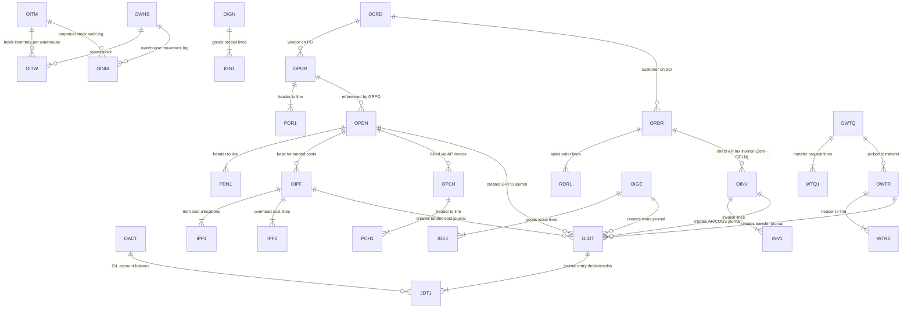

# SAP Business One Enterprise Database Schema Reference (`Schema.md`)
## End-to-End Enterprise Data Architecture & Entity Relationship Specification

---

| Database Attribute | Specification |
| :--- | :--- |
| **System Standard** | **SAP Business One Relational Data Architecture (SQL / HANA Compatible)** |
| **Operating Databases** | [**`new_b1.db`**](file:///Users/billy/SAPB1_Sim/new_b1.db) *(Multi-Warehouse Moving Average Costing)*<br>[**`old_b1.db`**](file:///Users/billy/SAPB1_Sim/old_b1.db) *(Company-Level Moving Average Valuation)* |
| **Architecture Standard** | **5-Level Process Classification Framework (PCF) Data Persistence** |
| **Document Version** | **1.0.0 (Enterprise Gold Master Schema)** |

---

## 1. Architectural Overview & Dual-Database Paradigm

The SAP Business One simulation environment operates across two distinct database paradigms reflecting differing enterprise inventory valuation methods:

```
┌────────────────────────────────────────────────────────────────────────────────────────────────────────┐
│                                DUAL-DATABASE ARCHITECTURAL COMPARISON                                  │
├───────────────────────────────────────────────────────┬────────────────────────────────────────────────┤
│ 1. new_b1.db (Multi-Warehouse Moving Average Costing)  │ 2. old_b1.db (Company-Level Moving Average)    │
├───────────────────────────────────────────────────────┼────────────────────────────────────────────────┤
│ • Valuation Level: Item-Warehouse (`OITW.AvgPrice`)   │ • Valuation Level: Item-Company (`OITM.AvgPrice`)│
│ • Independent Moving Average per Regional DC & Hub:   │ • Single blended Moving Average across all AU  │
│   - ICCChina: Origin Base + Handling ($424.00 AUD)      │   warehouses:                                  │
│   - ICCSIT / EuropeSIT / NZSIT: Transferred at MWAG       │   - AU Warehouses share $522.00 AUD          │
│   - NZNTH ($522 AUD) / NZSTH ($545 AUD) / EuropeMarketPlace ($560)│ • Relies on global material subledger.         │
│ • Full Multi-Leg Stacked Landed Cost Support (`OIPF`) │ • Direct Import single-stage costing focus.    │
└───────────────────────────────────────────────────────┴────────────────────────────────────────────────┘
```

---

## 2. Master Entity-Relationship Diagram (ERD)

The core transaction lifecycle follows the standard SAP Business One **Header (`O***`)** to **Line (`***1`)** relational pattern with backward document traceability via `BaseEntry`, `BaseLine`, and `BaseType`.



---

## 3. Core Database Tables by Functional Module

---

### Module 1: Master Data & System Setup

#### 1.1 `OITM` — Item Master Data
Stores global item definitions, catalog metadata, purchasing/sales groups, and default warehouse settings.

| Field Name | Type | Key | Description |
| :--- | :--- | :---: | :--- |
| `ItemCode` | `TEXT` | **PK** | Unique Item Identifier (e.g. `'ART-1001'`, `'FURN-DESK-01'`). |
| `ItemName` | `TEXT` | | Full Item Description / SKU Name. |
| `ItmsGrpCod` | `INTEGER` | **FK** | Item Group Code (FK to `OITB`). |
| `OnHand` | `REAL` | | Total stock quantity across all company warehouses. |
| `IsCommited` | `REAL` | | Total quantity reserved for open Sales Orders (`ORDR`) & Transfers (`OWTQ`). |
| `OnOrder` | `REAL` | | Total quantity on open Factory & Intercompany Purchase Orders (`OPOR`). |
| `AvgPrice` | `REAL` | | Company-level moving average cost (Primary in `old_b1.db`). |
| `DfltWH` | `TEXT` | **FK** | Default warehouse code (FK to `OWHS.WhsCode`). |

#### 1.2 `OITW` — Item Warehouse Master Data
Stores warehouse-specific stock levels, reservations, bin assignments, and local moving average valuation.

| Field Name | Type | Key | Description |
| :--- | :--- | :---: | :--- |
| `ItemCode` | `TEXT` | **PK, FK** | Item Code (FK to `OITM.ItemCode`). |
| `WhsCode` | `TEXT` | **PK, FK** | Warehouse Code (FK to `OWHS.WhsCode`, e.g. `'ICCChina'`, `'AU Warehouse'`). |
| `OnHand` | `REAL` | | Physical stock quantity currently located in this specific warehouse. |
| `IsCommited` | `REAL` | | Allocated stock reserved for picking in this warehouse. |
| `OnOrder` | `REAL` | | Inbound quantity ordered for delivery into this specific warehouse. |
| `AvgPrice` | `REAL` | | Warehouse-level moving average unit cost (Primary valuation in `new_b1.db`). |
| `MinStock` | `REAL` | | Safety stock minimum threshold. |
| `MaxStock` | `REAL` | | Maximum warehouse storage threshold. |

#### 1.3 `OWHS` — Warehouse Master Data
Defines physical logistics distribution centers, origin hubs, port staging areas, and In-Transit (`SIT`) virtual nodes.

| Field Name | Type | Key | Description |
| :--- | :--- | :---: | :--- |
| `WhsCode` | `TEXT` | **PK** | Unique Warehouse Code (e.g. `'ICCChina'`, `'ICCSIT'`, `'AU Warehouse'`, `'NZNTH'`, `'EuropeMarketPlace'`). |
| `WhsName` | `TEXT` | | Descriptive Warehouse Name. |
| `Building` | `TEXT` | | Building or Facility Name. |
| `Street` | `TEXT` | | Street Address. |
| `City` | `TEXT` | | City Location. |
| `State` | `TEXT` | | State / Province. |
| `ZipCode` | `TEXT` | | Postal Code. |

#### 1.4 `OCRD` — Business Partner Master Data
Maintains master records for Overseas Factory Vendors (`'S'`), Customs Brokers (`'S'`), Carriers (`'S'`), and Wholesale/Retail Customers (`'C'`).

| Field Name | Type | Key | Description |
| :--- | :--- | :---: | :--- |
| `CardCode` | `TEXT` | **PK** | Unique Business Partner Code (e.g. `'V-FACTORY-CN'`, `'C-EUROMKT-UK'`). |
| `CardName` | `TEXT` | | Registered Legal Name. |
| `CardType` | `TEXT` | | Partner Classification (`'C'` = Customer, `'S'` = Vendor/Supplier). |
| `GroupCode` | `INTEGER` | **FK** | Business Partner Group (FK to `OCRG`). |
| `Currency` | `TEXT` | | Master Currency (`'USD'`, `'AUD'`, `'NZD'`, `'GBP'`, or `'##'` for Multi-Currency). |
| `Address` | `TEXT` | | Default Billing Address. |
| `Balance` | `REAL` | | Current outstanding Accounts Receivable / Payable Balance in local currency. |
| `ZipCode` | `TEXT` | | Postal Code. |

#### 1.5 `OACT` — Chart of Accounts (G/L Master)
Defines enterprise general ledger accounts for balance sheet assets, liabilities, clearing accounts, revenue, and COGS.

| Field Name | Type | Key | Description |
| :--- | :--- | :---: | :--- |
| `AcctCode` | `TEXT` | **PK** | Unique G/L Account Code (e.g. `'100010'`, `'100050'`, `'200050'`, `'500010'`). |
| `AcctName` | `TEXT` | | Descriptive Account Name. |
| `CurrTotal` | `REAL` | | Current Account Balance. |
| `ActType` | `TEXT` | | Classification (`'N'` = Non-Active, `'Y'` = Active). |
| `LocManTran`| `TEXT` | | Local Currency Lock (`'Y'`/`'N'`). |
| `Financ` | `TEXT` | | Financial Account Identifier. |
| `GroupMask` | `INTEGER` | | Account Category (`1` = Assets, `2` = Liabilities, `4` = Revenue, `5` = COGS). |

---

### Module 2: Procurement & Inbound Supply Stream

#### 2.1 `OPOR` / `POR1` — Purchase Orders (Factory & Intercompany Tracking)
Maintains factory production commitments in USD FOB and intercompany tracking POs in AUD.

* **`OPOR` (Header Table)**:
  - `DocEntry` (`INTEGER`, **PK**): Internal document key.
  - `DocNum` (`INTEGER`): User-visible document number.
  - `DocDate` (`TEXT`): Document posting date.
  - `DocDueDate` (`TEXT`): Expected delivery date.
  - `CardCode` (`TEXT`, **FK**): Vendor Code (`OCRD`).
  - `CardName` (`TEXT`): Vendor Name.
  - `DocStatus` (`TEXT`): Status (`'O'` = Open, `'C'` = Closed).
  - `DocTotal` (`REAL`): Total order amount in statutory local currency (AUD).
  - `DocCur` (`TEXT`): Document currency (`'USD'` for factory POs, `'AUD'` for intercompany).
  - `DocRate` (`REAL`): Exchange rate applied (e.g. `0.65` AUD/USD).
  - `DocTotalFC` (`REAL`): Total order amount in Foreign Currency (USD).
  - `Comments` (`TEXT`): Remarks, B/L tracking (`U_BOLNo`), and container numbers.

* **`POR1` (Line Table)**:
  - `DocEntry` (`INTEGER`, **PK, FK**): Link to `OPOR.DocEntry`.
  - `LineNum` (`INTEGER`, **PK**): Zero-indexed line number.
  - `ItemCode` (`TEXT`, **FK**): Item Code (`OITM`).
  - `Dscription` (`TEXT`): Item description.
  - `Quantity` (`REAL`): Ordered quantity.
  - `Price` (`REAL`): Unit price in statutory local currency (AUD).
  - `LineTotal` (`REAL`): Total line amount (AUD).
  - `PriceFC` (`REAL`): Unit price in Foreign Currency (USD FOB).
  - `TotalFrgn` (`REAL`): Foreign currency line total.
  - `OpenQty` (`REAL`): Remaining un-received quantity (`POR1.OpenQty`).
  - `WhsCode` (`TEXT`, **FK**): Target receiving warehouse (`OWHS`).
  - `LineStatus` (`TEXT`): Line status (`'O'`/`'C'`).

#### 2.2 `OPDN` / `PDN1` — Goods Receipt PO (GRPO)
Records physical dock arrival, converts spot FX to AUD base cost, capitalizes inventory, and accrues allocation liabilities.

* **`OPDN` (Header Table)**:
  - `DocEntry` (`INTEGER`, **PK**), `DocNum` (`INTEGER`), `DocDate` (`TEXT`), `CardCode` (`TEXT`), `CardName` (`TEXT`), `DocStatus` (`TEXT`), `DocTotal` (`REAL`), `DocCur` (`TEXT`), `DocRate` (`REAL`), `DocTotalFC` (`REAL`), `BaseEntry` (`INTEGER`, **FK** to `OPOR`), `Comments` (`TEXT`).

* **`PDN1` (Line Table)**:
  - `DocEntry` (`INTEGER`, **PK, FK**), `LineNum` (`INTEGER`, **PK`), `ItemCode` (`TEXT`, **FK**), `Dscription` (`TEXT`), `Quantity` (`REAL`), `Price` (`REAL`, Base AUD), `LineTotal` (`REAL`), `PriceFC` (`REAL`), `TotalFrgn` (`REAL`), `WhsCode` (`TEXT`, **FK**), `BaseEntry` (`INTEGER`, **FK** to `OPOR`), `BaseLine` (`INTEGER`, line on `POR1`).

#### 2.3 `OIPF` / `IPF1` / `IPF2` — Landed Costs Allocation Engine
Executes Policy 5: Two-Stage Landed Costing (Provisional Accrual `'E'` and Actual Overwrite `'A'`).

* **`OIPF` (Header Table)**:
  - `DocEntry` (`INTEGER`, **PK**): Unique Landed Cost entry key.
  - `DocNum` (`INTEGER`): Landed cost voucher number.
  - `DocDate` (`TEXT`): Allocation date.
  - `CardCode` (`TEXT`, **FK**): Customs broker / freight forwarder vendor code.
  - `CardName` (`TEXT`): Broker / Carrier Name.
  - `CostSum` (`REAL`): Total landed cost expense to allocate across items.
  - `DocTotal` (`REAL`): Total landed cost document value.
  - `DocType` (`TEXT`): **`'E'` = Estimated (Provisional Accrual)** / **`'A'` = Actual (Invoice Overwrite)**.
  - `BaseEntry` (`INTEGER`, **FK**): Base document link to `OPDN.DocEntry`.
  - `WhsCode` (`TEXT`, **FK**): Warehouse receiving the cost capitalization.
  - `Comments` (`TEXT`): Allocation notes and clearing reconciliations.

* **`IPF1` (Item Allocation Lines)**:
  - `DocEntry` (`INTEGER`, **PK, FK**), `LineNum` (`INTEGER`, **PK**), `ItemCode` (`TEXT`), `Dscription` (`TEXT`), `Quantity` (`REAL`), `Price` (`REAL`), `CostSum` (`REAL`, Allocated freight/duty), `Factor` (`REAL`), `BaseDocEntry` (`INTEGER`), `BaseLineNum` (`INTEGER`), `BaseDocType` (`INTEGER`), `WhsCode` (`TEXT`).

* **`IPF2` (Overhead Expense Cost Types)**:
  - `DocEntry` (`INTEGER`, **PK, FK**), `LineNum` (`INTEGER`, **PK**), `AlcCode` (`TEXT`, Landed cost code, e.g. `'OCEAN_FRT'`, `'CUSTOMS_DUTY'`, `'WHARFAGE'`), `CostSum` (`REAL`).

---

### Module 3: Inventory Transfers & Warehouse Movements

#### 3.1 `OWTQ` / `WTQ1` — Inventory Transfer Requests
Executes Policy 7: Mandatory Transfer Request & Picking Reservation for stock moving into In-Transit (`SIT`).

* **`OWTQ` (Header Table)**:
  - `DocEntry` (`INTEGER`, **PK**), `DocNum` (`INTEGER`), `DocDate` (`TEXT`), `DocDueDate` (`TEXT`), `FromWhsCod` (`TEXT`, **FK**), `ToWhsCode` (`TEXT`, **FK**), `DocStatus` (`TEXT`), `Comments` (`TEXT`).

* **`WTQ1` (Line Table)**:
  - `DocEntry` (`INTEGER`, **PK, FK**), `LineNum` (`INTEGER`, **PK**), `ItemCode` (`TEXT`, **FK**), `Dscription` (`TEXT`), `Quantity` (`REAL`), `OpenQty` (`REAL`), `FromWhsCod` (`TEXT`, **FK**), `ToWhsCode` (`TEXT`, **FK`).
  - *Trigger Effect*: Sets `OITW.IsCommited = +Quantity` at `FromWhsCod` without financial G/L posting.

#### 3.2 `OWTR` / `WTR1` — Inventory Transfers
Executes physical dispatch and balance sheet reclassification from Physical Warehouse to In-Transit Asset (`G/L 100050`).

* **`OWTR` (Header Table)**:
  - `DocEntry` (`INTEGER`, **PK**), `DocNum` (`INTEGER`), `DocDate` (`TEXT`), `FromWhsCod` (`TEXT`, **FK**), `ToWhsCode` (`TEXT`, **FK**), `Comments` (`TEXT`).

* **`WTR1` (Line Table)**:
  - `DocEntry` (`INTEGER`, **PK, FK**), `LineNum` (`INTEGER`, **PK**), `ItemCode` (`TEXT`, **FK**), `Dscription` (`TEXT`), `Quantity` (`REAL`), `Price` (`REAL`, Source MWAG Cost), `FromWhsCod` (`TEXT`, **FK**), `ToWhsCode` (`TEXT`, **FK`).

#### 3.3 `OIGE` / `IGE1` & `OIGN` / `IGN1` — Goods Issue & Goods Receipt
Used for cross-database intercompany discharges from SIT (Policy 4) and exception variance adjustments (Process 2.4.3).

* **`OIGE` / `IGE1` (Goods Issue)**:
  - Records stock outflow from warehouse (e.g. discharging `ICCSIT` in `new_b1.db` upon port arrival).
  - *Financial Trigger*: **Dr** `110020` (Intercompany AR) / **Cr** `100050` (In-Transit Asset).

* **`OIGN` / `IGN1` (Goods Receipt)**:
  - Records non-purchase stock inflows, physical inventory surplus adjustments, and opening balances.

#### 3.4 `OINM` — Warehouse Inventory Transaction Log (Subledger Audit)
Maintains the complete, immutable transaction history for all stock movements and cost calculations.

| Field Name | Type | Description |
| :--- | :--- | :--- |
| `TransSeq` | `INTEGER` (**PK**) | Sequential audit sequence number. |
| `ItemCode` | `TEXT` (**FK**) | Item Code. |
| `DocDate` | `TEXT` | Transaction Date. |
| `TransType` | `INTEGER` | SAP Object Type (`18`=AP Invoice, `20`=GRPO, `67`=Transfer, `59`=Goods Receipt, `60`=Goods Issue, `13`=AR Invoice). |
| `CreatedBy` | `INTEGER` | Document `DocEntry` key. |
| `DocLineNum`| `INTEGER` | Document `LineNum`. |
| `InQty` | `REAL` | Inward movement quantity. |
| `OutQty` | `REAL` | Outward movement quantity. |
| `Price` | `REAL` | Transaction unit valuation. |
| `TransValue`| `REAL` | Total financial inventory value change. |
| `Warehouse` | `TEXT` (**FK**) | Warehouse code affected. |
| `CalcPrice` | `REAL` | Calculated moving average cost after transaction. |
| `Balance` | `REAL` | Cumulative stock quantity balance in warehouse. |

---

### Module 4: Sales & Customer Order Fulfillment

#### 4.1 `ORDR` / `RDR1` — Sales Orders
Records customer commitments, pricing, delivery schedules, and finished goods reservations (`OITW.IsCommited`).

* **`ORDR` (Header Table)**:
  - `DocEntry` (`INTEGER`, **PK**), `DocNum` (`INTEGER`), `DocDate` (`TEXT`), `DocDueDate` (`TEXT`), `CardCode` (`TEXT`, **FK**), `CardName` (`TEXT`), `DocStatus` (`TEXT`), `DocTotal` (`REAL`), `Comments` (`TEXT`).

* **`RDR1` (Line Table)**:
  - `DocEntry` (`INTEGER`, **PK, FK**), `LineNum` (`INTEGER`, **PK**), `ItemCode` (`TEXT`, **FK**), `Dscription` (`TEXT`), `Quantity` (`REAL`), `Price` (`REAL`), `LineTotal` (`REAL`), `OpenQty` (`REAL`), `WhsCode` (`TEXT`, **FK**), `LineStatus` (`TEXT`).

#### 4.2 `OINV` / `INV1` — Direct AR Tax Invoices (Policy 6: Zero-ODLN)
Created by `[Logistics]` directly based on `ORDR` to confirm order dispatch. Concurrently executes stock relief, COGS recognition, revenue, and tax in a single transaction.

* **`OINV` (Header Table)**:
  - `DocEntry` (`INTEGER`, **PK**), `DocNum` (`INTEGER`), `DocDate` (`TEXT`), `DocDueDate` (`TEXT`), `CardCode` (`TEXT`, **FK**), `CardName` (`TEXT`), `DocStatus` (`TEXT`), `DocTotal` (`REAL`, Gross incl tax), `Comments` (`TEXT`).

* **`INV1` (Line Table)**:
  - `DocEntry` (`INTEGER`, **PK, FK**), `LineNum` (`INTEGER`, **PK**), `ItemCode` (`TEXT`, **FK**), `Dscription` (`TEXT`), `Quantity` (`REAL`), `Price` (`REAL`, Selling price), `LineTotal` (`REAL`, Net revenue), `WhsCode` (`TEXT`, **FK**).

---

### Module 5: Financial Accounting, Multi-Currency & Ledgers

#### 5.1 `OJDT` / `JDT1` — Journal Entries & G/L Postings
Stores all balance sheet and profit & loss accounting debits and credits generated by system transactions.

* **`OJDT` (Header Table)**:
  - `TransId` (`INTEGER`, **PK**): Unique journal entry transaction ID.
  - `BaseRef` (`INTEGER`): Source document number (`DocNum`).
  - `RefDate` (`TEXT`): Posting date.
  - `DueDate` (`TEXT`): Due date.
  - `TaxDate` (`TEXT`): Document tax date.
  - `Memo` (`TEXT`): Journal description (e.g. `'Direct AR Invoice - Art Table'`).
  - `TransType` (`INTEGER`): Document Object Type (e.g. `13`=OINV, `20`=OPDN, `67`=OWTR).
  - `LocTotal` (`REAL`): Total journal entry amount in local currency (AUD).

* **`JDT1` (Line Table — Balanced Debits & Credits)**:
  - `TransId` (`INTEGER`, **PK, FK**): Link to `OJDT.TransId`.
  - `Line_ID` (`INTEGER`, **PK**): Zero-indexed journal line number.
  - `Account` (`TEXT`, **FK**): G/L Account code (FK to `OACT.AcctCode`).
  - `ShortName` (`TEXT`): Account code or Business Partner CardCode (`OCRD`).
  - `Debit` (`REAL`): Debit amount in local currency (AUD).
  - `Credit` (`REAL`): Credit amount in local currency (AUD).
  - `LineMemo` (`TEXT`): Line narrative.
  - `FCDebit` (`REAL`): Debit amount in foreign currency (USD).
  - `FCCredit` (`REAL`): Credit amount in foreign currency (USD).

---

## 4. Master Data Value Stream Mapping & G/L Account Code Directory

```
┌────────────────────────────────────────────────────────────────────────────────────────────────────────┐
│                             ENTERPRISE CHART OF ACCOUNTS & POSTING MAP                                │
├──────────────┬──────────────────────────────────────────┬──────────────┬───────────────────────────────┤
│ Account Code │ Account Name                             │ Category     │ Primary Document Trigger      │
├──────────────┼──────────────────────────────────────────┼──────────────┼───────────────────────────────┤
│ 100010       │ Finished Goods Inventory Asset (AU DC)   │ Asset        │ OPDN, OIPF, OWTR, OINV        │
│ 100040       │ Origin / International Stock Asset (NZ/UK)│ Asset       │ OPDN, OIPF, OWTR, OINV        │
│ 100050       │ Goods In-Transit Asset (SIT Warehouses)  │ Asset        │ OWTR (Dr), OIGE (Cr)          │
│ 110010       │ Accounts Receivable (Customer Trade)     │ Asset        │ OINV (Dr)                     │
│ 110020       │ Intercompany Trade Receivables           │ Asset        │ OIGE (Dr), OWTR Intercompany  │
│ 200010       │ Accounts Payable (Trade Vendors & Freight)│ Liability   │ OPCH, OIPF 'A' (Cr)           │
│ 200020       │ GST / VAT Output Tax Payable             │ Liability    │ OINV (Cr)                     │
│ 200030       │ Intercompany Trade Payables              │ Liability    │ OPDN Dest Intercompany (Cr)   │
│ 200050       │ Estimated Landed Cost Clearing (Accrual) │ Liability    │ OIPF 'E' (Cr), OIPF 'A' (Dr)  │
│ 200060       │ Goods Receipt Allocation Clearing        │ Liability    │ OPDN (Cr), OPCH (Dr)          │
│ 400010       │ Commercial Sales Revenue                 │ Revenue      │ OINV (Cr)                     │
│ 500010       │ Cost of Goods Sold (COGS)                │ Expense      │ OINV (Dr)                     │
│ 500080       │ Exchange Rate Variance & Gain/Loss       │ Expense      │ OJDT Year-End Reconciliation  │
└──────────────┴──────────────────────────────────────────┴──────────────┴───────────────────────────────┘
```

---

## 5. Summary Data Dictionary Table Index

| SAP B1 Table | Description | Module | Primary Key | Foreign Key References |
| :--- | :--- | :--- | :--- | :--- |
| **`OACT`** | Chart of Accounts Master | Finance | `AcctCode` | — |
| **`OCRD`** | Business Partner Master (Vendors/Customers) | Master Data | `CardCode` | `OCRG` |
| **`CRD1`** | Business Partner Addresses | Master Data | `CardCode, LineNum` | `OCRD` |
| **`OITM`** | Item Master Data | Inventory | `ItemCode` | `OITB, OWHS` |
| **`OITW`** | Item Warehouse Master Data | Inventory | `ItemCode, WhsCode` | `OITM, OWHS` |
| **`OWHS`** | Warehouse Master Data | Inventory | `WhsCode` | — |
| **`OPOR`** | Purchase Order Header | Purchasing | `DocEntry` | `OCRD` |
| **`POR1`** | Purchase Order Lines | Purchasing | `DocEntry, LineNum` | `OPOR, OITM, OWHS` |
| **`OPDN`** | Goods Receipt PO Header | Purchasing | `DocEntry` | `OCRD, OPOR` |
| **`PDN1`** | Goods Receipt PO Lines | Purchasing | `DocEntry, LineNum` | `OPDN, OITM, POR1` |
| **`OIPF`** | Landed Costs Allocation Header | Cost Accounting | `DocEntry` | `OCRD, OPDN, OWHS` |
| **`IPF1`** | Landed Costs Item Allocations | Cost Accounting | `DocEntry, LineNum` | `OIPF, OITM, PDN1` |
| **`IPF2`** | Landed Costs Expense Types | Cost Accounting | `DocEntry, LineNum` | `OIPF, OALC` |
| **`OWTQ`** | Inventory Transfer Request Header | Logistics | `DocEntry` | `OWHS` |
| **`WTQ1`** | Inventory Transfer Request Lines | Logistics | `DocEntry, LineNum` | `OWTQ, OITM, OWHS` |
| **`OWTR`** | Inventory Transfer Header | Logistics | `DocEntry` | `OWHS, OWTQ` |
| **`WTR1`** | Inventory Transfer Lines | Logistics | `DocEntry, LineNum` | `OWTR, OITM, WTQ1` |
| **`OIGE`** | Goods Issue Header | Logistics | `DocEntry` | — |
| **`IGE1`** | Goods Issue Lines | Logistics | `DocEntry, LineNum` | `OIGE, OITM, OWHS` |
| **`ORDR`** | Sales Order Header | Sales | `DocEntry` | `OCRD` |
| **`RDR1`** | Sales Order Lines | Sales | `DocEntry, LineNum` | `ORDR, OITM, OWHS` |
| **`OINV`** | Direct AR Tax Invoice Header | Logistics/Finance | `DocEntry` | `OCRD, ORDR` |
| **`INV1`** | Direct AR Tax Invoice Lines | Logistics/Finance | `DocEntry, LineNum` | `OINV, OITM, RDR1` |
| **`OJDT`** | General Ledger Journal Entry Header | Finance | `TransId` | — |
| **`JDT1`** | General Ledger Journal Entry Lines | Finance | `TransId, Line_ID` | `OJDT, OACT, OCRD` |
| **`OINM`** | Warehouse Inventory Audit Log | Subledger | `TransSeq` | `OITM, OWHS` |
